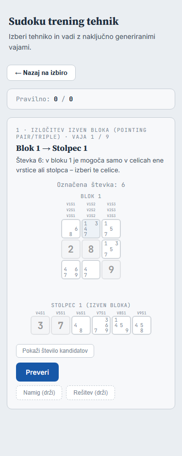
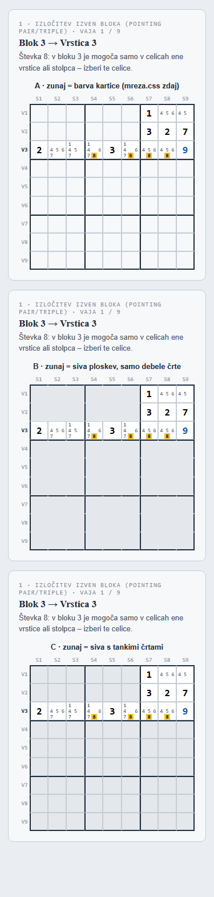
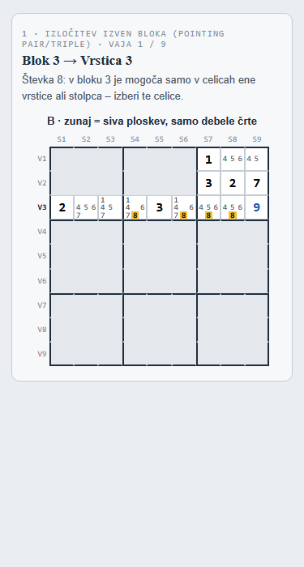
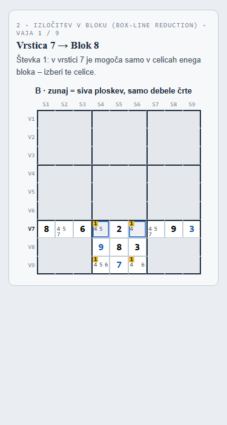
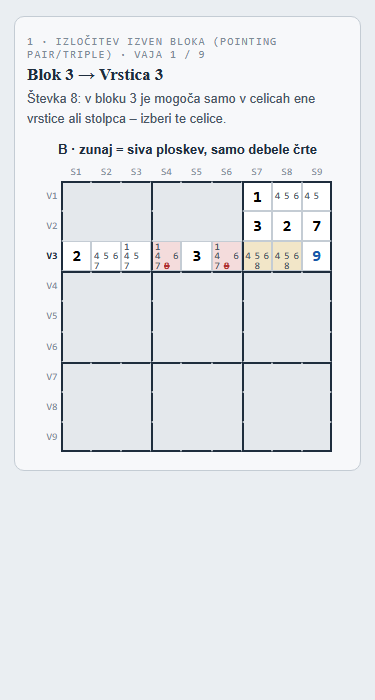
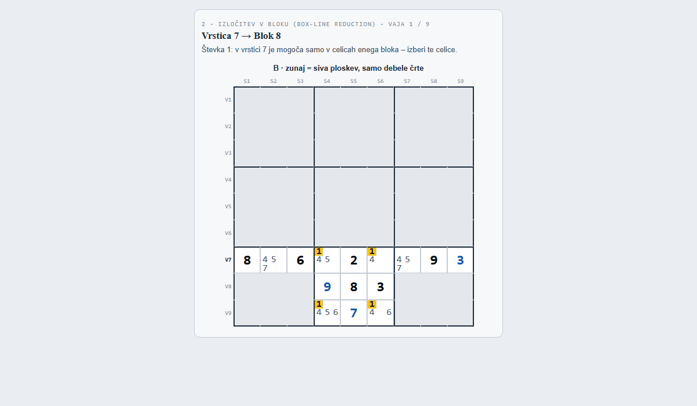

# Prava geometrija pri tehnikah 1 in 2 v »Spoznaj« – načrt

Naloga: vaji **1 · Izločitev izven bloka** in **2 · Izločitev v bloku** v načinu »Spoznaj«
(trening) namesto ločenih enot pokažeta **delno mrežo 9 × 9**: vidni sta samo obe enoti
vaje (blok in vrstica ali stolpec, skupaj 15 celic) na svojih pravih mestih, ostale celice
so skrite. Izris gre skozi `shared/mreza.js` (možnost `vidne`), ne skozi posebno kodo v
treningu. Izhodišče: zapis v `docs/trening-v-uganki-nacrt.md`, razdelek »Po delu 4 –
samostojna naloga …«.

Stanje: **načrt, čaka na potrditev** (2026-09-27). Koda še ni spremenjena.

Posnetki zaslona so v `docs/slike/geometrija-1-2/`. Predlog je posnet s prototipom, ki
uporablja pravo `shared/mreza.js` z možnostjo `vidne` in pravi primer iz banke vaj; oznake
robov in siva ploskev so v prototipu dodani kot CSS, v izvedbi pridejo v `shared/`.

## 1. Kako »Spoznaj« zdaj prikaže tehniki 1 in 2

**Prikaz** – `trening/trening.js`:

- `renderExercise()`, veja `M.isPointing||M.isBoxLine`: oznaka »Označena števka: d« in
  `buildBoxLineLayout()`.
- `buildBoxLineLayout()` gradi lastne celice `.gc` (`makeCell()`), ne mreže. Zgoraj je
  primarna enota (blok kot 3 × 3, vrstica ali stolpec kot trak). Pod njo je 6 celic druge
  enote v ločenem traku »Stolpec 1 (izven bloka)«. Oznake celic (V1S1 …) so nad vsako
  celico. Pri vsaki celici je še število kandidatov (gumb »Pokaži število kandidatov«).
- Preverjanje je v `checkPhase1()`: 2 ali 3 celice, nato `pointing()`/`boxLineReduction()`
  na deski vaje (`ex.boardGrid`/`ex.boardCand`) in ujemanje po celicah. Namig je v
  `buildHintText()`, rešitev v `buildSolutionText()`/`exDigitStep()`, poudarki med
  držanjem v `peekOn()` (`peek-hl`, `peek-elim`).
- Slogi so v `trening/trening.css` (`.layout-block`, `.layout-row`, `.layout-col`,
  `.layout-rest`, `.bl-section-label`, `.block-labels`, `.block-counts`).

**Vaje** – `trening/generators.js`, `genBoxLineCore()` (za njo `genPointing()` in
`genBoxLineReduction()`): naključno sestavi 15 celic, skrite celice so na deski »dane«
(vrednost 1). Vajo vrne samo, če jo motor potrdi (`pointing()`/`boxLineReduction()`).
`MODES`: `isPointing`/`isBoxLine`, `pickN: 3`, `showCandidateCount: true`, barvi izbire
modra in indigo.

**Ugotovitev pri meritvi** (2000 vaj vsake tehnike, skripta v pogovoru, ni v projektu):
sestavljene vaje na pravih mestih ne bi zdržale.

| | 1 · Izločitev izven bloka | 2 · Izločitev v bloku |
|---|---|---|
| vaja ima kandidata, ki je v isti vidni enoti že dana števka | 1959 / 2000 (98 %) | 1958 / 2000 (98 %) |
| preverjanje na delni deski sprejme še drug vzorec iste števke | 918 / 2000 (46 %) | 1881 / 2000 (94 %) |

- **Prvo** je danes skrito, ker enote niso na svojih mestih. Primer: v bloku 4 je dana 3,
  celica V5S3 v istem bloku pa ima kandidata 3. Na pravi mreži bi bilo to vidno takoj.
- **Drugo** je napaka zdajšnjega »Spoznaj«. Skrite celice so na deski »dane«, zato motor
  meni, da je v drugih vrsticah skozi blok (pri 2) ali v drugih blokih ob vrstici (pri 1)
  števka omejena. Tak odgovor sprejme kot pravilen, čeprav ga iz prikazanega ni mogoče
  utemeljiti.

Zato predlagam nov vir vaj (točka 4), ne samo nov izris.

## 2. Kaj `shared/mreza.js` že zna in kaj mu manjka

**Že zna** (del 4):

- `pogled.vidne` (množica celic ali `null`): celice zunaj dobijo razred `izven`, so
  prazne, klik nanje se ne pokliče. Debele črte blokov ostanejo, ker so vezane na
  `data-r`/`data-c`, ne na vsebino.
- Dane in vpisane števke (`grid` + `danosti`), kandidati na stalnih mestih, poudarek
  števke (`barva`), izbira (`izbrane`), oznake koraka (`oznake`: jantarni vzorec, rdeče
  prečrtan kandidat za izbris).
- Test v `tests/mreza.test.js` pokriva `vidne` (prazne celice z `izven`, brez odziva na
  klik).

**Manjka:**

1. **Oznake robov V1–V9 in S1–S9.** Mreža nima glav. Predlog: nova možnost
   `ustvariMrezo(el, { obKliku, robovi: true })`. Z njo mreža v `el` zgradi okvir:
   kot, vrstico `S1…S9` zgoraj, stolpec `V1…V9` levo in notranji `div.mreza` z 81
   celicami. Vrnjeni `el` je notranja mreža. Brez `robovi` je vse kot zdaj (igra).
2. **Označena vrstica ali stolpec vaje.** Ob izrisu z `vidne` dobi oznaka roba razred
   `akt` (krepko, temno), če je vrstica ali stolpec **v celoti** viden. To se izpelje iz
   `vidne`, zato pogled ne potrebuje novega polja. Pri vaji je to natanko enota vaje; blok
   se vidi po debelih črtah.
3. **Videz skritih celic.** Zdaj imajo `.celica.izven` podlago `var(--card)`. To je v
   treningu `#F7F8FA`, skoraj bela in enaka podlagi kartice (varianta A spodaj). Predlog
   je varianta B (točka 3): nova spremenljivka `--izven-bg` v `:root` datoteke
   `mreza.css`, tanke črte v barvi ploskve, debele črte ostanejo.
4. **Mreža z `vidne` dobi razred `delna`.** Njena podlaga je v barvi skritih celic, zato
   na stičiščih skritih celic ni belih pik (na prototipu so še vidne, glej
   `predlog-2-1200.png`).

Vse tri spremembe CSS (`.celica.izven`, `.mreza.delna`, `.mreza-robovi`) veljajo samo za
elemente, ki jih igra ne ustvari, ker ne uporablja ne `vidne` ne `robovi`.

## 3. Videz skritih celic

Tri variante na isti vaji (1 · blok 3 → vrstica 3, števka 8, seme 3 iz banke):

- **A** – kot zdaj v `mreza.css` (`var(--card)`). Skrite celice so skoraj bele, vidnih
  15 celic se ne loči dovolj.
- **B (predlog)** – skrite celice so siva ploskev (`#E4E8EC`) brez tankih črt, ostanejo
  samo debele črte blokov. Vidnih 15 celic je bel »križ« ali »T«, bloki so šteti na prvi
  pogled.
- **C** – siva s tankimi črtami. Vidi se vsaka celica, a mreža je bolj nemirna, vidne
  celice pa manj izstopajo.

Kako ostane jasno, kje smo:

1. Debele črte blokov so na vsej mreži, blok vaje je bel kvadrat 3 × 3 na svojem mestu.
2. Oznake robov: vrstica ali stolpec vaje je krepko (na posnetku `V3`).
3. Naslov (»Blok 3 → Vrstica 3«) in navodilo ostaneta, kakor sta.
4. Števka vaje je poudarjena kot v igri (rumen kvadrat, `--poud`) – **vprašanje 2**.

Predlog B pri 375 px (vaja 1) in pri vaji 2 z izbranima celicama (izbira iz `mreza.js`:
siva s tanko modro obrobo, kot v igri):

»Rešitev (drži)« in pravilen odgovor z oznakami koraka iz `mreza.js` (jantarno vzorec,
rdeče prečrtan kandidat za izbris – kot »Pokaži rešitev« v igri). Poudarek števke je med
tem izklopljen, ker bi rumena podlaga prekrila rdeče prečrtano števko (na prototipu
preizkušeno):

Pri 1200 px (vaja 2):

**Velikost** (v `trening/trening.css`, za okvir vaje; aplikacija ima zadnjo besedo):

- `--gcs: min(46px, (min(560px, 100vw) - 104px) / 9)` – isto pravilo kot `--gs` za
  druge mreže 9 × 9 v treningu. Pri 375 px je to pribl. 30 px, pri 1200 px 46 px. Na
  prototipu pri 375 px ni vodoravnega drsnika (`scrollWidth` 375).
- Kandidati `calc(var(--gcs) * .34)` namesto `.27` iz `mreza.css`, ker so pri 30 px
  celici sicer pribl. 8 px. Z `.34` so pribl. 10 px; to je treba pogledati na pravem
  telefonu (ročni seznam).

## 4. Od kod pridejo primeri

Predlog: **iz banke vaj** (`shared/vaje-banka.js`) in motorja, ne iz sestavljenih vaj.
Uganke niso sestavljene na pamet: vsaka uganka v banki ima natanko eno rešitev
(`tests/vaje-banka.test.js`). Stanje in korak izračuna motor.

Postopek za eno vajo (nova funkcija v `trening/generators.js`, npr. `genPresek(kljuc)`,
namesto `genBoxLineCore()`, ki se odstrani):

1. Naključna uganka iz `VAJE_BANKA` s tehniko `Pointing pair/triple` oz.
   `Box-line reduction`.
2. `vajaIzUganke(danosti, kljuc, rnd)` iz `shared/vaje-uganka.js`: naključno stanje S0
   na poti motorja, v katerem je ta tehnika prvi korak. `KT` so vsi koraki tehnike v S0.
3. Naključen korak iz `KT`. Vidne celice so blok koraka ∪ vrstica ali stolpec koraka
   (15 celic). Števka je števka izbrisa.
4. Prikaz: dane števke temne, vpisi poti modri (kot pri E1/E2), kandidati iz S0 (z vsemi
   izbrisi poti).

Meritev na vseh stanjih iz banke:

| | 1 · Izločitev izven bloka | 2 · Izločitev v bloku |
|---|---|---|
| ugank v banki | 204 | 108 |
| stanj (S0) | 695 | 204 |
| korakov v prvem stanju vsake uganke | 522 (2 celici 484, 3 celice 38) | 147 (2 celici 132, 3 celice 15) |
| vrstica / stolpec | 278 / 244 | 74 / 73 |
| vidnih celic: dane / prazne (povprečje) | 7,3 / 7,7 | 8,1 / 6,9 |
| kandidatov na prazno celico (povprečje) | 3,3 | 3,2 |
| izbrisov na korak (povprečje) | 1,9 | 2,8 |
| čas za eno vajo (povprečje / največ) | 20 ms / 98 ms | 16 ms / 29 ms |
| drug pravi korak iste tehnike in števke v celoti med vidnimi celicami | 0 / 1319 | 0 / 259 |

Posledice:

- **Kandidati so skladni** z vidnimi števkami, ker je S0 pravo stanje uganke.
- **Odgovor je enoličen.** Pri dani števki in primarni enoti (blok pri 1, vrstica ali
  stolpec pri 2) je vzorec en sam. Meritev to potrdi (0 drugih korakov). Preverjanje je
  zato: izbrane celice = celice koraka. Zanj se ne kliče motor na delni deski, zato
  napačni »vzorci« iz točke 1 odpadejo. Sporočilo pri napačnem odgovoru ostane isto kot
  zdaj.
- Vzorcev s tremi celicami je malo (7 % pri 1 in 10 % pri 2, prej pribl. 50 %). To je
  resnična pogostost v ugankah. Če želiš več trojic, lahko vsaka tretja vaja v krogu vzame
  korak s tremi celicami, kadar obstaja – **vprašanje 5**.
- Trening mora naložiti še `shared/vaje-banka.js` (57 KB). Del 6 bi jo naložil tako ali
  tako. Poleg nje še `shared/mreza.js` in `shared/mreza.css` (pred `trening.css`).

Zakaj ne popraviti sestavljenih vaj: odstraniti bi bilo treba neskladne kandidate in
preverjanje prestaviti na načrtovani korak. Vaja bi ostala umetna, banka pa je že
preverjena in je isti vir, kot ga bo uporabil »Vadi v uganki« (del 6).

## 5. Vpliv na igro, reševalec in druge tehnike v »Spoznaj«

- **Igra:** `shared/mreza.js` dobi možnost `robovi` in razred `delna`, `mreza.css` pa
  pravila `.celica.izven`, `.mreza.delna`, `.mreza-robovi` in spremenljivko
  `--izven-bg`. Igra ničesar od tega ne uporablja, zato ostane DOM enak. Preverja to
  `node tools/posnetek-igre.js --primerjaj tools/posnetki/igra-pred-niz.json`, ki mora
  dati »Enako«, in obstoječi `tests/mreza.test.js` ter `tests/igra-ui.test.js`.
- **Reševalec:** ne nalaga ne `mreza.js` ne `mreza.css`, zato ostane nespremenjen.
- **Druge tehnike v »Spoznaj«** (E1, E2, 3–12): spremenijo se samo veje
  `isPointing`/`isBoxLine` v `renderExercise()`, `checkPhase1()`, `buildHintText()`,
  `buildSolutionText()` in `peekOn()`. `buildLayout()`, `buildFullGridLayout()`,
  `buildSingleLayout()` in prikaz X-krila ter mečarice ostanejo. `mreza.css` v treningu ne
  križa imen razredov: vsa pravila so vezana na `.celica`, `.kand`, `.mreza` ali
  `.seznam`, trening pa uporablja `.gc`, `.cd` in `.g9`. Edino skupno ime je `vpis`, a
  `mreza.css` ga ima samo kot `.celica.vpis`. Brskalnik to preveri tako, da primerja
  izris vseh drugih tehnik s stanjem pred spremembo (točka 6).
- **Štetje, pomoč, krog 9 vaj:** `stej()`, `oznaciPomoc()` in `preveri()` ostanejo;
  pravilo »vaja s pomočjo se ne šteje« velja naprej.
- **Obnašanje, ki se pri 1 in 2 spremeni** (in je zapisano v vprašanjih):
  - izbira je videti kot v igri, ne v barvi tehnike;
  - pravilen odgovor je prikazan z oznakami koraka (jantarno in rdeče), ne zeleno;
  - ne sprejme se več napačen vzorec z delne deske (točka 1);
  - gumb »Pokaži število kandidatov« (vprašanje 3).
- `CLAUDE.md` (opisi `mreza.js`, `mreza.css`, `generators.js`, `trening.js`,
  `trening/index.html`, testi, Arhitektura – `showCandidateCount`) in
  `docs/trening-v-uganki-nacrt.md` (naloga narejena) se posodobita ob izvedbi.

## 6. Novi testi in preverjanje

**`tests/mreza.test.js`** (dopolnitev):

- `robovi`: 9 oznak S in 9 oznak V v pravem vrstnem redu, 81 celic v notranji mreži, klik
  deluje.
- `akt`: z `vidne` = blok ∪ vrstica je krepka samo ta vrstica, noben stolpec, prav tako
  za stolpec. Brez `vidne` ni nobena.
- Razred `delna` samo ob `vidne`. Brez `robovi` je DOM enak kot zdaj (obstoječi testi).

**Nov `tests/trening-presek.test.js`:**

- **Generator** (100 vaj vsake tehnike, `Math.random` s semenom):
  - uganka je iz banke;
  - korak je v `KT`, ki ga motor da na S0;
  - vidne celice so natanko blok ∪ enota koraka (15);
  - celice koraka so v preseku, vsi izbrisi so v vidnem delu druge enote;
  - noben kandidat vidne celice ni števka, ki je vpisana v vidni sosedi;
  - odgovor je enoličen (ni drugega koraka iste tehnike in števke med vidnimi);
  - `unitLabel` in `desc` se ujemata z blokom, enoto in števko;
  - čas na vajo.
- **UI v nadomestnem DOM-u** (vaji 1 in 2):
  - 81 celic, od tega 66 `izven`, 18 oznak robov in krepka oznaka enote;
  - klik skrite ali dane celice ne izbere ničesar;
  - izbira največ 3 celic, »Izberi 2 ali 3 celice.«;
  - pravilna izbira → »Pravilno!« s sporočilom motorja in oznake koraka na mreži;
  - napačna izbira → isto sporočilo kot zdaj, izbira počiščena;
  - »Namig« in »Rešitev« → vaja »s pomočjo«;
  - gumb števila kandidatov po odločitvi.
- Nalagalni seznami v `tests/trening-tehnike.test.js` in `tests/trening-pomoc.test.js`
  dobijo `shared/vaje-banka.js` (in `shared/mreza.js`, kjer se nalaga `trening.js`). Test
  besedil (`desc`, `unitLabel`, sporočilo motorja brez »številk« in angleških imen) potem
  teče na novih vajah.

**Brskalnik brez glave – nov `tools/preveri-presek-brskalnik.js`** (po vzoru
`tools/preveri-niz-brskalnik.js`):

- Vaji 1 in 2 pri 375 in 1200 px:
  - ni vodoravnega drsnika, mreža je v kartici;
  - 66 celic `izven` z izračunano sivo podlago, 15 vidnih belih;
  - oznaka enote je krepka;
  - pravi klik na skrito celico ne izbere, pravilna izbira s pravimi kliki → »Pravilno!«;
  - v strani ni napak JS;
  - posnetki zaslona, ki jih pogledam sam.
- **Druge tehnike ostanejo enake:** za E1, E2, 3–12 z `Math.random` s semenom primerja
  `innerHTML` območja vaje in izračunane sloge nekaj celic med stanjem pred spremembo
  (`git archive` zadnjega commita kot `koren`) in po njej.

**Vse skupaj ob izvedbi:** `node --test "tests/*.test.js"`, posnetek igre `--primerjaj`
(»Enako«) in scenarij v brskalniku.

## Koraki izvedbe (po potrditvi)

1. `shared/mreza.js` in `mreza.css`: `robovi`, `akt`, `delna`, videz `izven` (B);
   dopolnitev `tests/mreza.test.js`; posnetek igre »Enako«.
2. `trening/generators.js`: `genPresek()` iz banke namesto `genBoxLineCore()`; generator
   v `tests/trening-presek.test.js`.
3. `trening/trening.js`, `trening/index.html` (nalaganje), `trening/trening.css`
   (velikost, kandidati; slogi `.layout-*`, `.bl-section-label`, `.block-*`, ki jih po
   spremembi ne uporablja nihče več, se odstranijo); UI del testa.
4. `tools/preveri-presek-brskalnik.js`, posnetki, `CLAUDE.md`, `docs/rocni-test.md`,
   `docs/trening-v-uganki-nacrt.md`.

Vsak korak v svojem commitu s pushem.

## Vprašanja

1. **Videz skritih celic:** B (siva ploskev, samo debele črte) – predlog; ali A ali C?
2. **Poudarek števke vaje** (rumen kvadrat kot v igri): da – predlog. Navodilo in oznaka
   »Označena števka: d« števko že povesta, poudarek jo samo pokaže na mreži, kot pri
   verigi ene števke.
3. **Gumb »Pokaži število kandidatov« pri 1 in 2:** predlog je, da odpade
   (`showCandidateCount: false`). Pri teh dveh tehnikah šteje ena števka, ne število
   kandidatov, in `mreza.js` števil nima. Druga možnost: nova možnost pogleda v
   `mreza.js` (majhno število v kotu celice).
4. **Izbira in pravilen odgovor** kot v igri (siva z modro obrobo; oznake koraka jantarno
   in rdeče) namesto barv tehnike (modra ali indigo, zeleno »pravilno«) – predlog da, ker
   gre izris skozi `mreza.js`.
5. **Trojice:** pustiti resnično pogostost (pribl. 1 od 10) – predlog; ali vsaka tretja
   vaja v krogu s tremi celicami, kadar obstaja?

## Ročni seznam (po izvedbi)

1. **Trening, pravi telefon, vaja 1:** preberi kandidate in izberi dve celici s prstom.
   Pričakovano: kandidati berljivi (pribl. 10 px), celice (pribl. 30 px) zadeneš brez
   zgrešenih klikov. Ni avtomatsko, ker brskalnik brez glave ne oceni berljivosti in
   dotika.
2. **Trening, vaja 2 (1200 px in telefon):** brez branja naslova povej, katera vrstica
   ali stolpec in kateri blok sta v vaji. Pričakovano: takoj jasno iz sive ploskve in
   krepke oznake. Ni avtomatsko, ker je to presoja videza.
3. **Trening, vaji 1 in 2 na telefonu:** drži »Rešitev«, nato spusti. Pričakovano: oznake
   (jantarno in rdeče prečrtano) se pokažejo in ob spustu izginejo. Ni avtomatsko, ker
   scenarij pošilja dogodke miške, ne dotika.
