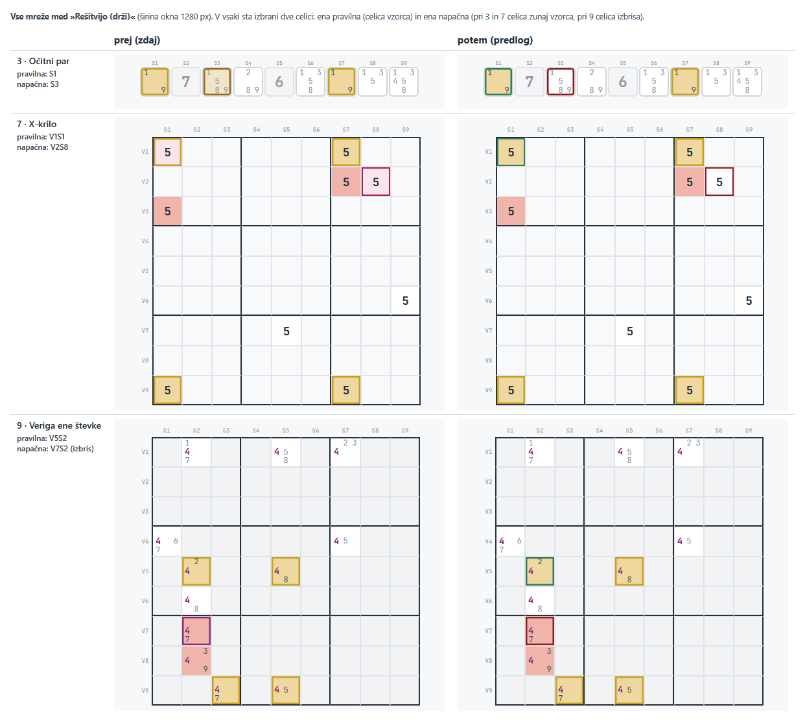

# Enotna izbira v »Spoznaj« 3–12 – načrt

Postavka »Izbira v vajah 3–12 v »Spoznaj« naj bo modra kot drugod« iz razdelka »Kasneje« v
`docs/uskladitev.md`. Naredi se pred fazo 6, ker bo legenda v fazi 6 opisovala končne barve.

**Cilj:** pred »Preveri« je izbrana celica pri vseh vajah 3–12 modra kot drugod po fazi 5
(`--izbira-bg`, obroba `--izbira`). Ob »Rešitvi (drži)« okvir pove, ali je izbira pravilna – pri
vseh vajah enako.

Prva različica načrta (dvojni okvir modro + zlato) je zavrnjena (Darko, 2026-10-03).

## 1. Kaj se spremeni

**Pred »Preveri«** – izbira modra (podlaga #DDE7F3, obroba #4A86D8) namesto barve tehnike:

| Vaja | Zdaj (podlaga / obroba) |
|---|---|
| 3 · Očitni par | jantarna #F1E5C9 / #9C6B12 |
| 4 · Skriti par | vijolična #E7DEF0 / #7548A0 |
| 5 · Očitna trojica | turkizna #D2EFEF / #0E7A7A |
| 6 · Skrita trojica | jeklena #DCE8F8 / #2956A0 |
| 7 · X-krilo, 8 · Mečarica | rožnata #FCE4EC / rdečkasta #A02050 |
| 9 · Veriga ene števke | slivova #F3DDEF / #8A2F7A |
| 10 · W-krilo | olivna #ECEFD1 / #5C6B14 |
| 11 · XY-krilo | modrozelena #D5EAF2 / #0E6E8A |
| 12 · Edinstveni pravokotnik | oranžna #F6E2D0 / #9A5218 |

**Ob »Rešitvi (drži)«** – pri vseh vajah:

| Celica | Zdaj | Potem |
|---|---|---|
| pravilno izbrana (del vzorca) | 3–6, 9–12: enaka spregledani; 7, 8: rožnata, zlat okvir | jantarna podlaga, **zelen okvir** (`--green` #2E7D5C, kot pri pravilnem odgovoru) |
| napačno izbrana (zunaj vzorca) | podlaga in obroba izbire (pri 3 skoraj enaka vzorcu, pri 7, 8 videti kot izbris) | brez podlage (bela), **temno rdeč okvir** #8E1B1B |
| napačno izbrana celica izbrisa (9–11, 7, 8) | 9–11: rožnata, obroba barve tehnike; 7, 8: podlaga izbire, izbris se ne vidi | rožnata podlaga izbrisa, temno rdeč okvir |
| spregledana (del vzorca, neizbrana) | jantarna, zlat okvir | nespremenjeno |
| izbris (neizbran) | rožnata, brez okvirja | nespremenjeno |

Temno rdeča #8E1B1B: kontrast 5,1 na rožnati podlagi izbrisa (#F0B4AA) in 9,0 na beli (zahteva
vsaj 3; `--red` #B23A2E bi imel na rožnati samo 3,3). Zelena in rdeča se ločita tudi po podlagi
(jantarna proti beli/rožnati), kar pomaga pri slabšem razločevanju rdeče in zelene.

**Ostane, kot je:** zelene celice po pravilnem odgovoru in ogled »Rešitve« po njem, celice izbrisa
po odgovoru, obarvane male števke in gumb »Preveri« v barvi tehnike, gumbi števk v 2. fazi pri 4 in
6, vaje E1, E2, 1 in 2 in »Vadi v uganki«. Opomba: pri 8 je zelena pravilnega odgovora #2E7D32
(`.xw-sf-correct`), drugod `--green` #2E7D5C – okvir ob »Rešitvi« je povsod `--green` (razlika je
komaj vidna; poenotenje pri 8 ni del naloge).

## 2. Kaj je »pravilno« – meritev na 300 vajah vsake tehnike

»Pravilno izbrana« ob »Rešitvi« pomeni: celica vzorca, ki ga »Rešitev« pokaže (vzorec, ki ga je
sestavil generator). Primerjal sem s tem, kar sprejme »Preveri« (`checkPhase1` v
`trening/trening.js`):

| Vaja | Celice izbrisa izbirne | Izbris v vzorcu | »Preveri« sprejme tudi drug vzorec |
|---|---|---|---|
| 3 · Očitni par | – (ni jih) | – | 0 / 300 |
| 4 · Skriti par, 6 · Skrita trojica | – | – | ne (samo vzorec vaje) |
| 5 · Očitna trojica | – | – | **4 / 300** |
| 7 · X-krilo | da | nikoli | **103 / 300** |
| 8 · Mečarica | da | nikoli | **232 / 300** |
| 9 · Veriga ene števke | da | nikoli | 0 / 300 |
| 10 · W-krilo | da | nikoli | 0 / 300 |
| 11 · XY-krilo | da | nikoli | 0 / 300 |
| 12 · Edinstveni pravokotnik | da | **vedno** (četrti vogal) | 0 / 300 |

**Pri 9–12:** celice izbrisa so med celicami, ki jih je mogoče izbrati, a odgovor so samo celice
vzorca – »Preveri« zahteva natanko te (generator zagotovi, da je vzorec na deski en sam). Pri 9–11
celica izbrisa nikoli ni del vzorca: izbrana je napačna (rožnata z rdečim okvirjem). Pri 12 je
celica izbrisa vedno četrti vogal pravokotnika in torej del odgovora: izbrana je pravilna (jantarna z
zelenim okvirjem), neizbrana spregledana – ob »Rešitvi« ima vzorec prednost pred izbrisom, kot zdaj.
Pri 9–12 se ocena ob »Rešitvi« torej vedno ujema s »Preveri«.

**Pri 5, 7 in 8 se ne ujema:** »Preveri« sprejme vsak veljaven vzorec (pri 7 in 8 ga »Rešitev«
celo našteje v besedilu – »Vse veljavne kombinacije …«), mreža pa pokaže samo vzorec generatorja.
Kdor izbere drug veljaven vzorec, bi ob »Rešitvi« videl rdeče okvirje, »Preveri« pa bi rekel
»Pravilno!«. S samim CSS tega ni mogoče popraviti – glej razdelek 6.

## 3. Male števke pri 375 px

Širine okvirjev ostanejo, kot so (2,5 px v celicah s kandidati; pri 7 in 8 izbira 2 px, oznake
»Rešitve« 2,5 px) – spremenijo se samo barve. Meritev na posnetkih (vaje 3–12, `Math.random` s
semenom 4242, izbrane 2–3 celice – pravilna, napačna in pri 9–11 celica izbrisa; po vzoru meritve
iz `docs/oznake-nacrt.md`): pikslov, kjer se okvir in mala števka prekrivata, je pri vseh desetih
vajah pred »Preveri« in ob »Rešitvi« **enako kot zdaj**; pikslov števke, ki se na okvirju ne
vidijo več (večinoma bledi robovi glajenja), je pri vsaki vaji enako ali manj (skupaj 14 → 7).

## 4. Slika

Vaje 3, 7 in 9 med »Rešitvijo (drži)«, 1280 px, z eno pravilno in eno napačno izbiro (pri 9 je
napačna celica izbrisa). Levo zdaj, desno predlog (vbrizgan slog v pravi strani, `Math.random` s
semenom 4242):

## 5. Izvedba (CSS)

- `trening/trening.css`: dvanajst pravil `.gc.selected-*` in `.xw-cell.xw-selected` postane eno
  pravilo izbire (modro); imena razredov ostanejo (iz `MODES[].selClass` v
  `trening/generators.js`, ki ga ne spreminjam), komentar pove, da so zgodovinska. Pravilo izbire
  X-krila in mečarice se premakne pred pravila »Rešitve«, da ima podlaga izbrisa prednost.
- Ali je »Rešitev« prikazana, CSS prebere s `:has()` – `.exercise:has(.peek-hl)` (celice vzorca
  dobijo `peek-hl` samo med »Rešitvijo (drži)«). Brskalnik brez `:has()` (starejši od pribl. 2023)
  bi napačno izbrano celico ob »Rešitvi« pokazal modro, kot pred pritiskom – drugo deluje.
- Zelene celice po pravilnem odgovoru (`.correct`, `.xw-correct`, `.xw-sf-correct`) so iz novih
  pravil izvzete.
- Dokumentacija: `CLAUDE.md` (opis `trening.css`), `docs/uskladitev.md` (postavka iz »Kasneje«
  odstranjena, opis barv pri fazi 6 popravljen), `docs/rocni-test.md`, izvedba v tem načrtu.

## 6. JS pri 5, 7 in 8 – odločeno: B (Darko, 2026-10-03)

- **A – brez JS:** ob »Rešitvi« se izbira ocenjuje glede na prikazani vzorec. Pri 5, 7 in 8 lahko
  rdeč okvir označi celico drugega veljavnega vzorca, ki ga »Preveri« sprejme. To zapišem v ta
  načrt in v opombo za fazo 6.
- **B – majhna sprememba v `trening/trening.js` (priporočam):** samo prikaz »Rešitve«, preverjanje
  odgovora ostane. Pri 3, 5, 7 in 8 (3 zaradi iste kode kot 5) »Rešitev« pokaže tisti veljavni vzorec, ki se najbolj ujema z
  izbiro (brez izbire ali ob enakem ujemanju vzorec generatorja – kot zdaj); pri 7 in 8 tudi
  njegove celice izbrisa (pri 8 iz `swordfish()`, kot »Preveri«; pri 7 z istim naštevanjem kot
  besedilo »Vse veljavne kombinacije«), pri 5 besedilo kot pri »Preveri« za drug veljaven vzorec
  (»{1, 4, 7} v S1, S3, S6.«). Pribl. 30–40 vrstic v `peekOn()` in pomožni funkciji.

## 7. Preverjanje

Samodejno:
- `node --test "tests/*.test.js"` (CSS testi ne vidijo – samo, da ni kaj drugega pokvarjeno);
- nov scenarij `tools/preveri-izbira-brskalnik.js`: vseh 10 vaj 3–12 pri 375 in 1280 px s pravimi
  kliki in pravim pritiskom miške – izračunana podlaga in okvir izbire pred »Preveri«, med
  »Rešitvijo« vseh petih vrst celic (pravilna, napačna, napačna celica izbrisa, spregledana,
  izbris), po spustu spet modra; kontrast rdeče na beli in rožnati; prekrivanje okvirja z malimi
  števkami pri 375 px ne večje kot v izhodišču (`85adb6b`); pravilen odgovor in ogled »Rešitve« po
  njem ter izris brez izbire enaki izhodišču (pri B še: drug veljaven vzorec pri 7 in 8 ob
  »Rešitvi« zelen);
- obstoječi scenariji `preveri-vadi-`, `preveri-enojcki-`, `preveri-presek-` in
  `preveri-videz-brskalnik.js` ter `tools/posnetek-igre.js --primerjaj` (igra mora ostati enaka).

Ročni pregled: en sam, na koncu, največ 3 točke.

## 8. Izvedba (2026-10-04)

**`trening/trening.css`**
- Pravilo izbire: eno pravilo s seznamom razredov `MODES[].selClass` (deset, kolikor jih
  `MODES` uporablja; nerabljena `.gc.selected-blue` in `.gc.selected-indigo` sta odstranjena) in
  `.xw-cell.xw-selected`, pred pravili »Rešitve«. Obrobe 2,5 px (pri `.xw-cell` 2 px) kot prej.
- Med »Rešitvijo«: zelen okvir (`--green`) na izbrani celici vzorca, temno rdeč #8E1B1B in bela
  podlaga na izbrani celici zunaj vzorca (na celici izbrisa ostane rožnata) – s
  `.exercise:has(.peek-hl)`; obe pravili izvzameta celice pravilnega odgovora. Okvirji med
  »Rešitvijo« so 2,5 px tudi pri X-krilu in mečarici (kot zlati okvir vzorca).
- **Najdba pri 8 · Mečarica:** pravilo `.xw-cell.xw-selected` je bilo za pravilom
  `.xw-sf-correct` (enaka specifičnost, oboje `!important`), zato so celice po pravilnem
  odgovoru ostale rožnate (barva izbire) – zelena pravilnega odgovora se pri mečarici nikoli ni
  pokazala. Ko se pravilo izbire premakne pred pravila »Rešitve«, zelena velja; dobila je isto
  zeleno kot X-krilo (`--green-bg`, `--green`; prej #E8F5E9 / #2E7D32, ki se ni videla).

**`trening/trening.js`** (različica B) – `veljavniVzorci(ex, M)` našteje vzorce, ki jih sprejme
»Preveri« (par/trojica, X-krilo, mečarica – po pravilih `checkPhase1`); `vzorecResitve()` v
`renderExercise()` izbere tistega z največ izbranimi celicami (pri izenačenju tistega, ki je
izbran ves; brez izbire ali ob izenačenju vzorec generatorja); `peekOn()` ga označi z njegovim
izbrisom, `buildSolutionText()` pri drugem vzorcu para/trojice izpiše besedilo kot »Preveri«.
Besedilo »Vse veljavne kombinacije« pri 7 in 8 ostane; pri mečarici se na 300 vajah natanko ujema
s `swordfish()`, ki ga uporablja »Preveri«.

**Testi in orodja:** `tests/trening-resitev.test.js` (12 testov; trije za drug vzorec padejo na
kodi pred nalogo), `tools/preveri-izbira-brskalnik.js` (338 preverjanj).
