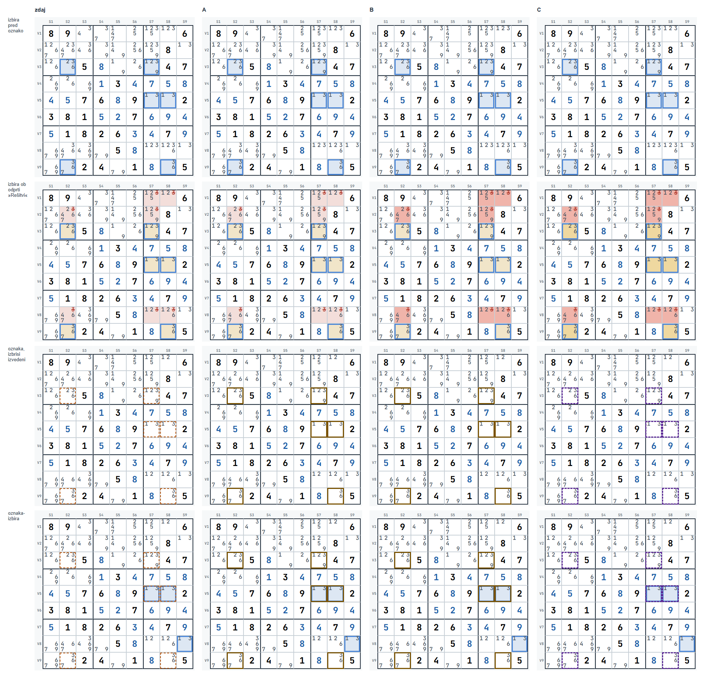
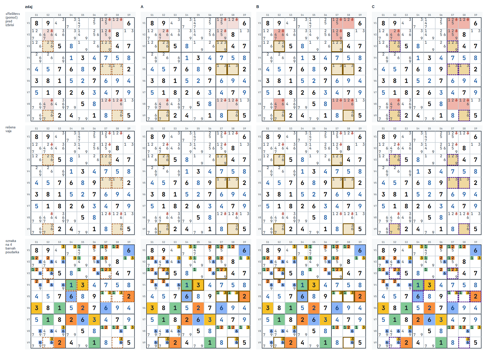
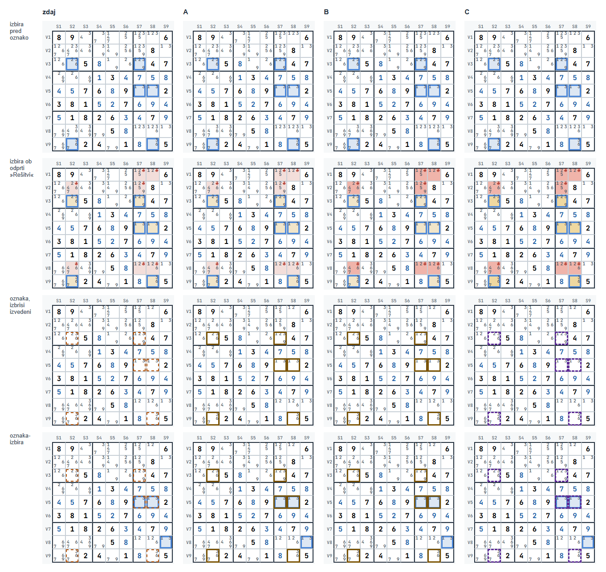
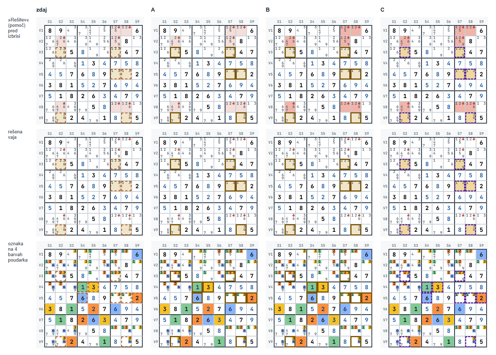

# Vidnost oznak in izbire v treningu (»Vadi v uganki«) – načrt

Naloga: oznake (zaznamki, gumb »◩ Označi izbrane (O)«) se premalo ločijo od celic z izbrisom
in po rešeni vaji od celic vzorca; izbrane celice imajo včasih bež podlago. Pripravljene so
tri različice (A, B, C), posnete na istem stanju pri 375 in 1280 px. Samo slogi – logika in
shramba zaznamkov (`shared/plosca.js`), tipka O, gumbi, »Preveri«, pomoč in zaklep ostanejo.

Stanje: **načrt, čaka na izbor** (razdelek 4).

## 1. Kaj je zdaj in zakaj

Slogi so v `shared/mreza.css` (zaznamki obstajajo samo v treningu »Vadi v uganki« 1–12):

| Kaj | Slog zdaj |
|---|---|
| oznaka (`.celica.zaznamovana`) | 2 px črtkana obroba `--zaznamek` (#B45309, oranžna), `outline` z odmikom −3 px (1–3 px od roba navznoter), brez podlage |
| izbira (`.celica.izbrana`) | podlaga `--izbira-bg` (#DDE7F3) in 3 px polna obroba `--izbira` (#4A86D8) |
| celica vzorca (`.celica.k-vzorec`) | podlaga `--amber-bg` (#F1E5C9, bež) |
| celica z izbrisom (`.celica.k-izbris`) | podlaga `--red-bg` (#F3DEDA, rožnata) |

Oznake koraka (vzorec, izbris) so na mreži, kadar je odprta »Rešitev« (pomoč) ali po
pravilnem odgovoru.

**Opažanje 1 – oznaka proti celicam z izbrisom.** Bež podlaga ni od oznake: to je celica
vzorca ob odprti »Rešitvi« (oznaka sama podlage nima). Bež (vzorec) in rožnata (izbris) imata
**enako svetlost** – kontrast med njima je 1,0, ločita se samo po odtenku. Oznaka je tanka
(2 px) in oranžna, torej iz iste barvne družine kot bež vzorec; na oranžni 3. barvi poudarka
ima kontrast 2,2 in je skoraj ni videti (`zdaj-poudarek-1280.png`, V5S9).

**Opažanje 2 – bež podlaga izbranih celic.** Vzrok: v `shared/mreza.css` imata
`.celica.izbrana { background: var(--izbira-bg) }` in `.celica.k-vzorec { background:
var(--amber-bg) }` enako specifičnost, pravilo vzorca je v datoteki pozneje, zato zmaga.
**To je namerno** – odločitev A2 iz faze 5 (`docs/faza5-nacrt.md`, razdelek 3): »Oznake
koraka (jantarno, rdečkasto, zeleno) imajo prednost pred podlago izbire«; izbiro takrat nosi
modra obroba. Bež se pokaže samo na celicah vzorca ob odprti »Rešitvi«
(`zdaj-izbira-pomoc-*.png`); brez nje je izbrana celica modrikasta – izmerjeno
rgb(221, 231, 243) = #DDE7F3 (`zdaj-izbira-*.png`). Če si bež videl brez odprte »Rešitve«,
mi povej korake – drugega vzroka v kodi nisem našel. **Predlog: ostane** (podlaga pove
oznako koraka, obroba izbiro – pri vseh treh različicah).

**Opažanje 3 – po rešeni vaji.** Celice vzorca dobijo bež podlago; oznaka je na njih tanka
oranžna črtkana obroba – ista barvna družina, 2 px, zato je označena celica vzorca videti
kot neoznačena (`zdaj-resitev-*.png`).

## 2. Različice

Vse tri: oznaka ostane `outline` z odmikom −3 px, pri debelini 3 px torej 0–3 px od roba celice navznoter (riše se **nad** kandidati in
nad poudarjenimi polji kandidatov, zato je vidna na vseh štirih barvah poudarka). Izbrana in označena celica nima posebnega pravila – glej konec razdelka.

| | Oznaka | Podlaga izbrisa | Podlaga vzorca |
|---|---|---|---|
| zdaj | 2 px **črtkana**, #B45309 (oranžna) | #F3DEDA | #F1E5C9 |
| **A** | 3 px **polna**, #7A5200 (temnejša jantarna) | kot zdaj | kot zdaj |
| **B** | kot A | **#F0B4AA** (bolj nasičena rdečkasta) | kot zdaj |
| **C** | 3 px **črtkana**, #5E2B97 (temno vijolična) | #F0B4AA | **#EFD8A0** (močnejša jantarna; tudi kvadratek v legendi) |

CSS prototipa (vstavljen v stran z brskalnikom brez glave; v izvedbi gre v
`shared/mreza.css` in `trening/trening.css`):

```css
/* A */
.celica.zaznamovana{ outline:3px solid #7A5200; outline-offset:-3px; }
/* B = A in */
.vaja-uganka .celica.k-izbris{ background:#F0B4AA; }
/* C */
.celica.zaznamovana{ outline:3px dashed #5E2B97; outline-offset:-3px; }
.vaja-uganka .celica.k-vzorec{ background:#EFD8A0; }
.vaja-uganka .celica.k-izbris{ background:#F0B4AA; }
.legenda-vaje .sw-vzorec{ background:#EFD8A0; }
```

**Zakaj predlagam C.** Barva ni edini nosilec razlike:

- **oblika:** oznaka je črtkana, izbira polna (modra), okvir območja pri vajah 1–6 polna
  temna črta, črte blokov polne črne. Pri A in B sta oznaka in izbira obe polni obrobi na
  istem mestu – ločita se samo po barvi (jantarna proti modri);
- **odtenek:** vijolične ni v nobeni drugi oznaki pri 1–12 (jantarna = vzorec, rdeča =
  izbris, modra = izbira, zelena = vpis, temno modra = območje). Pri A in B je oznaka
  jantarna kot vzorec – po rešeni vaji je obroba iste družine kot podlaga pod njo;
- **svetlost:** najtemnejša od treh barv, zato ima najvišji kontrast na vsaki podlagi
  (tabela spodaj) – tudi na bledih odtenkih, ki se na tvojem zaslonu slabo vidijo;
- celice z izbrisom imajo poleg podlage še rdeče prečrtane kandidate (oblika), celice vzorca
  pri C močnejšo jantarno podlago.

Kontrast barve oznake s podlago (razmerje svetlosti po WCAG; neodvisno od odtenka, 3,0 je
meja za opazne grafične elemente):

| Podlaga | zdaj #B45309 | A, B #7A5200 | C #5E2B97 |
|---|---|---|---|
| bela | 5,0 | 6,9 | 9,3 |
| vzorec #F1E5C9 / C #EFD8A0 | 4,0 / 3,6 | 5,5 / 4,9 | 7,4 / 6,6 |
| izbris #F3DEDA / B, C #F0B4AA | 3,9 / 2,8 | 5,4 / 3,9 | 7,2 / 5,2 |
| izbira #DDE7F3 | 4,0 | 5,5 | 7,4 |
| 1. poudarek (rumena) | 3,0 | 4,1 | 5,5 |
| 2. poudarek (zelena) | 2,6 | 3,5 | 4,7 |
| 3. poudarek (oranžna) | **2,2** | 3,0 | 4,0 |
| 4. poudarek (modra) | 2,4 | 3,3 | 4,4 |

Podlage same so blede: proti beli imajo kontrast 1,3 (vzorec, izbris, izbira), močnejši
odtenki 1,4 (C vzorec) in 1,8 (B, C izbris). Vzorec proti izbrisu: zdaj 1,0, B 1,4, C 1,3 –
zato pri C razliko med njima nosita tudi odtenek in prečrtani kandidati.

**Izbrana in označena celica** (`*-oznaka-izbira-*.png`, V5S7 in V5S8): oznaka (`outline`)
leži nad obrobo izbire (`box-shadow`). Pri A in B polna oznaka obrobo izbire prekrije – izbiro
pokaže samo modrikasta podlaga; pri C se modra vidi v presledkih črtk. Preizkusil sem tudi
oznako, pomaknjeno navznoter, in širšo obrobo izbire pod njo: pri 375 px (celica 30 px,
kandidat 10 px) obe prekrijeta kandidate ob robu celice (sivo na modrem se ne bere), zato
posebnega pravila ni. Ta primer je redek (odznačevanje, Ctrl+klik).

**Debelina pri 375 px:** 3 px obroba ob robu prekrije zgornji in spodnji rob števk kandidatov
ob robu za pribl. 1,5 px; na posnetkih ostanejo berljive. Pri 2 px (kot zdaj) bi bila oznaka
na telefonu tanjša – glej O3.

## 3. Posnetki

Stanje: trening, vaja 8 · Mečarica, »Vadi v uganki«, vaja 7 / 9 iz banke (`Math.random` s
semenom 4, kot v `tools/preveri-vadi-brskalnik.js`); korak: vzorec V3S2, V3S7, V5S7, V5S8,
V9S2, V9S8, izbris 3 iz V1S7, V1S8, V2S2, V2S7, V8S2, V8S7, V8S8. Vsi kliki so pravi (miška,
gumb »Označi izbrane«, niz »Odstrani«, tipka O, »Preveri«, »Rešitev«). Izrez je mreža z
oznakami robov.

Pregled – vrstice so stanja, stolpci različice (zdaj, A, B, C):

**1280 px**





**375 px**





Posamezni posnetki v `docs/slike/oznake/` so `<različica>-<stanje>-<širina>.png`
(različica `zdaj`, `a`, `b`, `c`; širina 375 ali 1280):

| Stanje | Kaj kaže |
|---|---|
| `izbira` | celice vzorca izbrane (»več celic«), še brez oznake |
| `izbira-pomoc` | isto ob odprti »Rešitvi« – podlaga vzorca prekrije podlago izbire (opažanje 2) |
| `oznaka` | vzorec označen, izbrisi izvedeni (glavno stanje) |
| `oznaka-izbira` | isto, izbrane so še dve označeni celici (V5S7, V5S8) in neoznačena V8S9 |
| `pomoc` | vzorec označen, »Rešitev« odprta pred izbrisi – oznake ob rožnatih celicah z izbrisom (opažanje 1) |
| `resitev` | rešena vaja (»Preveri« → »Pravilno!«) – oznake na celicah vzorca (opažanje 3) |
| `poudarek` | glavno stanje, »več hkrati«, poudarjene 3, 1, 2, 6 (rumena, zelena, oranžna, modra); označena je še po ena polna celica vsake števke: V4S5 (3), V4S4 (1), V5S9 (2), V5S4 (6) |

## 4. Odločitve (predlagam, odločiš ti)

- **O1 – različica:** A, B ali **C (predlog)**. Kombinacije so mogoče (npr. C brez močnejše
  podlage vzorca).
- **O2 – kje veljajo močnejše podlage (B, C):**
  - **a (predlog): ves trening** – »Vadi v uganki« in »Spoznaj« (E1, E2, 1 in 2 imajo iste
    oznake koraka iz `shared/mreza.js`; pri E1/E2 je enota v »Rešitvi« jantarna). Izvedba:
    spremenljivki `--k-vzorec-bg` in `--k-izbris-bg` v `shared/mreza.css` s sedanjima
    vrednostma, `trening/trening.css` ju nastavi. Igra (»Naslednji korak«) in reševalec
    (mala mreža koraka ima svoje sloge v `app/app.css`) ostaneta – če želiš, gre v »Kasneje«
    (`docs/uskladitev.md`), da se spremenita skupaj.
  - b: samo »Vadi v uganki« (kot prototip) – »Spoznaj« bi imel iste oznake bledejše.
  - c: tudi igra (`shared/mreza.css`) – reševalec bi se razlikoval od igre.
- **O3 – debelina oznake:** **3 px povsod (predlog)** ali 2 px pri ozki mreži (telefon) in
  3 px pri široki.
- **O4 – Kasneje, ne zdaj:** v legendi pod »Pravilno!« postavka »tvoje oznake« (črtkan
  kvadratek). Ni samo slog (`legendaKoraka()` v `trening/v-uganki.js`), zato je zunaj te
  naloge.

Oznaka zaznamka (`--zaznamek`) in pravilo `.celica.zaznamovana` ostaneta v `shared/mreza.css`
(zaznamke uporablja samo trening); igra se ne spremeni.

## 5. Izvedba po izboru

1. Načrt in posnetki prototipa (ta dokument).
2. Slogi: `shared/mreza.css` (`--zaznamek`, `.celica.zaznamovana`, pri B/C spremenljivki
   podlag), `trening/trening.css` (podlage, kvadratek legende); besedila v `CLAUDE.md`,
   `docs/rocni-test.md` in komentarjih (»oranžna črtkana obroba«).
3. Preverjanje: testi (`node --test "tests/*.test.js"`), posnetek igre `--primerjaj` (igra
   mora ostati enaka), `tools/preveri-vadi-brskalnik.js` (zaznamki: izračunan slog oznake –
   zdaj preverja `dashed rgb(180, 83, 9)` –; novo: oznaka na štirih barvah poudarka, podlagi
   vzorca in izbrisa ob »Rešitvi« in po pravilnem odgovoru, izbrana in označena celica, brez
   preliva pri 375 in 1280 px), `preveri-videz-`, `preveri-enojcki-` in
   `preveri-presek-brskalnik.js` (»Spoznaj« ostane enak izhodišču – primerjava gleda prvo
   vajo brez oznak koraka).
4. Ročni pregled: en sam, na koncu, največ 5 točk (videz na tvojem zaslonu – brskalnik brez
   glave izmeri slog, ne pa, ali ga vidiš).

Commit in push po vsakem koraku.
