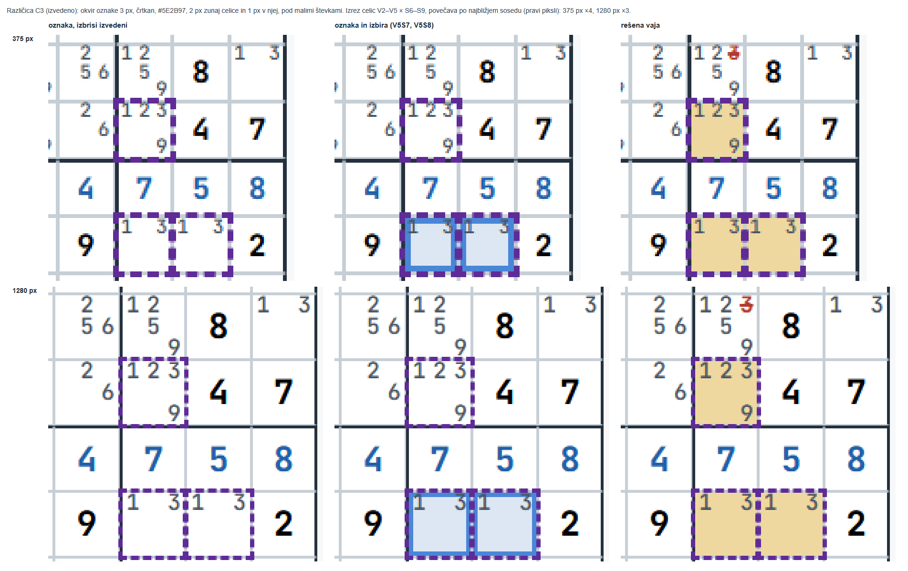

# Vidnost oznak in izbire v treningu (»Vadi v uganki«) – načrt

Naloga: oznake (zaznamki, gumb »◩ Označi izbrane (O)«) se premalo ločijo od celic z izbrisom
in po rešeni vaji od celic vzorca; izbrane celice imajo včasih bež podlago. Pripravljene so
tri različice (A, B, C), posnete na istem stanju pri 375 in 1280 px. Samo slogi – logika in
shramba zaznamkov (`shared/plosca.js`), tipka O, gumbi, »Preveri«, pomoč in zaklep ostanejo.

Stanje: **izvedeno 2026-10-03** – različica **C3** (razdelka 6 in 7), ročni pregled (5 točk v
`docs/rocni-test.md`, »Trening: vidnost oznak«) potrjen istega dne; O2 dokončan za vaje 3–12 v
»Spoznaj« (razdelek 8).

**Odločitve (Darko, 2026-10-03):**

- **O1:** C, a z drugačnim okvirjem – pri C 3 px okvir zakriva male števke v kotih (pri 375 in
  1280 px). Preizkusi **C2** (okvir 2 px kot zdaj, vijoličen, črtkan) in **C3** (okvir 3 px,
  risan navzven čez mrežno črto; v celico sega največ toliko kot sedanji okvir 2 px). Izmeri na
  posnetkih, ali okvir prekrije kak piksel male števke v označeni in v sosednjih celicah pri
  375 in 1280 px. C3, če ne prekriva nikjer, sicer C2. → **C3** (meritev v razdelku 6).
- **O2:** močnejši podlagi za ves trening, tudi »Spoznaj«; igra in reševalec ostaneta.
  V »Kasneje«: uskladitev podlag vzorca in izbrisa v igri in reševalcu s treningom.
- **O3:** izbrana debelina, enaka pri vseh širinah (3 px).
- **O4:** postavka »tvoje oznake« v legendi gre v »Kasneje«.

Razdelki 1–5 so načrt, kot je bil predložen (posnetki A, B, C so prototip).

## 1. Kaj je zdaj in zakaj

Slogi so v `shared/mreza.css` (zaznamki obstajajo samo v treningu »Vadi v uganki« 1–12):

| Kaj | Slog zdaj |
|---|---|
| oznaka (`.celica.zaznamovana`) | 2 px črtkana obroba `--zaznamek` (#B45309, oranžna), `outline` z odmikom −3 px (1–3 px od roba navznoter), brez podlage |
| izbira (`.celica.izbrana`) | podlaga `--izbira-bg` (#DDE7F3) in 3 px polna obroba `--izbira` (#4A86D8) |
| celica vzorca (`.celica.k-vzorec`) | podlaga `--amber-bg` (#F1E5C9, bež) |
| celica z izbrisom (`.celica.k-izbris`) | podlaga `--red-bg` (#F3DEDA, rožnata) |

Oznake koraka (vzorec, izbris) so na mreži, kadar je odprta »Rešitev« (pomoč) ali po
pravilnem odgovoru.

**Opažanje 1 – oznaka proti celicam z izbrisom.** Bež podlaga ni od oznake: to je celica
vzorca ob odprti »Rešitvi« (oznaka sama podlage nima). Bež (vzorec) in rožnata (izbris) imata
**enako svetlost** – kontrast med njima je 1,0, ločita se samo po odtenku. Oznaka je tanka
(2 px) in oranžna, torej iz iste barvne družine kot bež vzorec; na oranžni 3. barvi poudarka
ima kontrast 2,2 in je skoraj ni videti (`zdaj-poudarek-1280.png`, V5S9).

**Opažanje 2 – bež podlaga izbranih celic.** Vzrok: v `shared/mreza.css` imata
`.celica.izbrana { background: var(--izbira-bg) }` in `.celica.k-vzorec { background:
var(--amber-bg) }` enako specifičnost, pravilo vzorca je v datoteki pozneje, zato zmaga.
**To je namerno** – odločitev A2 iz faze 5 (`docs/faza5-nacrt.md`, razdelek 3): »Oznake
koraka (jantarno, rdečkasto, zeleno) imajo prednost pred podlago izbire«; izbiro takrat nosi
modra obroba. Bež se pokaže samo na celicah vzorca ob odprti »Rešitvi«
(`zdaj-izbira-pomoc-*.png`); brez nje je izbrana celica modrikasta – izmerjeno
rgb(221, 231, 243) = #DDE7F3 (`zdaj-izbira-*.png`). Če si bež videl brez odprte »Rešitve«,
mi povej korake – drugega vzroka v kodi nisem našel. **Predlog: ostane** (podlaga pove
oznako koraka, obroba izbiro – pri vseh treh različicah).

**Opažanje 3 – po rešeni vaji.** Celice vzorca dobijo bež podlago; oznaka je na njih tanka
oranžna črtkana obroba – ista barvna družina, 2 px, zato je označena celica vzorca videti
kot neoznačena (`zdaj-resitev-*.png`).

## 2. Različice

Vse tri: oznaka ostane `outline` z odmikom −3 px, pri debelini 3 px torej 0–3 px od roba celice navznoter (riše se **nad** kandidati in
nad poudarjenimi polji kandidatov, zato je vidna na vseh štirih barvah poudarka). Izbrana in označena celica nima posebnega pravila – glej konec razdelka.

| | Oznaka | Podlaga izbrisa | Podlaga vzorca |
|---|---|---|---|
| zdaj | 2 px **črtkana**, #B45309 (oranžna) | #F3DEDA | #F1E5C9 |
| **A** | 3 px **polna**, #7A5200 (temnejša jantarna) | kot zdaj | kot zdaj |
| **B** | kot A | **#F0B4AA** (bolj nasičena rdečkasta) | kot zdaj |
| **C** | 3 px **črtkana**, #5E2B97 (temno vijolična) | #F0B4AA | **#EFD8A0** (močnejša jantarna; tudi kvadratek v legendi) |

CSS prototipa (vstavljen v stran z brskalnikom brez glave; v izvedbi gre v
`shared/mreza.css` in `trening/trening.css`):

```css
/* A */
.celica.zaznamovana{ outline:3px solid #7A5200; outline-offset:-3px; }
/* B = A in */
.vaja-uganka .celica.k-izbris{ background:#F0B4AA; }
/* C */
.celica.zaznamovana{ outline:3px dashed #5E2B97; outline-offset:-3px; }
.vaja-uganka .celica.k-vzorec{ background:#EFD8A0; }
.vaja-uganka .celica.k-izbris{ background:#F0B4AA; }
.legenda-vaje .sw-vzorec{ background:#EFD8A0; }
```

**Zakaj predlagam C.** Barva ni edini nosilec razlike:

- **oblika:** oznaka je črtkana, izbira polna (modra), okvir območja pri vajah 1–6 polna
  temna črta, črte blokov polne črne. Pri A in B sta oznaka in izbira obe polni obrobi na
  istem mestu – ločita se samo po barvi (jantarna proti modri);
- **odtenek:** vijolične ni v nobeni drugi oznaki pri 1–12 (jantarna = vzorec, rdeča =
  izbris, modra = izbira, zelena = vpis, temno modra = območje). Pri A in B je oznaka
  jantarna kot vzorec – po rešeni vaji je obroba iste družine kot podlaga pod njo;
- **svetlost:** najtemnejša od treh barv, zato ima najvišji kontrast na vsaki podlagi
  (tabela spodaj) – tudi na bledih odtenkih, ki se na tvojem zaslonu slabo vidijo;
- celice z izbrisom imajo poleg podlage še rdeče prečrtane kandidate (oblika), celice vzorca
  pri C močnejšo jantarno podlago.

Kontrast barve oznake s podlago (razmerje svetlosti po WCAG; neodvisno od odtenka, 3,0 je
meja za opazne grafične elemente):

| Podlaga | zdaj #B45309 | A, B #7A5200 | C #5E2B97 |
|---|---|---|---|
| bela | 5,0 | 6,9 | 9,3 |
| vzorec #F1E5C9 / C #EFD8A0 | 4,0 / 3,6 | 5,5 / 4,9 | 7,4 / 6,6 |
| izbris #F3DEDA / B, C #F0B4AA | 3,9 / 2,8 | 5,4 / 3,9 | 7,2 / 5,2 |
| izbira #DDE7F3 | 4,0 | 5,5 | 7,4 |
| 1. poudarek (rumena) | 3,0 | 4,1 | 5,5 |
| 2. poudarek (zelena) | 2,6 | 3,5 | 4,7 |
| 3. poudarek (oranžna) | **2,2** | 3,0 | 4,0 |
| 4. poudarek (modra) | 2,4 | 3,3 | 4,4 |

Podlage same so blede: proti beli imajo kontrast 1,3 (vzorec, izbris, izbira), močnejši
odtenki 1,4 (C vzorec) in 1,8 (B, C izbris). Vzorec proti izbrisu: zdaj 1,0, B 1,4, C 1,3 –
zato pri C razliko med njima nosita tudi odtenek in prečrtani kandidati.

**Izbrana in označena celica** (`*-oznaka-izbira-*.png`, V5S7 in V5S8): oznaka (`outline`)
leži nad obrobo izbire (`box-shadow`). Pri A in B polna oznaka obrobo izbire prekrije – izbiro
pokaže samo modrikasta podlaga; pri C se modra vidi v presledkih črtk. Preizkusil sem tudi
oznako, pomaknjeno navznoter, in širšo obrobo izbire pod njo: pri 375 px (celica 30 px,
kandidat 10 px) obe prekrijeta kandidate ob robu celice (sivo na modrem se ne bere), zato
posebnega pravila ni. Ta primer je redek (odznačevanje, Ctrl+klik).

**Debelina pri 375 px:** 3 px obroba ob robu prekrije zgornji in spodnji rob števk kandidatov
ob robu za pribl. 1,5 px; na posnetkih ostanejo berljive. Pri 2 px (kot zdaj) bi bila oznaka
na telefonu tanjša – glej O3.

## 3. Posnetki

Stanje: trening, vaja 8 · Mečarica, »Vadi v uganki«, vaja 7 / 9 iz banke (`Math.random` s
semenom 4, kot v `tools/preveri-vadi-brskalnik.js`); korak: vzorec V3S2, V3S7, V5S7, V5S8,
V9S2, V9S8, izbris 3 iz V1S7, V1S8, V2S2, V2S7, V8S2, V8S7, V8S8. Vsi kliki so pravi (miška,
gumb »Označi izbrane«, niz »Odstrani«, tipka O, »Preveri«, »Rešitev«). Izrez je mreža z
oznakami robov.

Pregled – vrstice so stanja, stolpci različice (zdaj, A, B, C):

**1280 px**


**375 px**


Posamezni posnetki v `docs/slike/oznake/` so `<različica>-<stanje>-<širina>.png`
(različica `zdaj`, `a`, `b`, `c`; širina 375 ali 1280):

| Stanje | Kaj kaže |
|---|---|
| `izbira` | celice vzorca izbrane (»več celic«), še brez oznake |
| `izbira-pomoc` | isto ob odprti »Rešitvi« – podlaga vzorca prekrije podlago izbire (opažanje 2) |
| `oznaka` | vzorec označen, izbrisi izvedeni (glavno stanje) |
| `oznaka-izbira` | isto, izbrane so še dve označeni celici (V5S7, V5S8) in neoznačena V8S9 |
| `pomoc` | vzorec označen, »Rešitev« odprta pred izbrisi – oznake ob rožnatih celicah z izbrisom (opažanje 1) |
| `resitev` | rešena vaja (»Preveri« → »Pravilno!«) – oznake na celicah vzorca (opažanje 3) |
| `poudarek` | glavno stanje, »več hkrati«, poudarjene 3, 1, 2, 6 (rumena, zelena, oranžna, modra); označena je še po ena polna celica vsake števke: V4S5 (3), V4S4 (1), V5S9 (2), V5S4 (6) |

## 4. Odločitve (predlagam, odločiš ti)

- **O1 – različica:** A, B ali **C (predlog)**. Kombinacije so mogoče (npr. C brez močnejše
  podlage vzorca).
- **O2 – kje veljajo močnejše podlage (B, C):**
  - **a (predlog): ves trening** – »Vadi v uganki« in »Spoznaj« (E1, E2, 1 in 2 imajo iste
    oznake koraka iz `shared/mreza.js`; pri E1/E2 je enota v »Rešitvi« jantarna). Izvedba:
    spremenljivki `--k-vzorec-bg` in `--k-izbris-bg` v `shared/mreza.css` s sedanjima
    vrednostma, `trening/trening.css` ju nastavi. Igra (»Naslednji korak«) in reševalec
    (mala mreža koraka ima svoje sloge v `app/app.css`) ostaneta – če želiš, gre v »Kasneje«
    (`docs/uskladitev.md`), da se spremenita skupaj.
  - b: samo »Vadi v uganki« (kot prototip) – »Spoznaj« bi imel iste oznake bledejše.
  - c: tudi igra (`shared/mreza.css`) – reševalec bi se razlikoval od igre.
- **O3 – debelina oznake:** **3 px povsod (predlog)** ali 2 px pri ozki mreži (telefon) in
  3 px pri široki.
- **O4 – Kasneje, ne zdaj:** v legendi pod »Pravilno!« postavka »tvoje oznake« (črtkan
  kvadratek). Ni samo slog (`legendaKoraka()` v `trening/v-uganki.js`), zato je zunaj te
  naloge.

Oznaka zaznamka (`--zaznamek`) in pravilo `.celica.zaznamovana` ostaneta v `shared/mreza.css`
(zaznamke uporablja samo trening); igra se ne spremeni.

## 5. Izvedba po izboru

1. Načrt in posnetki prototipa (ta dokument).
2. Slogi: `shared/mreza.css` (`--zaznamek`, `.celica.zaznamovana`, pri B/C spremenljivki
   podlag), `trening/trening.css` (podlage, kvadratek legende); besedila v `CLAUDE.md`,
   `docs/rocni-test.md` in komentarjih (»oranžna črtkana obroba«).
3. Preverjanje: testi (`node --test "tests/*.test.js"`), posnetek igre `--primerjaj` (igra
   mora ostati enaka), `tools/preveri-vadi-brskalnik.js` (zaznamki: izračunan slog oznake –
   zdaj preverja `dashed rgb(180, 83, 9)` –; novo: oznaka na štirih barvah poudarka, podlagi
   vzorca in izbrisa ob »Rešitvi« in po pravilnem odgovoru, izbrana in označena celica, brez
   preliva pri 375 in 1280 px), `preveri-videz-`, `preveri-enojcki-` in
   `preveri-presek-brskalnik.js` (»Spoznaj« ostane enak izhodišču – primerjava gleda prvo
   vajo brez oznak koraka).
4. Ročni pregled: en sam, na koncu, največ 5 točk (videz na tvojem zaslonu – brskalnik brez
   glave izmeri slog, ne pa, ali ga vidiš).

Commit in push po vsakem koraku.

## 6. Meritev: C2 in C3

**Kako:** brskalnik brez glave, ista vaja kot posnetki (mečarica, vaja 7 / 9), štirje posnetki
mreže pri 1x (brez povečave): končni, brez okvirja, brez malih števk (`.kand` prozoren – tudi
prečrtani) in brez obojega. Piksel male števke je tisti, ki ga števka spremeni; okvir ga
**zakrije**, če je na končni sliki enak sliki brez števk (števke tam ni videti). Šteje se po
celicah – v označeni ali v sosednji. Poleg treh stanj (oznaka z izvedenimi izbrisi, oznaka in
izbira, rešena vaja) še sestavljen **najslabši primer**: v vsaki prazni celici vseh 9
kandidatov (tudi 4, 6, 8 ob robovih), označene vse celice ali vsaka druga (šahovnica 1 in 2 –
vsaka meja med označeno in neoznačeno celico v obe smeri).

Zakriti piksli (stanja: oznaka / oznaka in izbira / rešena vaja; najslabši primer: vse
označene / šahovnica 1 / šahovnica 2):

| | 375 px, stanja | 375 px, najslabši | 1280 px, stanja | 1280 px, najslabši |
|---|---|---|---|---|
| **C2** (2 px, 1–3 px v celici, nad števkami) | **100 / 98 / 100** | 1102 / 500 / 602 | **67 / 65 / 67** | 681 / 310 / 371 |
| **C3** (3 px, 2 px zunaj, 1 px v celici, nad števkami) | **2 / 2 / 2** | 25 / 64 / 60 | **0 / 0 / 0** | 0 / 146 / 126 |
| **C3 pod malimi števkami** (izvedeno) | **0 / 0 / 0** | 0 / 0 / 0 | **0 / 0 / 0** | 0 / 0 / 0 |

- **C2** zakrije števke **v označeni celici** pri obeh širinah (V3S2 25, V3S7 26, V5S7 14,
  V5S8 15, V9S2 12, V9S8 8 pikslov pri 375 px) – leži 1–3 px od roba, kjer so vrhovi in dna
  malih števk. Tudi sedanji oranžni okvir ima to geometrijo. Prvotna C (3 px, 0–3 px v celici)
  se je v prvi meritvi s števkami stikala v 86 / 84 / 86 (375 px) in 101 / 97 / 101 pikslih
  (1280 px) – podobno kot C2.
- **C3** (navaden `outline`) pri 375 px zakrije po 1 piksel vrha števke v zgornji vrstici
  (V3S2, V3S7): na 30 px celici seže vrh števke 1–3 do 1 px od roba celice – v vrstico pikslov
  mrežne črte. Na šahovnici zakrije tudi števke v **sosednji** celici (pri 375 px 51 in 48,
  pri 1280 px 146 in 126 pikslov): označena celica, ki je v vrstnem redu prej, nariše okvir
  čez vrhove števk celice pod njo.
- Zato noben okvir ob robu celice pri 375 px ne more biti brez **stika** s števkami. Izvedena
  C3 je narisana **pod malimi števkami**: okvir je na `::after` (z-index 2, nad sosednjimi
  celicami), male števke v »Vadi v uganki« imajo z-index 3 – vrh števke, ki seže v okvir, je
  narisan nad njim. Stik (piksli, kjer sta oba – števka nad okvirjem): 375 px 9 / 9 / 9 in
  253 / 167 / 161, 1280 px 0 / 0 / 0 in 364 / 196 / 168.
- Rob glajenja: v najslabšem primeru pri 375 px so 3, 6 in 3 piksli, kjer števka sliko
  spremeni za največ 3/255 (skoraj prozoren rob črke), na končni sliki pa so enaki okvirju –
  mešanica se zaokroži v barvo okvirja. Takega piksla ni videti, zato se ne šteje (pri polnem
  okvirju namesto črtkanega jih ni).

**Izbira: C3** (pod malimi števkami) – ne zakrije nobenega vidnega piksla male števke ne v
označeni ne v sosednji celici, pri 375 in 1280 px, tudi v najslabšem primeru. Če pravilo
»ne prekriva« bereš strožje (okvir se števk sploh ne sme dotikati), ga pri 375 px ne izpolni
nobena različica (C3 9 pikslov stika, C2 100 zakritih) – povej in izmerim drugo postavitev.

Kontrola meritve: ko so male števke za poskus pod okvirjem (z-index 1), meritev najde 4
zakrite piksle v V3S2 in V3S7 ter 92–149 v najslabšem primeru.

## 7. Izvedba

| Korak | Commit | Kaj |
|---|---|---|
| 1 | `4155ba5` | načrt in posnetki prototipa (A, B, C) |
| 2 | `f5ff3fe` | slogi C3, podlagi, preverjanje v brskalniku, dokumentacija, slika |



`c3-izvedeno.png`: izrez celic V2–V5 × S6–S9 (označene V3S7, V5S7 in V5S8 z malimi števkami
v kotih), povečava po najbližjem sosedu – pravi piksli pri 375 px (×4) in 1280 px (×3);
oznaka z izvedenimi izbrisi, oznaka in izbira (V5S7, V5S8 izbrani), rešena vaja.

**Slogi:**

- `shared/mreza.css`: `--zaznamek` #5E2B97; `.celica.zaznamovana::after` – `inset:-3px` od
  notranjega roba obrobe celice, `border: 3px dashed`, `z-index: 2`, `pointer-events: none`.
  Ob tanki črti (obroba 1 px) sega okvir 1 px v celico (njena obroba) in 2 px ven (obroba
  sosednje celice in 1 px njene vsebine), ob debeli črti bloka (obroba 2 px) ostane v obeh
  obrobah – 2 px v svoji, 1 px v sosednji. `outline` zaznamka odpade. Okvir območja
  (`.celica.obm::before`) z-index 1 → 4, da ostane nad malimi števkami kot prej. Spremenljivki
  `--k-vzorec-bg` (`--amber-bg`) in `--k-izbris-bg` (`--red-bg`) za `.celica.k-vzorec` in
  `.celica.k-izbris` – igra ima isti barvi kot prej.
- `trening/trening.css`: `--k-vzorec-bg` #EFD8A0 in `--k-izbris-bg` #F0B4AA (vse mreže iz
  `shared/mreza.js` v treningu: »Vadi v uganki«, »Spoznaj« E1, E2, 1 in 2), kvadratek legende
  iz `--k-vzorec-bg`, `.vaja-uganka .kandidati { position: relative; z-index: 3 }`.
- Izbrana in označena celica: obroba izbire (1–4 px v celici) in okvir oznake (2 px zunaj, 1 px
  v celici) se ne prekrivata – vidna sta oba (srednji stolpec slike).
- `::after` ima tudi senčenje (`zasencena`, samo E1/E2); zaznamki so samo pri 1–12, zato nista
  nikoli hkrati.

**Ne spremeni se:** logika in shramba zaznamkov, tipka O, gumbi, igra (posnetek igre: 99
enakih posnetkov; podlagi in male števke v igri preveri scenarij), reševalec, sestavljene vaje
3–12 v »Spoznaj« (svoje mreže, `.gc`/`.xw-cell` – v tem koraku še `--red-bg`; dopolnjeno v
razdelku 8).

**Preverjanje (vse drži):** testi 431 / 431; `tools/posnetek-igre.js --primerjaj
tools/posnetki/igra-po-5a.json` enako (99); `tools/preveri-vadi-brskalnik.js` (z novim delom
»oznake« pri 375 in 1280 px – slog okvirja in plasti, zakriti piksli v treh stanjih in
najslabšem primeru, izbrana in označena celica, okvir na štirih barvah poudarka – kontrast
vsaj 3, na posnetku viden –, podlagi v »Rešitvi«, po pravilnem odgovoru in v »Spoznaj«, igra
nespremenjena, brez vodoravnega drsnika; »Spoznaj« enak izhodišču `4e1e4dc`),
`preveri-videz-`, `preveri-enojcki-`, `preveri-presek-` in `preveri-kandidati-brskalnik.js`.

Kontrast okvirja (#5E2B97) s podlago: bela 9,3, vzorec #EFD8A0 6,6, izbris #F0B4AA 5,2, izbira
7,4, poudarki 5,5 / 4,7 / 4,0 / 4,4 (privzete barve).

## 8. Dopolnitev O2: vaje 3–12 v »Spoznaj«

**Odločitve (Darko, 2026-10-03, po ročnem pregledu):** vseh 5 točk potrjenih. C3, kot je
izveden, ostane – dotik okvirja in števke je sprejemljiv. Obroba izbire ostane, kot je (na
telefonu je videti širša, števke so vidne). O2 dokončati: močnejši podlagi veljata tudi v
mrežah vaj 3–12 v »Spoznaj« (dogovor je bil ves trening); v »Kasneje« ostaneta samo igra in
reševalec.

Vaje 3–12 v »Spoznaj« imajo svoje mreže (`.gc` – vrsta, stolpec, blok in mreža 9 × 9 pri 9–12,
`.xw-cell` – mreža ene števke pri 7 in 8). Spremenjena pravila v `trening/trening.css`:

| Pravilo | Kdaj | Prej | Zdaj |
|---|---|---|---|
| `.gc.peek-hl` | »Rešitev (drži)«, celice vzorca (3–6, 9–12) | #FFFCE8, obroba #C8A020 | `--k-vzorec-bg` (#EFD8A0), obroba ista |
| `.xw-cell.peek-hl` | »Rešitev (drži)«, celice vzorca (7, 8) | `--green-bg`, zelena obroba | `--k-vzorec-bg`, obroba #C8A020 |
| `.gc.peek-elim`, `.xw-cell.peek-elim` | »Rešitev (drži)«, celice izbrisa | `--red-bg` | `--k-izbris-bg` (#F0B4AA) |
| `.gc.elimcell`, `.xw-cell.xw-elim` | po pravilnem odgovoru, celice izbrisa | `--red-bg` | `--k-izbris-bg` |
| `:where(.gc.peek-hl, .gc.peek-elim, .gc.elimcell) .cd` | sivi kandidati v teh celicah | `--pencil` | `--kand-ink` (#4A5561) |

- **X-krilo in mečarica:** vzorec v »Rešitvi« je bil zelen kot pravilen odgovor; zdaj je jantaren
  kot pri drugih tehnikah in v »Vadi v uganki« (podlaga vzorca). Zelena ostane za pravilen
  odgovor (`.gc.correct`, `.xw-cell.xw-correct` – nespremenjena).
- **Kandidati:** sivi kandidat (`--pencil`) je imel na prejšnjih podlagah kontrast 3,0 (#FFFCE8) in
  2,4 (#F3DEDA), na novih bi imel 2,2 in 1,7. Zato je v celicah vzorca in izbrisa temnejši
  (`--kand-ink`): 5,4 na vzorcu, 4,3 na izbrisu. Obarvani (`.cd.hl-*`) in prečrtani (`.cd.elim`,
  rdeč) ostanejo v svojih barvah – `:where()` ima specifičnost samo `.cd`. Najmanjši izmerjeni
  kontrast besedila v teh celicah je 3,3 (rdeče prečrtan kandidat na izbrisu, XY-krilo).
- **Edinstveni pravokotnik:** celica izbrisa je tudi celica vzorca (četrti vogal) – ima obe oznaki
  in prednost ima vzorec, kot prej.
- **Ne spremeni se:** izbira (barve tehnik, `.gc.selected-*`), pravilen odgovor (zeleno; sivi
  kandidati na njem imajo kontrast 2,6, kot prej), prvi izris vaje (primerjava »Spoznaj« z
  izhodiščem `4e1e4dc` enaka), igra in reševalec.
- **Izbira pri 3 · Očitni par** je jantarna (`.gc.selected-amber`, #F1E5C9, obroba #9C6B12) – ob
  »Rešitvi« se od vzorca (#EFD8A0, obroba #C8A020) loči s kontrastom podlag 1,1 in obrob 1,9;
  prej je bila razlika podlag 1,2 (#FFFCE8). Ročna točka v `docs/rocni-test.md`.

**Preverjanje:** `tools/preveri-vadi-brskalnik.js`, nov del »Spoznaj 3–12« pri 375 in 1280 px: za
vseh 10 tehnik »Rešitev (drži)« s pravim pritiskom miške – podlaga in obroba vzorca, podlaga
izbrisa, kontrast vsega besedila v teh celicah vsaj 3, brez vodoravnega drsnika; pri 3, 7 in 11
še pravilen odgovor s pravimi kliki (celice, ki jih je pokazala »Rešitev«) – izbrane celice
zelene, podlaga in kontrast izbrisa; vsi razredi oznak 3–12 tudi na sestavljenih celicah (barva
podlage in kandidatov). Barve se berejo po koncu prehoda podlage (`.gc` in `.xw-cell` imata
`transition` 0,12 s).

**Opažena napaka (ni popravljena, v »Kasneje«):** »Namig (drži)« in »Rešitev (drži)« se ob
pritisku z miško takoj skrijeta, če je stran pomaknjena do konca. Okvir z besedilom se pokaže
pod gumbom, stran se zamakne za njegovo višino (11 · XY-krilo, okno 1280 × 1000: `scrollY` 59 →
129 pri »Rešitvi«, 59 → 170 pri »Namigu«), gumb uide izpod miške in `mouseleave` okvir skrije.
Enako v `4e1e4dc`, torej ne zaradi te naloge. Scenarij pred pritiskom doda prostor pod vsebino.

| Korak | Commit | Kaj |
|---|---|---|
| 3 | (ta commit) | vaje 3–12 v »Spoznaj«: podlagi, kandidati, preverjanje, dokumentacija |
