# Pripomočki za E1 in E2 v »Spoznaj« – načrt

Naloga: vaji **E1 · Očitni enojček** in **E2 · Skriti enojček** v načinu »Spoznaj«
(trening) izrišeta mrežo skozi `shared/mreza.js` namesto lastnega izrisa v
`trening/trening.js` in dobita pripomočke kot v igri: poudarek števk (tudi »več hkrati«)
in sezname manjkajočih števk (vrstice, stolpci, bloki). Kandidati ostanejo skriti.
Postopnost (vaje 1–3, 4–6, 7–9), namig, rešitev, štetje in pravilo »s pomočjo« se ne
spremenijo. Izhodišče: `docs/trening-v-uganki-nacrt.md`, razdelek »Po delih 4 in 5 –
samostojna naloga Pripomočki za E1/E2«.

Stanje: **narejeno 2026-09-28** (načrt potrjen, odgovori v razdelku »Odgovori«, izvedba v
razdelku »Izvedba«). **Dopolnitev** (poudarek po pravilnem odgovoru, senčenje): načrt
2026-09-28, čaka potrditev – razdelek »Dopolnitev« na koncu.

Posnetki zaslona so v `docs/slike/pripomocki-e1-e2/`. Predlog je posnet s prototipom v
začasni kopiji projekta (ni v repozitoriju). Prototip uporablja pravo `shared/plosca.js`
in `shared/mreza.js` z dodanimi možnostmi iz točke 2 in prave vaje iz `genEnojcek()`
(`Math.random` s semenom). Nekaj podrobnosti (prelom oznake, zelena obroba) je na
posnetkih še nepopravljenih, glej točko 5.

## 1. Kako sta E1 in E2 izrisana zdaj

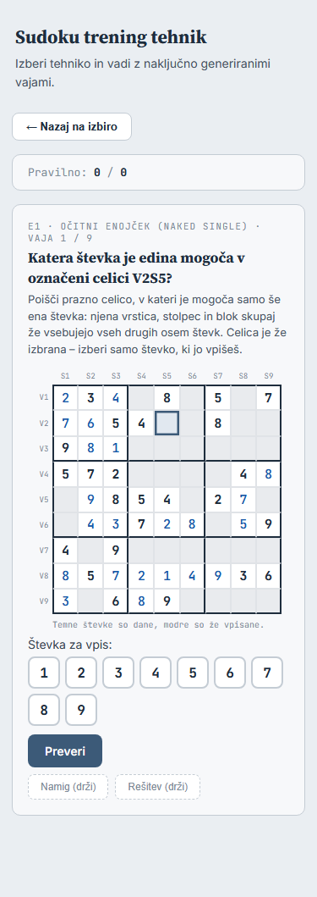

Vsa koda je v `trening/trening.js`, vaja pa pride iz `genEnojcek()` v
`trening/generators.js` (`boardGrid`, `danosti`, `korak`, `oznaka`, `namig`).

- **Izris:** `buildSingleLayout()` zgradi lastno mrežo `.g9` z glavami S1–S9/V1–V9 in
  81 celicami `.gc` (razredi `stevka`, `vpis`, `oznacena-enota`, `ni-izbire`,
  `selectable`). Pod mrežo sta opomba »Temne števke so dane …« in niz »Števka za vpis:«
  (`.digit-btns`).
- **Izbira:** klik prazne dovoljene celice nastavi `selected = [idx]` in razred
  `selected-slate`, ponoven klik izbiro prekliče. Števka je v `pickedDigits` (gumb
  `picked`, ponoven klik prekliče).
- **Postopnost:** iz `ex.oznaka`. Označena enota ali celica je svetlo modra
  (`oznacena-enota`). Prazne celice zunaj nje so zatemnjene (`ni-izbire`) in se ne
  odzovejo. Označena celica (E1, vaje 1–3) je izbrana vnaprej in je ni mogoče
  odizbrati. Označena števka (E2, vaje 1–3) je izbrana vnaprej, drugi gumbi števk so
  onemogočeni.
- **Preverjanje:** `checkSingle()` → `preveriEnojcek()`. Pri »prav« celica dobi števko in
  razred `correct` (zelena). Pri »nevtralno« in »narobe« se izbira počisti, razen
  vnaprej izbrane celice ali števke.
- **Namig in rešitev:** `buildHintText()` = `ex.namig`, `buildSolutionText()` =
  `ex.korak.message`. Med držanjem »Rešitev« `peekOn()` obarva enoto skritega enojčka
  (`peek-enota`, rumeno) in celico (`peek-hl`, rumena obroba).
- **Slogi:** `trening/trening.css` (`.g9 .gc.stevka`, `.vpis`, `.correct`,
  `.oznacena-enota`, `.ni-izbire`, `.peek-enota`, `.stevke-label`, `.digit-btns`).
- **Tipkovnice ni.** Trening nima poslušalca `keydown`.
- **Testi:** `tests/trening-pomoc.test.js` bere razrede `.gc`, `selectable`,
  `ni-izbire`, `oznacena-enota`, `selected-slate` in spremenljivki `selected` in
  `pickedDigits`. `tests/trening-enojcki.test.js` preverja samo generator in
  `preveriEnojcek()`.

## 2. Kaj `shared/mreza.js` in `shared/plosca.js` že znata in kaj manjka

**Že znata:**

| Potreba | Kje |
|---|---|
| mreža brez kandidatov, dane temno, vpisi modro | `mreza.js`: `kandidati: null`, `danosti` |
| oznake S1–S9 / V1–V9 | `mreza.js`: `robovi: true` (od naloge 1 in 2) |
| poudarek števke, »več hkrati« s štirimi barvami, števci »še manjka« | `plosca.js`: niz `nizPoudari`, kljukica `vecHkrati` |
| seznami manjkajočih števk s stikali, shranjena stikala, `z-vrsticami` | `plosca.js`: `seznami`, `stikala`, `kljucSeznamov`, `postavitev` |
| izbira ene celice, ponoven klik prekliče | `plosca.js` |
| oznake koraka (vzorec, vpis) | `mreza.js`: `oznake` |
| vaja kot igra, vpisi poti zaklenjeni | `stanje.js`: `igraZZacetkom()` (kot pri »Vadi v uganki«) |

Plošča potrebuje igro (`vir()`). Vaja E1/E2 postane igra z `igraZZacetkom(danosti,
vpisi poti)`. Vpisi poti so začetne poteze, zato jih ni mogoče zbrisati ali
razveljaviti. Stanje (`stanjeIgre()`) da mrežo, števce »še manjka« in maske seznamov.
Samodejni kandidati v stanju so, a se ne izrišejo.

**Manjka** (vse so nove možnosti. Brez njih je obnašanje tako kot zdaj, zato igra ostane
enaka):

`shared/mreza.js` (pogled):

1. **`oznacene`** (celice): razred `oznacena`, svetlo modra podlaga. Nadomesti
   `oznacena-enota`.
2. **`neaktivne`** (celice): razred `neaktivna`, zatemnjena, brez kazalca z roko. Klik se
   ne sporoči. Nadomesti `ni-izbire`.
3. **Števka oznake vpisa brez kandidatov:** pri `kandidati: null` prazna celica z oznako
   vpisa pokaže števko (zeleno podlago `k-vpis` ima že zdaj). Rabi jo »Rešitev (drži)«,
   pozneje tudi del 6.
4. **Okvir s seznami in robovi:** `.mreza-okvir` zdaj pričakuje golo `.mreza`. Pri
   `robovi` so potrebna pravila za postavitev (`.mreza-okvir .mreza-robovi`) in zamik
   seznamov za širino roba (`--rob`). To je samo CSS v `mreza.css`.

`shared/plosca.js` (možnosti):

5. **`robovi`**: poda se naprej v `ustvariMrezo()`.
6. **`kandidati: false`**: pogled brez kandidatov. Shift+števka in niz »Odstrani« ne
   naredita nič, sicer bi odstranila nevidnega kandidata.
7. **`samoEna`**: Ctrl/⌘+klik ne dodaja celic v izbiro.
8. **`spremenljiva(i)`**: ali igralec sme izbrati celico `i` ali jo odizbrati. Klik
   celice, ki ni spremenljiva, ne naredi nič. Puščice jo preskočijo (naslednja
   spremenljiva celica v smeri, sicer ostane). Escape in nova metoda `pocistiIzbiro()`
   pustita v izbiri celice, ki niso spremenljive (vnaprej izbrana celica pri E1, vaje
   1–3).
9. **`zacetnaIzbira`**: izbira ob nastanku plošče (vnaprej izbrana celica).
10. **`obVpisu(celica, stevka)`**: tipka s števko in niz »Vpiši« pokličeta to funkcijo
    namesto poteze. V »Spoznaj« izbere števko za vpis, kot klik na gumb »Števka za
    vpis«. To je povratni klic iz tabele za del 6.
11. **`pogled()`**: dodatna polja pogleda (`oznacene`, `neaktivne`, `sosede`), ki
    jih plošča doda k svojemu pogledu.

Prototip (posnetki) ima 1–9 in 11. Puščic, Escape in `obVpisu` še nima.

## 3. Prekrivanje z delom 6

Tabela v `docs/trening-v-uganki-nacrt.md` (del 5, točka 5) za E1/E2 v »Vadi v uganki«
predvideva: `kandidati: false`, niz »Odstrani« skrit, **vpis je predlog**
(`obVpisu(celica, stevka)`, poteza šele po pravilnem odgovoru), v nizu »Vpiši« vseh 9
števk omogočenih.

**Predlog: zdaj v `shared/` samo to, kar »Spoznaj« res uporablja, del 6 pa to samo
uporabi.** Tako se nič ne doda na zalogo brez preverjanja (isto pravilo kot pri delu 5).

| Možnost | Zdaj | Zakaj |
|---|---|---|
| `kandidati: false` | **da** | »Spoznaj« jo uporablja; del 6 enako |
| `obVpisu(celica, stevka)` | **da** | tipka s števko v »Spoznaj« izbere števko namesto poteze; del 6 dobi isti povratni klic |
| `samoEna`, `spremenljiva`, `zacetnaIzbira`, `pocistiIzbiro()` | **da** | postopnost v »Spoznaj« (del 6 jih verjetno ne rabi) |
| `pogled()`, `oznacene`, `neaktivne`, števka oznake vpisa | **da** | postopnost in »Rešitev« |
| branje barv poudarka iz nastavitev igre | **da** | točka 4; del 6 isto |
| niz »Vpiši« z vsemi 9 števkami, predlog, prikazan v celici | **ne – del 6** | »Spoznaj« obdrži svoj niz »Števka za vpis« z vnaprej izbrano števko in onemogočenimi gumbi (postopnost). Niza plošče ne uporablja, zato ne bi bil preverjen |
| »Pokaži prečrtane« (`precrtan`), `vpis: false` za 1–12 | **ne – del 6** | tehnike 1–12 |

Odstop od tabele za del 6: pri `kandidati: false` Shift+števka in niz »Odstrani« ne
naredita nič (točka 2.6). Tabela je predvidevala samo skrit niz »Odstrani«, tipka pa bi
še delovala.

## 4. Barve poudarka

**Predlog: iz nastavitev igre, samo branje** (`sudoku.igra.poud`). To je že odločitev za
del 6 (odgovor 9 v `docs/trening-v-uganki-nacrt.md`). Igralec, ki si je v igri nastavil
barve, dobi v treningu iste.

- Branje (`normalizirajHex()` in razčlenitev zapisa, tudi star zapis kot sam hex niz) se
  preseli iz `igra/igra.js` v `shared/plosca.js`: `barvePoudarkaIzNastavitev(kljuc)` →
  štiri barve ali `null`, in `uporabiBarvePoudarka(barve)`, ki nastavi `--poud` …
  `--poud4` na `<html>`. Igra uporablja isto branje. Nastavljanje (gumbi 1–4, izbirnik,
  hex, »Privzeto«) in pisanje ostaneta v igri.
- Trening prebere barve ob nalaganju strani. Sprememba v igri velja po osvežitvi
  treninga. Pri `file://` brskalnik shrambo lahko loči po datotekah, takrat so barve
  privzete.
- Druga možnost so stalne barve iz `mreza.css`. Ta je preprostejša, a se razlikuje od
  odločitve za del 6.

## 5. Kje so pripomočki na zaslonu

Kartica vaje ostane ena, od zgoraj navzdol:

1. oznaka »E1 · … · Vaja 1 / 9«, navodilo, opis (nespremenjeno);
2. **»Poudari števko«** in kljukica **»več hkrati«**, pod tem niz 9 gumbov s števci
   »še manjka«, poravnan s stolpci mreže (kot v igri);
3. **mreža** z oznakami S/V; ob vklopljenem seznamu desno od vrstic in pod stolpci
   kvadratki manjkajočih števk;
4. opomba »Temne števke so dane, modre so že vpisane.«;
5. **»Manjkajoče števke«**: tri kljukice v eni vrstici (Vrstice, Stolpci, Bloki), pod
   njimi mala mreža blokov, kadar je vklopljena;
6. »Števka za vpis:«, Preveri, Namig in Rešitev (nespremenjeno).

Velikost celice: `--gcs: min(46px, (min(560px, 100vw) - 104px) / 9)`, kot pri 1 in 2.
S seznamom vrstic (10 stolpcev) je `/ 10` z odštetim razmikom. Pri 375 px je celica
pribl. 30 px oziroma 27 px s seznamom vrstic, pri 1200 px 46 oziroma 45 px. Izbira je
izrazitejša kot v igri (modrikasta podlaga, 3 px obroba), kot pri 1 in 2.

**375 px – E1, vaja 1** (označena celica, poudarjena 5, seznama vrstic in stolpcev):

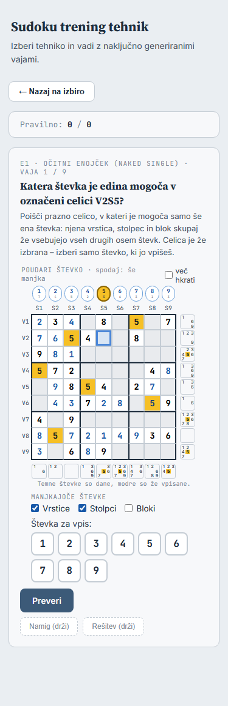

**375 px – E2, vaja 4** (označen blok, »več hkrati« s 3 in 7):

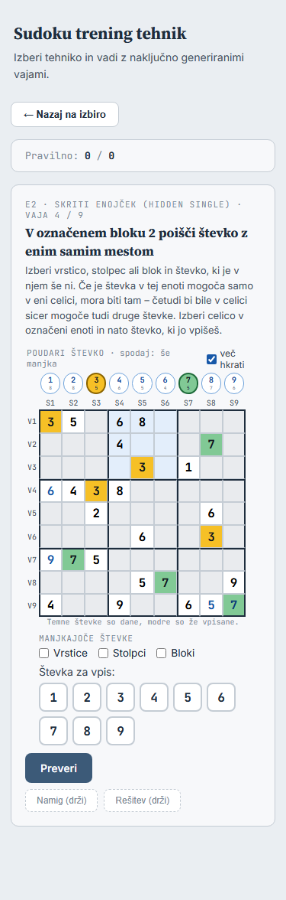

**375 px – E1, vaja 7** (cela mreža, seznam blokov):

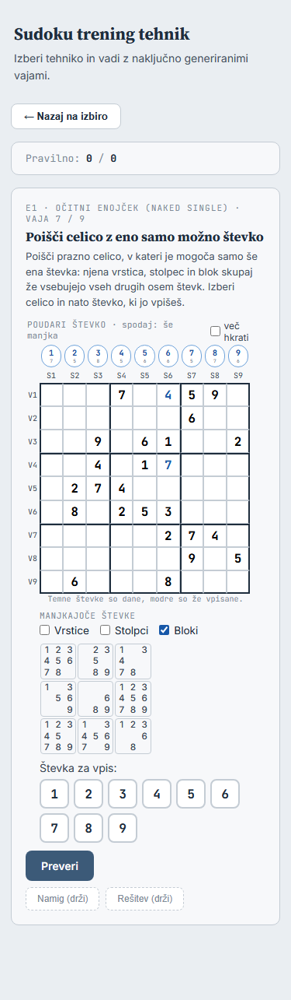

**375 px – E2, vaja 1, »Rešitev (drži)«**: enota koraka je jantarna (vzorec), celica
zelena s števko (vpis). To so iste oznake kot pri 1 in 2 in pri »Pokaži rešitev« v
igri, namesto rumene enote in rumene obrobe:

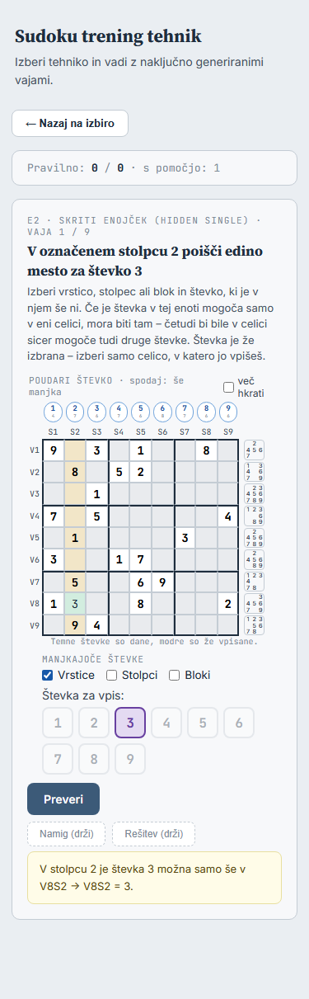

**1200 px – E1, vaja 1** (poudarjena 5, seznam stolpcev):

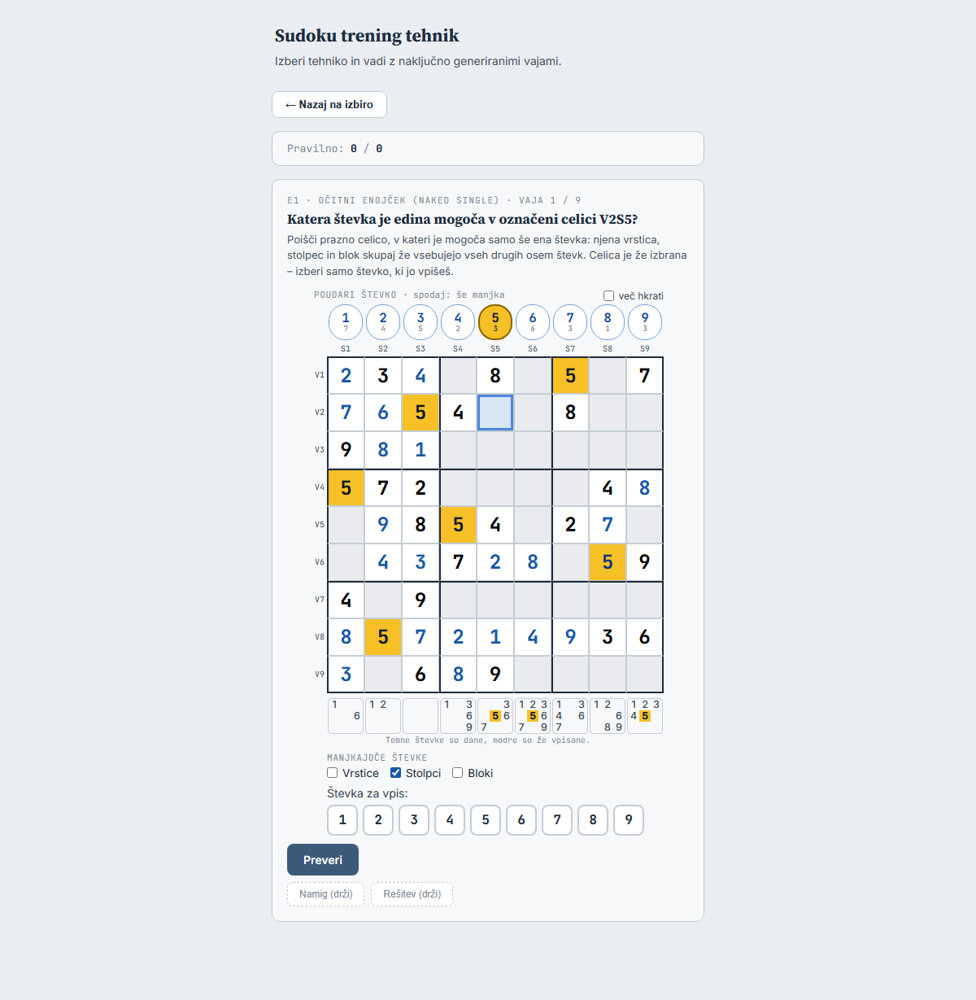

**1200 px – E2, pravilen odgovor.** Prototip uporablja zaklep igre (`samoZaOgled()`) in
njegovo zeleno obrobo. Obroba prekrije oznake V1–V9, izbira pa je ostala na celici. V
izvedbi mreža po pravilnem odgovoru nima zelene obrobe (**vprašanje 5**), izbira se
počisti, celica je zelena s števko:

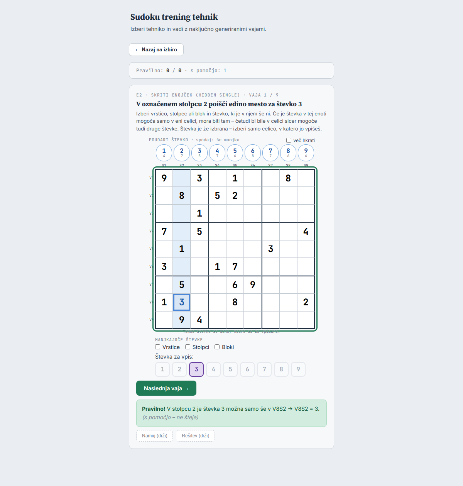

Popravki glede na prototip:

- Vrstica »Poudari števko · spodaj: še manjka« se pri 375 px prelomi skupaj s kljukico.
  Oznaka bo krajša, npr. »Poudari števko« (pojasnilo števcev v `title` gumbov, kot
  v igri).
- Števka oznake vpisa (»Rešitev«) je na posnetku tanka. Imela bo slog vpisa.
- Opomba pod mrežo se pri vklopljenem seznamu stolpcev primakne tik pod kvadratke. Dobi
  razmik.

Prototip z vsemi tremi seznami hkrati je bil izmerjen pri 320, 375 in 1200 px. Vodoravnega
drsnika ni (`scrollWidth` je enak širini okna), plošča je v kartici. Celica meri 21,
26,6 in 45 px. V izvedbi to preveri scenarij (točka 7).

## 6. Obnašanje in vpliv na drugo

**E1 in E2 v »Spoznaj« – ostane enako:**

- postopnost: iste celice so označene, izbrati se da iste celice, ista vnaprej izbrana
  celica in števka, isti onemogočeni gumbi števk;
- `preveriEnojcek()`, sporočila »Pravilno!« / »Še ne.« / »Ni pravilno.«, kaj se po
  napačnem odgovoru počisti;
- namig (`ex.namig`), besedilo rešitve (`ex.korak.message`), »Namig/Rešitev (drži)«;
- `stej()`, `oznaciPomoc()`, `preveri()`, krog 9 vaj, »Končano!«;
- generator (`genEnojcek()`) se ne spremeni.

**E1 in E2 – spremeni se:**

- videz mreže iz `mreza.css` (kot pri 1 in 2), izbira kot pri 1 in 2;
- »Rešitev (drži)«: oznake koraka namesto rumene enote in obrobe (glej posnetek);
- pravilen odgovor postane poteza (`dodajPotezo`). Števci »še manjka« in seznami se
  osvežijo, celica je zelena s števko, mreža ne sprejema več izbire (`samoZaOgled()`);
- **sivega senčenja** vrstice, stolpca in bloka izbrane celice (`sosede`) ni
  (**vprašanje 7**). Zdaj ga tudi ni. V sivini bi se zlilo z zatemnjenimi celicami
  postopnosti, ki so skoraj iste barve;
- novo: niz »Poudari« z »več hkrati«, seznami s stikali, tipkovnica.

**Tipkovnica** (**vprašanje 4**), samo ko je prikazana vaja E1/E2. Poslušalca `keydown`
ima `trening.js`, ta pokliče `plosca.obTipki(e)`:

- 1–9 (po `e.code`: `Digit1`…`Digit9` in `Numpad1`…`Numpad9`) izbere števko za vpis,
  kot klik na gumb. Pri vnaprej izbrani števki (E2, vaje 1–3) ne naredi nič;
- puščice premaknejo izbiro na naslednjo celico v smeri, ki jo je mogoče izbrati. Pri
  vnaprej izbrani celici (E1, vaje 1–3) ne naredijo nič;
- Escape počisti izbiro celice, vnaprej izbrana ostane;
- Shift+števka, Backspace/Delete, Ctrl+Z/Y ne naredijo nič: kandidatov ni, vpisi poti
  so zaklenjeni, drugih potez ni, po pravilnem odgovoru je mreža zaklenjena;
- Enter ni »Preveri« (tudi v igri ni bližnjice za gumbe pomoči).

**Stikala seznamov** imajo svoj ključ `sudoku.trening.seznami`, skupen za E1 in E2 (del 6
ga lahko uporabi). Privzeto so izklopljena, kot v igri. Kljukica »več hkrati« ostane
med vajami istega kroga in se ne shranjuje. Poudarki se ob novi vaji počistijo.

**Igra:** dobi nove možnosti plošče in mreže, ki jih ne uporablja. Spremembi v igri sta
dve:

- branje barv poudarka iz `shared/plosca.js` (točka 4);
- slogi nizov (vprašanje 3).

Preverjanje: `node tools/posnetek-igre.js --primerjaj tools/posnetki/igra-pred-niz.json`
→ »Enako«, obstoječi testi igre, in posnetki zaslona igre v brskalniku brez glave pred
in po spremembi (1200 in 390 px, lastne barve poudarka, vsi trije seznami) enaki do
bajta, kot pri delu 4.

**Reševalec:** ne nalaga ne `mreza.js` ne `plosca.js` ne novih slogov, zato ostane enak.

**Druge tehnike v »Spoznaj«** (1–12): spremeni se samo veja `M.isSingle` v
`renderExercise()`, `checkSingle()` in `peekOn()`/`peekOff()`. `buildSingleLayout()` se
zamenja. Pravila v `trening.css`, ki jih uporablja samo enojček (`.g9 .gc.stevka`,
`.vpis`, `.correct`, `.oznacena-enota`, `.ni-izbire`, `.peek-enota`), se odstranijo.
`.g9`, `.g9-hdr`, `.g9-note`, `.digit-btns` in `.stevke-label` ostanejo, ker jih
uporabljajo druge tehnike ali niz števk. Scenarij v brskalniku primerja izris vseh
drugih tehnik, tudi 1 in 2, z izhodiščem `10503c2`: `innerHTML` in izračunani slogi
morajo biti enaki.

## 7. Novi testi in preverjanje

**`tests/mreza.test.js`** (dopolnitev): `oznacene` (razred), `neaktivne` (razred, klik
se ne sporoči), števka oznake vpisa pri `kandidati: null` (s kandidati se ne spremeni
nič). Brez teh polj je DOM enak kot zdaj (obstoječi testi).

**`tests/plosca.test.js`** (dopolnitev):

- `kandidati: false`: pogled brez kandidatov, Shift+števka in niz »Odstrani« ne
  spremenita igre;
- `samoEna`: Ctrl+klik ne doda celice;
- `spremenljiva` in `zacetnaIzbira`: klik, ponoven klik, puščice preskočijo
  nespremenljive celice, Escape in `pocistiIzbiro()` pustita vnaprej izbrano celico;
- `obVpisu`: tipka s števko (tudi Numpad) pokliče povratni klic, poteze ni. Pari
  QWERTZ (`key: '"'`, `code: 'Digit2'`, Shift) ne pokličejo `obVpisu`;
- `pogled()` doda polja k pogledu, `robovi` se poda v mrežo;
- `barvePoudarkaIzNastavitev()`: nov zapis, star zapis (sam hex), napačen zapis,
  brez shrambe.

**`tests/trening-pomoc.test.js`:** obstoječi testi postopnosti in pomoči ostanejo s
**istimi pričakovanji**. Spremeni se dostop: celice so `.celica` v mreži vaje,
razredi `oznacena`, `neaktivna`, `izbrana`, izbira je `plosca.izbrane` (namesto
`selected`), pravilen odgovor se izbere s klikom celice. Novi primeri (E1 in E2):

- v mreži ni kandidatov (`.kand`);
- poudarek ene števke in »več hkrati« (razredi `poud-stevka b0`…`b3` na celicah s to
  števko);
- stikala seznamov: vidnost, ključ `sudoku.trening.seznami` in ohranitev ob novi vaji;
- tipkovnica po stopnjah: števka izbere števko, pri vnaprej izbrani števki ne; puščice
  preskočijo; Escape pri vnaprej izbrani celici ne počisti; pari QWERTZ;
- »Rešitev (drži)«: oznake vzorca (enota pri E2) in vpisa, po spustu nič;
- pravilen odgovor: poteza vpis, števec »še manjka« se zmanjša, klik celice ne izbere
  več ničesar, Ctrl+Z ne vrne poteze.

**`tests/trening-enojcki.test.js`** ostane (generator se ne spremeni).

**Brskalnik brez glave – nov `tools/preveri-enojcki-brskalnik.js`** (po vzoru
`tools/preveri-presek-brskalnik.js`). E1 in E2 pri 375 in 1200 px, vse tri stopnje
postopnosti (vaje 1, 4, 7):

- ni vodoravnega drsnika, tudi z vsemi tremi seznami; mreža in niz sta v kartici;
- ni kandidatov, števke so iz vaje, označena enota ali celica ima modro podlago,
  neaktivne so sive;
- pravi kliki: neaktivna celica se ne izbere, dovoljena se izbere;
- poudarek ima izračunano barvo `--poud` (in `--poud2` pri »več hkrati«). Z lastno
  barvo v `sudoku.igra.poud` ima to barvo;
- stikala pokažejo sezname;
- prave tipke prek protokola DevTools z ameriškimi **in** slovenskimi (QWERTZ) pari
  `key`/`code`. `tools/brskalnik.js` `tipka()` dobi neobvezna `code` in `shift`;
- pravilen odgovor s pravimi kliki → »Pravilno!«;
- brez napak JS;
- posnetki zaslona, ki jih pogledam sam;
- **druge tehnike** (1–12) z `Math.random` s semenom: `innerHTML` in izračunani slogi
  enaki kot v izhodišču `10503c2`.

**Vse skupaj:** `node --test "tests/*.test.js"` (zdaj 367), posnetek igre `--primerjaj`
(»Enako«), primerjava posnetkov zaslona igre, scenarij v brskalniku.

## Koraki izvedbe (po potrditvi)

1. **`shared/`:** `mreza.js`/`mreza.css` (točke 2.1–2.4), `plosca.js` (2.5–2.11, branje
   barv), slogi nizov po odgovoru 3. Igra uporablja skupno branje barv. Testi `mreza` in
   `plosca`, posnetek igre »Enako«, posnetki zaslona igre enaki.
2. **Trening:** `buildSingleLayout()` s ploščo, `checkSingle()`, »Rešitev«, tipkovnica,
   `trening/index.html` (`shared/plosca.js`, slogi), `trening.css`,
   `tests/trening-pomoc.test.js`.
3. **Preverjanje in dokumentacija:** `tools/preveri-enojcki-brskalnik.js`,
   `tools/brskalnik.js` (`tipka` s `code`/`shift`), `CLAUDE.md`, `docs/rocni-test.md`,
   ta načrt in `docs/trening-v-uganki-nacrt.md`.

Vsak korak v svojem commitu s pushem. Če posnetek igre ali primerjava drugih tehnik
pokaže razliko, se ustavim in razložim vzrok.

## Vprašanja

1. **Obseg v `shared/` za del 6** (točka 3): zdaj samo možnosti, ki jih »Spoznaj«
   uporablja (`kandidati: false`, `obVpisu`, izbira s postopnostjo, `pogled()`, branje
   barv), niz »Vpiši« s predlogom pa v delu 6 – predlog. Ali že zdaj vse iz tabele za
   del 6?
2. **Barve poudarka:** iz nastavitev igre, samo branje, branje preseljeno v
   `shared/plosca.js` – predlog. Ali stalne barve?
3. **Slogi nizov** (niz Poudari, kljukica, stikala; zdaj v `igra/igra.css`):
   - **predlog:** nova `shared/plosca.css`. Iz `igra.css` se preselijo nizi
     (`.niz*`), `.niz-oznaka`, `.poudari-glava`, `.vec-hkrati`, `.niz-pojasnilo`,
     `.seznami-stikala`, `--poud-line`, `--poud-gumb-ink`. Naložita jo igra in trening
     pred svojimi slogi. Igra ostane enaka, kar preverijo posnetki zaslona;
   - druga možnost: kopija pribl. 50 vrstic v `trening/trening.css`. Del 6 bi kopiral
     še več.
4. **Tipkovnica** v E1/E2 (števke, puščice, Escape; Enter ne): da – predlog?
5. **Po pravilnem odgovoru** brez zelene obrobe zaklenjene mreže (prekrije oznake V, pri
   1 in 2 je ni) – predlog; ali obroba kot v igri, z večjim robom?
6. **Stikala seznamov:** svoj ključ `sudoku.trening.seznami`, skupen za E1 in E2, privzeto
   izklopljena; »več hkrati« ostane med vajami kroga – predlog?
7. **Sivo senčenje** vrstice, stolpca in bloka izbrane celice: izklopljeno – predlog (zlilo
   bi se z zatemnjenimi celicami postopnosti). Ali vklopljeno samo pri vajah 7–9, kjer
   zatemnjenih celic ni?

## Odgovori (2026-09-28)

Načrt potrjen.

1. Obseg v `shared/`: **samo to, kar »Spoznaj« uporablja** (predlog).
2. Barve poudarka: **iz nastavitev igre, samo branje** (predlog). To velja tudi za
   poudarek števke pri vajah 1 in 2. Trening barve nastavi na `<html>` ob nalaganju
   strani, zato jih dobi vsaka mreža iz `shared/mreza.js`. Scenarij v brskalniku to
   preveri tudi pri 1 in 2.
3. Slogi nizov: **nova `shared/plosca.css`** (predlog).
4. Tipkovnica: **da** (predlog).
5. Po pravilnem odgovoru **brez zelene obrobe** (predlog).
6. Stikala: **svoj ključ `sudoku.trening.seznami`**, »več hkrati« ostane med vajami
   kroga (predlog).
7. Sivo senčenje izbrane celice: **izklopljeno** (predlog).

## Ročni seznam (po izvedbi, največ 5)

1. **Trening, pravi telefon, E1 vaja 7 z vsemi tremi seznami:** preberi števke v
   kvadratkih seznamov in izberi celico s prstom. Pričakovano: berljivo (celica pribl.
   27 px), brez vodoravnega drsenja, celico zadeneš brez zgrešenih dotikov. Ni
   avtomatsko, ker brskalnik brez glave ne oceni berljivosti in dotika.
2. **Trening, E2 vaja 4 (telefon in 1200 px):** poudari dve števki z »več hkrati«.
   Pričakovano: barvi se jasno ločita med seboj in od modre označene enote. Ni
   avtomatsko, ker je to presoja videza.
3. **Trening, slovenska tipkovnica, E1 vaja 7:** tipke 1–9 (vrstica števk in Numpad),
   puščice, Escape. Pričakovano: števka se izbere, izbira se premika po praznih celicah.
   Ni avtomatsko, ker scenarij pošlje pare `key`/`code`, ne prave razporeditve
   operacijskega sistema.
4. **Igra, nato trening (lokalni strežnik):** v igri nastavi 1. barvo poudarka, osveži
   trening in poudari števko v E1. Pričakovano: ista barva. Ni avtomatsko v celoti, ker
   je to prehod med aplikacijama v istem brskalniku z nastavitvijo iz drugega zavihka.
5. **Trening, E2 na telefonu:** drži »Rešitev«, nato spusti. Pričakovano: jantarna enota
   in zelena celica s števko se pokažeta in ob spustu izgineta. Ni avtomatsko, ker
   scenarij pošilja dogodke miške, ne dotika.

Seznam je prenesen v `docs/rocni-test.md` (razdelek »Trening: pripomočki pri E1 in E2«).

## Izvedba (2026-09-28)

| Korak | Commit | Testi |
|---|---|---|
| 1 `shared/`: možnosti mreže in plošče, `plosca.css`, branje barv poudarka | `4121cc8` | 370 (367 + 3) |
| 2 trening: E1/E2 na plošči, tipkovnica, testi | `2fcb63a` | 375 (370 + 5) |
| 3 `tools/preveri-enojcki-brskalnik.js`, `tipka()` s `code`/`shift`/`ctrl`, dokumentacija | (ta commit) | 375 |

Preverjanje po vsakem koraku:

- Posnetek igre `--primerjaj tools/posnetki/igra-pred-niz.json`: »Enako: 85 posnetkov.«
- Posnetki zaslona igre pred korakom 1 in po njem so bili enaki do bajta. Posnetih je bilo
  15: 1200, 1000, 900 in 390 px, lastne barve poudarka, vsi trije seznami, tri
  poudarjene števke z »več hkrati«, izbrana celica, korak pomoči na mreži. Prvi zagon je
  pokazal razliko pri enem posnetku koraka pomoči. Vzrok je bil v scenariju, ki je trikrat
  zaporedoma prehitro kliknil »Naslednji korak«, zato je obveljal le en klik. Ponovni zagon
  je bil enak, prav tako oba zagona po popravku, ko scenarij po vsakem kliku počaka na
  spremembo gumba.
- `tools/preveri-enojcki-brskalnik.js`: vse drži. Posnetki izvedbe so v
  `docs/slike/pripomocki-e1-e2/izvedba-*.png`. Tehnike 1–12 so pri 375 in 1200 px enake
  izhodišču `10503c2`.
- `tools/preveri-presek-brskalnik.js` in `tools/preveri-niz-brskalnik.js`: vse drži.

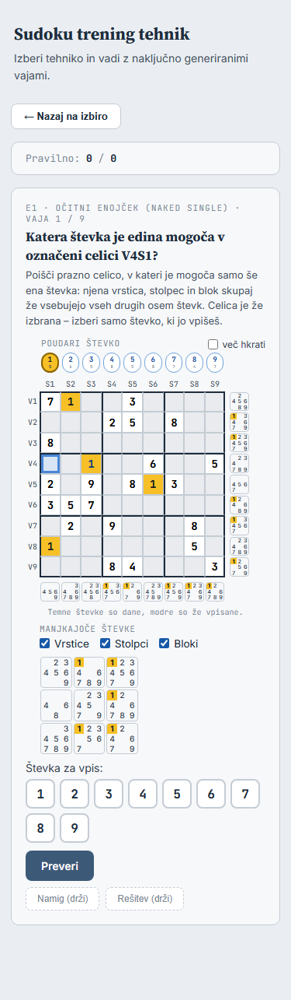
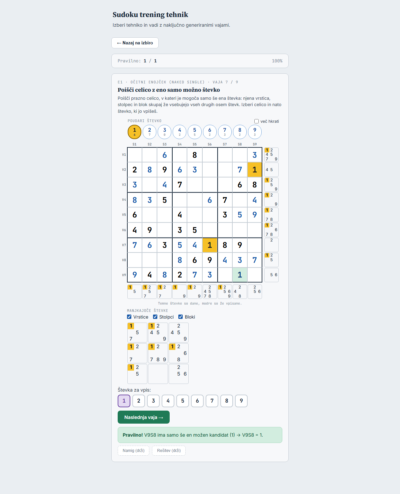

Odstopanja in dopolnitve glede na načrt:

- **»Več hkrati« med vajami kroga:** plošča ob nastanku prebere stanje kljukice
  (`o.vecHkrati.checked`), sicer bi kljukica nove vaje kazala kljukico, poudarki pa bi se
  ne seštevali. V igri je kljukica ob nalaganju izklopljena, zato se tam nič ne spremeni.
- **Izbira po pravilnem odgovoru** se ne počisti, ampak se ne prikaže več
  (`pogled().izbrane = []`). Celice, ki niso spremenljive (vnaprej izbrana), plošča ne
  odizbere; mreža je takrat tako ali tako zaklenjena.
- **Zatemnjene celice ostanejo** tudi po pravilnem odgovoru, kot doslej.
- **Slogi:** `.g9 .gc.correct` v `trening.css` ostane. Uporablja ga tudi prikaz XY-krila in
  edinstvenega pravokotnika. Odstranjeni so `.g9 .gc.stevka`, `.vpis`, `.peek-enota`,
  `.oznacena-enota`, `.ni-izbire`, `.gc.selected-slate` in `.cd.hl-slate`. E1 in E2 v
  `MODES` nimata več `selClass`/`hlClass`, kot 1 in 2.
- **`tools/preveri-presek-brskalnik.js`** ne primerja več E1 in E2 s svojim izhodiščem
  `7429363`, ker se namerno razlikujeta. Ju preverja novi scenarij.
- **`tools/brskalnik.js` `tipka()`** dobi neobvezne `code`, `shift` in `ctrl`. Obstoječi klici
  delujejo enako.

## Dopolnitev: poudarek po pravilnem odgovoru in senčenje (načrt, 2026-09-28)

Iz ročnega pregleda izvedbe prihajata dve opažanji. Kode še nisem spreminjal. Posnetki so
iz prototipa v začasni kopiji projekta (trenutni `main` z dodatki spodaj). Stanje točk
ročnega pregleda v `docs/rocni-test.md` ostaja »(nepotrjeno)«, dokler ne sporočiš,
katere so v redu.

### D1. Poudarek po pravilnem odgovoru

**Zdaj:** vpisana števka je poudarjena števka, a zelena oznaka vpisa (`k-vpis`) jo
prekrije. V `mreza.css` je pravilo `.celica.k-vpis` za `.celica.poud-stevka`, zato zmaga
zelena. Na posnetku je poudarjena 6, nova 6 v V8S6 pa je samo zelena:

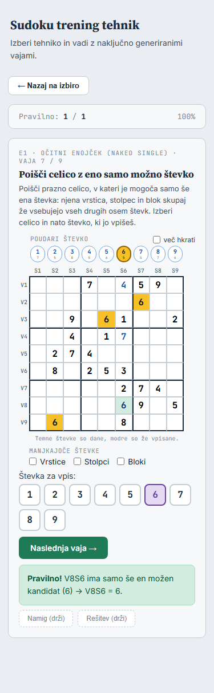

**Predlog: poudarek pred zeleno, z zelenim okvirjem.** Celica odgovora ima podlago v barvi
poudarka, zelen okvir (3 px, kot izbira) pa jo še vedno označi kot odgovor. Niz
»Poudari« je tudi legenda, zato mora biti nova števka med poudarjenimi. Sprememba je samo
v treningu (`trening.css`, `.vaja-enojcek`). V igri se ne pojavi: tam je `k-vpis` na
kandidatu prazne celice (korak pomoči), polna celica ga ne dobi.

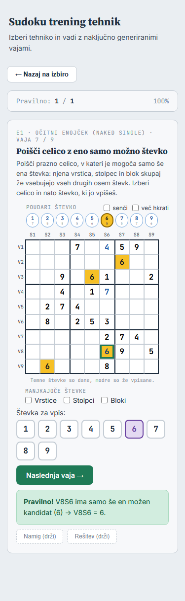

Pravilo igre ostane: vpis, ki števko dokonča (deveti), izklopi njen poudarek. Takrat je
celica samo zelena.

Druga možnost je, da ostane, kot je. Zelena podlaga je enotna oznaka odgovora, kot pri
»Rešitev (drži)«, poudarek pa se vidi v drugih celicah in v nizu.

### D2. Senčenje celic, kamor poudarjena števka ne more

**Kaj:** ob eni poudarjeni števki d so zasenčene:

- vse polne celice, razen tistih z d (te ostanejo poudarjene);
- vse celice v vrstici, stolpcu in bloku vsake celice z d.

Nezasenčene prazne celice so mesta, kjer d po vpisanih števkah še lahko je. To je ročno
»prečrtavanje« (cross-hatching) pri iskanju skritega enojčka. Upošteva samo vpisane
števke, ne kandidatov in ne drugih tehnik.

**Stikalo:** kljukica **»senči«** v vrstici »Poudari števko«, levo od »več hkrati«. V `title`
je razlaga: »Zasenči celice, kamor poudarjena števka ne more (samo ob eni poudarjeni
števki).« Kljukica ostane vklopljena med vajami kroga, kot »več hkrati«, in se ne
shranjuje (**vprašanje 5**).

**Videz** (**vprašanje 2**) – E2, vaja 4, označen blok 2, poudarjena 7:

| A – šrafura (predlog) | B – ploskev |
|---|---|
| 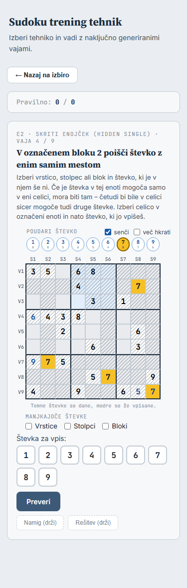 | 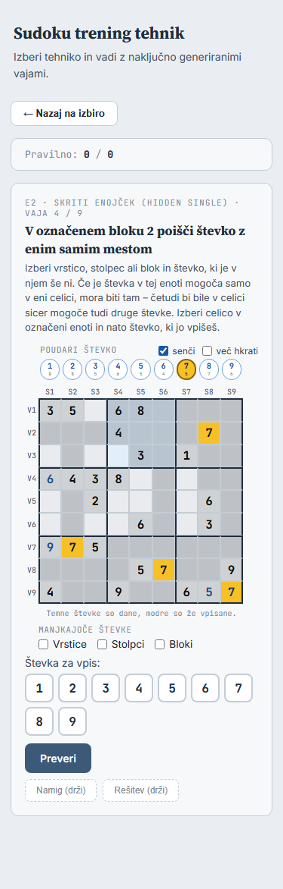 |

- **A** – poševne črte čez celico (`::after`, polprosojne). Šrafura se sešteje z modrikasto
  podlago označene enote in s sivino zatemnjenih celic, zato se vsa tri stanja ločijo.
- **B** – polprosojna siva ploskev. Zlije se z zatemnjenimi celicami postopnosti (na
  posnetku V3S1, V4S5 in V5S1 niso zasenčene, a so skoraj enako sive).
- Na celicah z oznakami koraka (»Rešitev (drži)«, zelena celica odgovora) se ne senči,
  oznake imajo prednost.

**»Več hkrati«** (**vprašanje 3**). Predlog: senči se samo ob **eni** poudarjeni števki. Z
dvema ali več ni senčenja (kljukica ostane vklopljena, razlaga je v `title`). Barve
poudarkov so različne, senčenje pa je eno. Pri več števkah ni jasno, čigavo je.

Drugi možnosti:

- senčenje za zadnjo izbrano števko (ista kot za »Naslednji korak« v igri), a ni vidno,
  katera je;
- celice, kamor ne more nobena od poudarjenih števk. Take ni lahko brati.

**Ali se šteje kot pomoč** (**vprašanje 4**):

- **E2:** senčenje ob pravi števki pusti v enoti **eno samo** nezasenčeno celico, in to je
  odgovor. Na posnetku v bloku 2 ostane samo V3S4. To je isto kot namig. Predlog: vaja E2,
  pri kateri se je senčenje pred pravilnim odgovorom **pokazalo** (kljukica vklopljena in
  natanko ena poudarjena števka), se šteje »s pomočjo«. Velja isto pravilo kot za namig:
  `oznaciPomoc()`, oznaka »(s pomočjo – ne šteje)«, vrstica rezultata in povzetek kroga.
  Sama kljukica brez poudarka se ne šteje. `title` kljukice to pove: »Pri skritem enojčku
  se vaja s senčenjem šteje kot vaja s pomočjo.«
- **E1:** senčenje ene števke odgovora ne pove. Za očitni enojček je treba izločiti osem
  števk v eni celici, senčenje ene števke pa pusti več prostih celic (posnetek spodaj:
  poudarjena 6, prostih celic je veliko). Predlog: se **ne** šteje, kot poudarek in seznami.
  Igralec bi moral zaporedoma poudariti osem števk, kar je ročno izvajanje tehnike.
- Druga možnost: nikjer se ne šteje (pripomoček kot seznami) ali pa se šteje povsod.

**E1** (predlog): isto stikalo in isto vedenje. Senčenje pomaga preveriti, ali števka v
izbrani celici še lahko je:

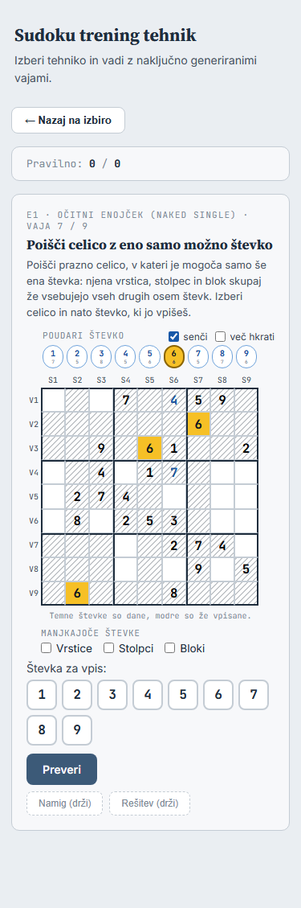

**Pozneje v »Vadi v uganki« (del 6)** (**vprašanje 6**):

- E1/E2 (brez kandidatov) enako kot tu, z istim pravilom pomoči;
- 1–12 (s kandidati) brez stikala: poudarek kandidatov že pokaže, kje je d mogoča, in
  upošteva tudi ročne izbrise. Senčenje po vpisanih števkah bi kazalo manj, kot je znano;
- igra ne v tej nalogi. Če bo želja, pride kot ideja v »Po želji«
  (`docs/trening-v-uganki-nacrt.md`).

### D3. Kje v kodi

- **`shared/mreza.js`:** pogled dobi `zasencene` (celice). Razred je `zasencena`, ne na
  celicah z oznakami koraka.
- **`shared/mreza.css`:** šrafura `.celica.zasencena::after`.
- **`shared/plosca.js`:** neobvezna kljukica `senci`. Izračun iz `stanje.grid` in `PEERS`
  samo ob eni poudarjeni števki. Novo je `sencenjeVidno()`, ki pove, ali je senčenje
  prikazano (trening ga rabi za pomoč). Igra kljukice ne poda, zato ostane enaka.
- **`trening/trening.js`:** kljukica v glavi niza »Poudari«, »senči« ostane med vajami
  kroga, pomoč pri E2 ob izrisu (`sencenjeVidno()` in vaja še ni rešena).
- **`trening/trening.css`:** glava z dvema kljukicama, poudarek z zelenim okvirjem (D1).

### D4. Testi in preverjanje

- **`tests/mreza.test.js`:** razred `zasencena`, ni ga na celicah z oznakami koraka.
- **`tests/plosca.test.js`:** izračun na uganki iz `docs/uganke.md` (primerjava z
  neodvisnim izračunom iz niza: polne celice razen d in sosede celic z d). Brez kljukice,
  brez poudarka in z dvema poudarjenima števkama ni senčenja. `sencenjeVidno()`.
- **`tests/trening-pomoc.test.js`:**
  - E2: vklop in poudarek → »s pomočjo« (že šteti poskus se odšteje);
  - E2: sama kljukica ali dve števki → brez pomoči;
  - E1: senčenje ni pomoč;
  - po pravilnem odgovoru senčenje nič ne spremeni;
  - kljukica ostane med vajami kroga;
  - poudarek z zelenim okvirjem (razreda `poud-stevka` in `k-vpis`).
- **`tools/preveri-enojcki-brskalnik.js`:**
  - senčenje pri 375 in 1200 px (izračunana šrafura na `::after`, ni je na neoznačenih
    celicah);
  - glava z dvema kljukicama v eni vrstici brez drsnika;
  - po pravilnem odgovoru ob poudarjeni števki podlaga v barvi poudarka in zelen okvir;
  - druge tehnike (1–12) enake kot `10503c2`.
- **Igra:** posnetek `--primerjaj` »Enako« in posnetki zaslona igre enaki do bajta.
- Testi: pribl. 375 + 5.

Koraki izvedbe: 1 `shared/` in testi (igra enaka), 2 trening in testi, 3 scenarij in
dokumentacija (`CLAUDE.md`, `docs/rocni-test.md`, ta načrt). Vsak korak je commit s
pushem.

### D5. Vprašanja

1. **Poudarek po pravilnem odgovoru:** poudarek pred zeleno z zelenim okvirjem – predlog;
   ali pustiti zeleno podlago?
2. **Videz senčenja:** A šrafura – predlog; ali B ploskev?
3. **»Več hkrati«:** senčenje samo ob eni poudarjeni števki – predlog; ali za zadnjo
   izbrano?
4. **Pomoč:** pri E2 se vaja s prikazanim senčenjem šteje »s pomočjo«, pri E1 ne –
   predlog; ali nikjer ali povsod?
5. **Ime in obstojnost kljukice:** »senči«, ostane med vajami kroga, ne shranjuje se –
   predlog; drugo ime (npr. »kam ne more«)?
6. **»Vadi v uganki«:** E1/E2 enako, pri 1–12 brez stikala, igra ne – predlog?

### D6. Ročni seznam (po izvedbi, največ 5)

1. **Trening, telefon, E2 vaja 4:** vklopi »senči« in poudari števko. Pričakovano: šrafura
   je jasno vidna na modrikasti in sivi podlagi, števke ostanejo berljive. Ni avtomatsko,
   ker je to presoja videza.
2. **Trening, E2:** z vklopljenim senčenjem odgovori pravilno. Pričakovano: »(s pomočjo –
   ne šteje)«, rezultat se ne poveča. Pri E1 enako brez te oznake. Ni avtomatsko v
   celoti, ker gre za razumljivost pravila za igralca.
3. **Trening, E1 vaja 7:** poudari števko odgovora in odgovori pravilno. Pričakovano: celica
   odgovora ima podlago poudarka in zelen okvir. Ni avtomatsko, ker je to presoja videza.
