# Del 6 – trening »Vadi v uganki«: načrt

(2026-09-28, **načrt potrjen**, odgovori v točki 11a; **izvedeno** po korakih 6a–6d, stanje v točki 13; ročni pregled v točki 14.) Posnetki so iz
prototipa v začasni kopiji projekta (trenutni `main` in dodatki iz točke 8). Prototip ni
v repozitoriju.

Izhodišče: `docs/trening-v-uganki-nacrt.md` (Odgovori, Opombe k delom – Del 6, Načrt
Claude Code točke 3–6, tabela plošče pri delu 5, senčenje) in analiza
`docs/trening-v-uganki.md` (3.2 izidi, 4.5 odločitve). Kjer se ta načrt razlikuje, velja
ta načrt (po potrditvi).

## 1. Uskladitev z današnjim stanjem

### 1.1 Kaj že obstaja

| Potreba dela 6 | Kje | Od kdaj |
|---|---|---|
| vaja kot igra z začetnimi potezami (Razveljavi in Začni znova ne gresta pod njih, `vrni` jih ne ponudi, začetnih vpisov ni mogoče zbrisati) | `shared/stanje.js` (`igraZZacetkom()`, `zacniZnova()`, `stanjeIgre().zacetni`) | del 1 |
| stanja v uganki, vaja iz stanja (`S0`, `KT`, `KV`, `resitev`, `stopnja`, `prejOdstranjenih`), presoja s šestimi izidi in `razveljavi` | `shared/vaje-uganka.js` (`stanjaVUganki()`, `vajaIzStanja()`, `vajaIzUganke()`, `preveriVajo()`) | del 2 |
| presoja in namig enojčka | `preveriEnojcek()`, `namigEnojcka()` (brez oznake = cela mreža) | del 2 in postopnost |
| banka (vsaj 50 ugank na tehniko, tudi »Presega tehnike«) | `shared/vaje-banka.js`; trening jo **že nalaga** (vaji 1 in 2) | del 3, geometrija 1–2 |
| mreža z robovi S/V, poudarek, oznake koraka, seznami, `oznacene`/`neaktivne`/`zasencene` | `shared/mreza.js`, `mreza.css` | del 4, geometrija, pripomočki |
| plošča: nizi Poudari/Vpiši/Odstrani, več celic, Razveljavi/Ponovi/Začni znova, tipkovnica s pari QWERTZ, seznami s stikali, `kandidati: false`, `obVpisu`, `samoEna`, `spremenljiva`, `pogled()`, kljukica »senči« in `sencenjeVidno()` | `shared/plosca.js`, `plosca.css` | del 5, pripomočki E1/E2 |
| barve poudarka iz nastavitev igre (samo branje) | `barvePoudarkaIzNastavitev()`; trening jih nastavi na `<html>` ob nalaganju | pripomočki E1/E2 |
| trening nalaga `stanje.js`, `vaje-uganka.js`, `vaje-banka.js`, `mreza.js`, `plosca.js` in sloge `mreza.css`, `plosca.css` | `trening/index.html` | deli 2–5 in samostojne naloge |
| štetje s pomočjo (vsak ogled namiga ali rešitve, E2 senčenje), krog 9 vaj, »Končano!« | `stej()`, `oznaciPomoc()`, `preveri()` v `trening/trening.js` | faza pred delom 1, pripomočki |
| stikala seznamov treninga | ključ `sudoku.trening.seznami` | pripomočki E1/E2 |

### 1.2 Kaj manjka

- izbira načina na kartici (gumba »Spoznaj« in »Vadi v uganki«);
- iskanje vaje s časovno mejo 1 s in banko kot rezervo (v kodi ga ni – `genPresek()` jemlje
  samo iz banke);
- zaslon vaje »Vadi v uganki« (nova `trening/v-uganki.js`) z odgovorom, »Preveri«,
  »Poskusi znova« in pomočjo s klikom;
- v `shared/` trije majhni dodatki (točka 8): prečrtani kandidati v mreži, predlog v
  celici, plošča brez vpisa in s predlogom, besedilo pod nizi za začetne vpise.

### 1.3 Pravilo »ne Presega tehnike« je odpadlo

Koda (`vaje-uganka.js`, banka, testi) ga že ne predpostavlja. Popravljena so še mesta v
dokumentih, ki so ga predpostavljala:

- `docs/trening-v-uganki-nacrt.md`: tabela časov v razdelku 0 in stavek »Pri tehnikah
  5–8 in 12 bo vaja večinoma iz banke« (zdaj opomba s sklicem na točko 7 spodaj), testna
  načrta v razdelku 6 (»ni Presega tehnike«) in vprašanje 4 v razdelku 7 (brezpredmetno);
- `docs/trening-v-uganki.md` 4.4: »Uganka Ekstrem« → »Presega tehnike« (ime iz časa pred
  opredelitvijo stopenj).

V delu 6 velja: vaja je stanje **pred** prvim poskusom s protislovjem, pogoj je samo ena
rešitev, stopnja uganke (tudi »Presega tehnike«) je samo informacija nad mrežo.

## 2. Razdelitev na korake

Predlagam štiri korake namesto treh. Razlog: pomoč je pri 1–12 dovolj velika in ločena od
presoje, da jo je bolje preveriti posebej; vsak dodatek v `shared/` pride v koraku, ki ga
prvi uporabi (in ga s tem tudi preveri). Vsak korak: testi, posnetek igre »Enako«,
scenarij v brskalniku (ustvari ga 6a, vsak naslednji korak ga dopolni), `CLAUDE.md`,
stanje v tem načrtu, commit + push.

| Korak | Vsebina | `shared/` |
|---|---|---|
| **6a** | izbira načina (dva gumba), iskanje vaje (sproti do 1 s, nato banka, »Iščem vajo …«), zaslon vaje za vseh 14 tehnik **samo za ogled in pripomočke**: vrstica nad vajo, stopnja uganke, vrstica s številom prej odstranjenih kandidatov in »pokaži prečrtane«, mreža (1–12 s kandidati, E1/E2 brez), poudarek, seznami; krog in »Končano!« s preskokom vaje | `mreza.js`: `precrtani` |
| **6b** | odgovor pri 1–12: niz »Odstrani« z »več celic«, Razveljavi/Ponovi/Začni znova, tipkovnica, »Preveri« s šestimi izidi, samodejna razveljavitev, »Poskusi znova«, zaklep in oznake po pravilnem odgovoru, štetje | `plosca.js`: `vpis: false`, besedilo za začetne vpise |
| **6c** | pomoč pri 1–12: »Namig« in »Rešitev« s klikom, ostaneta do »Skrij«, oznake in seznam dejanj na mreži, vsak ogled = s pomočjo | – |
| **6d** | E1/E2: vpis kot predlog v celici (niz »Vpiši« z vsemi 9 števkami, tipka, Backspace), presoja, senčenje (pri E2 pomoč), namig in rešitev; nato ročni pregled | `mreza.js`: `predlog`; `plosca.js`: `predlog: true` |

Po 6a je »Vadi v uganki« uporaben kot ogled stanja; »Preveri« pride v 6b. Če je vmesno
stanje na `main` moteče, lahko gumb »Vadi v uganki« do 6b ostane skrit (vprašanje 1).

## 3. Zaslon vaje in postavitev

Kartica vaje ostane ena, v enem stolpcu kot »Spoznaj« (`.container` 560 px), od zgoraj:

1. `ex-label`: »4 · Skriti par (Hidden Pair) · Vadi v uganki · Vaja 1 / 9«
   (`imeTehnike(kljuc, { stevilka: true })`);
2. naslov z navodilom: 1–12 »Poišči korak tehnike Skriti par in odstrani kandidate, ki
   jih izloči.«, E1 »Poišči celico z eno samo možno števko in jo vpiši.«, E2 »Poišči
   števko z enim samim mestom v enoti in jo vpiši.«; pod njim razlaga tehnike
   (`TEHNIKE_OPISI[m].razlaga`, brez `navodilo`, ki je za »Spoznaj«);
3. vrstica informacij: »Uganka: Zelo težka« (tudi »Presega tehnike«; izvor – banka ali
   sproti, s semenom – samo v `title`), pri 1–12 še »V tem stanju je že odstranjenih 11
   kandidatov (prejšnji koraki).« s kljukico **»pokaži prečrtane«** (sklanjanje: je
   odstranjen 1 kandidat / sta odstranjena 2 kandidata / so odstranjeni 3 kandidati / je
   odstranjenih 5 kandidatov; pri 0 samo »V tem stanju ni prej odstranjenih
   kandidatov.« brez kljukice; pri E1/E2 vrstice o kandidatih ni);
4. glava »Poudari števko« s kljukicama (»senči« samo pri E1/E2) in »več hkrati«, niz;
5. mreža z robovi S/V in seznama vrstic in stolpcev; opomba »Temne števke so dane,
   modre so vpisane na poti do te vaje.«;
6. 1–12: »Odstrani kandidata · ↺ = vrni« s kljukico »več celic«, niz; E1/E2: »Vpiši v
   izbrano celico (predlog)«, niz z vsemi 9 števkami;
7. vrstica z razlogom pod nizi;
8. 1–12: Razveljavi, Ponovi, Začni znova (brez števca potez – kazalec bi štel tudi
   začetne poteze, npr. »poteza 58 / 58«);
9. »Manjkajoče števke« s tremi stikali in seznam blokov;
10. »Preveri« / »Naslednja vaja →«, sporočilo, »Namig« in »Rešitev«, okvir pomoči.

Velikost celice kot pri E1/E2 v »Spoznaj« (`--gcs: min(46px, (min(560px, 100vw) -
104px) / 9)`, s seznamom vrstic `/ 10`), kandidati večji kot v igri (`* .34`, kot pri 1
in 2). Pri 375 px je celica 30 px, pri 1200 px 45 px; v prototipu ni vodoravnega drsnika
pri nobenem posnetku (`scrollWidth` = širina okna).

**Meni, 375 px** – gumba na vsaki kartici, klik drugam na kartici je »Spoznaj« (zato
obstoječi scenariji in testi, ki kliknejo kartico, delajo naprej):

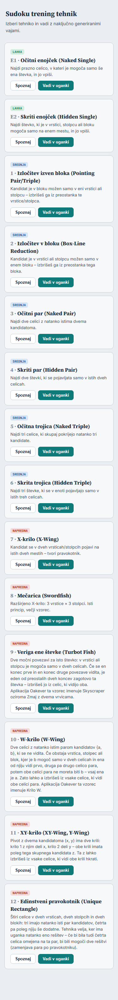

**4 · Skriti par, 375 px, začetek vaje** – vklopljeni »pokaži prečrtane« (sivo
prečrtani kandidati, npr. V4S1 5, V9S8 6), poudarjena 5, izbrana V4S2:

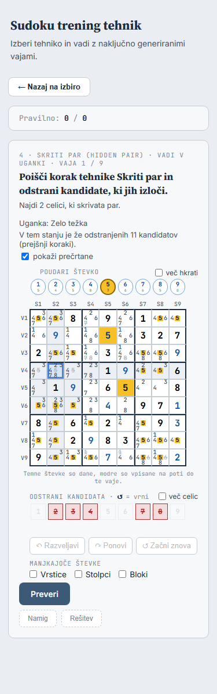

**4, 375 px, po enem izbrisu in »Preveri«** (izid `delno`, modro sporočilo) in odprta
»Rešitev«: oznake koraka na mreži (jantarno vzorec, rdeče prečrtano še neizvedeno),
seznam dejanj »Opravljeno: 1 od 6«:

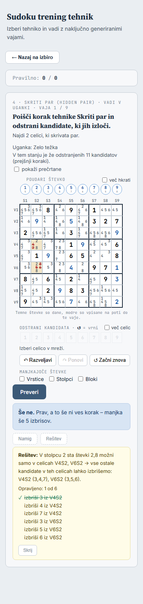

**4, 375 px, pravilno** – mreža zaklenjena (brez zelene obrobe, kot E1/E2 v »Spoznaj«),
vzorec jantarno, izbrisani kandidati koraka rdeče prečrtani. Na posnetku je »Začni znova«
še omogočen (prototip); v izvedbi se vrstica Razveljavi/Ponovi/Začni znova po pravilnem
odgovoru skrije:

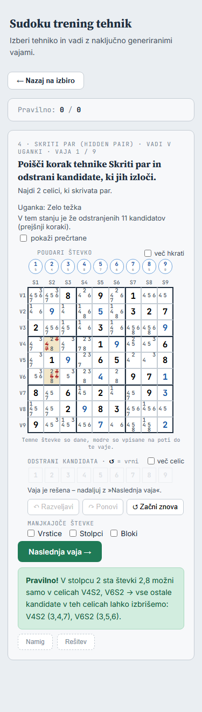

**4, 1200 px**, seznama vrstic in stolpcev, začetek in delno z rešitvijo:

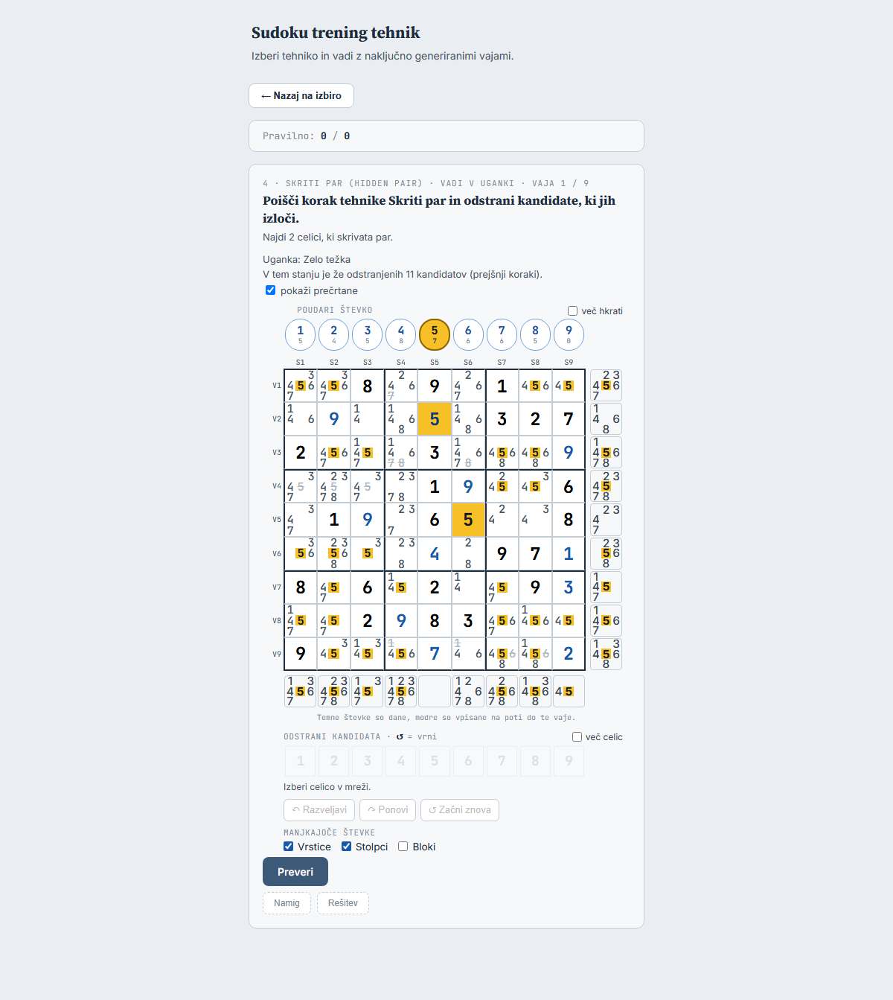
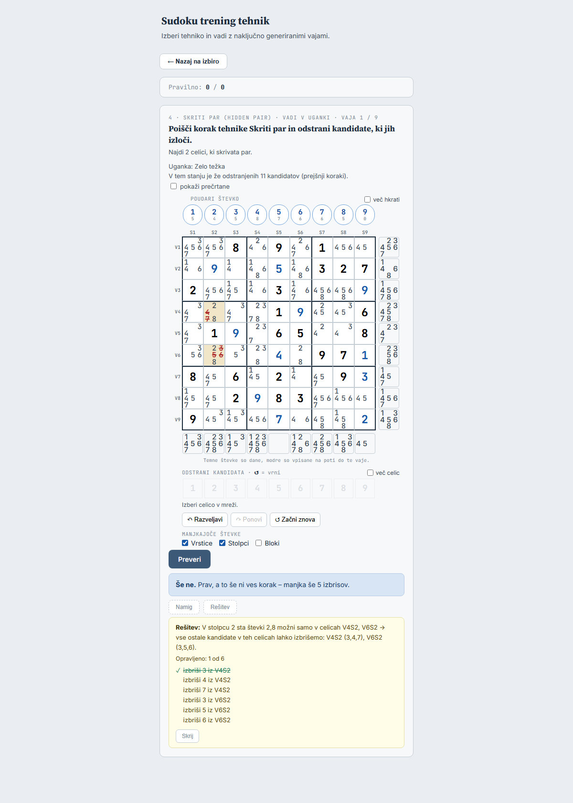

**E1, 375 in 1200 px** – predlog 5 v V2S5 (poševna modra števka v izbrani celici),
poudarjena 3, niz »Vpiši« z vsemi devetimi števkami:

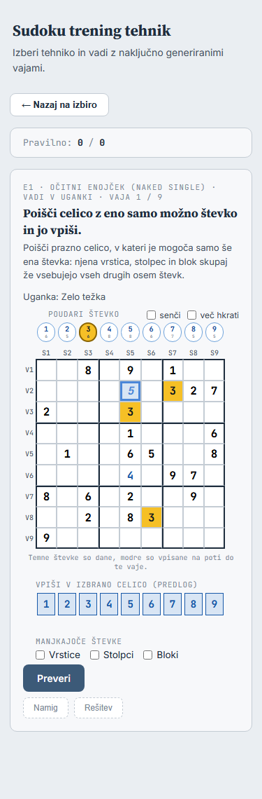
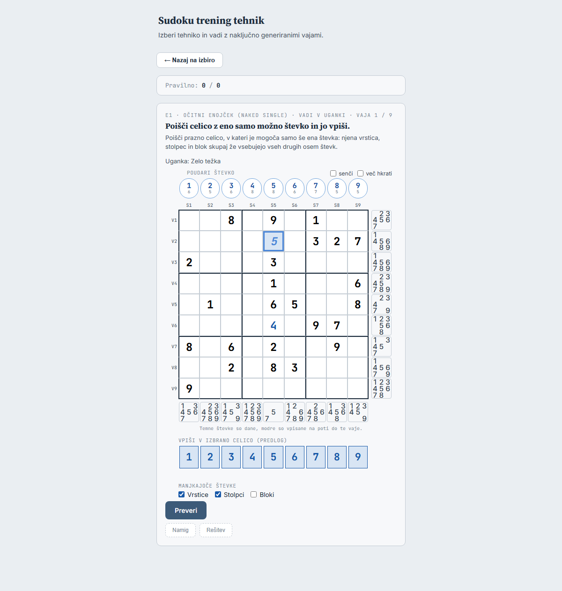

**E2, 375 px** – »senči« s poudarjeno 4 in odprt »Namig« (»Poglej vrstico 4: …«):

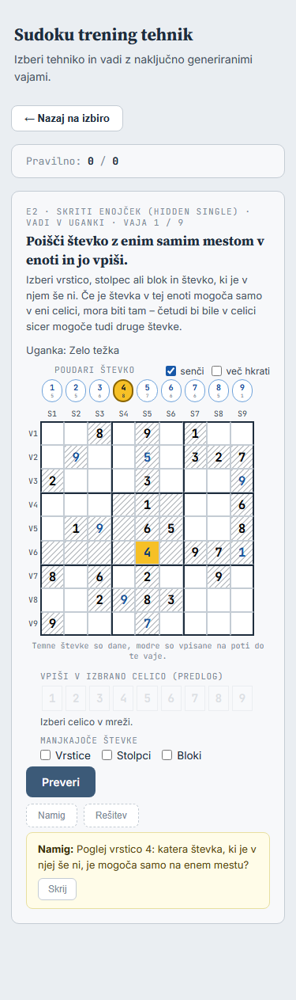

Pri 1200 px je veliko praznega prostora ob strani, pomoč pa je pod mrežo. Dvostolpčna
postavitev (mreža levo, gumbi in pomoč desno, kot igra ≥ 900 px) je mogoča, a bi se
razlikovala od »Spoznaj« – vprašanje 2.

## 4. Tehnike 1–12: odgovor in »Preveri«

**Vnos.** Plošča s kandidati: niz »Odstrani« (odstrani/vrni, več celic, Ctrl+klik,
Shift+števka), Razveljavi/Ponovi/Začni znova (brez vprašanja – vrne na S0, poteze ostanejo
v »Ponovi«), puščice, Escape, Ctrl+Z/Ctrl+Shift+Z/Ctrl+Y. Niza »Vpiši« ni, tipka s števko
brez Shift in Backspace/Delete ne naredita nič (`vpis: false`). Sivo senčenje sosed izbrane
celice ostane (kot v igri – pri 1–12 ni zatemnjenih celic postopnosti, s katerimi bi se
zlilo). Senčenja »senči« ni (odločitev D5a.6).

**Presoja** `preveriVajo(vaja, stanje)` – izidi in odziv UI:

| Izid | Sporočilo (iz `preveriVajo()`) | Slog | Šteje | Kaj še |
|---|---|---|---|---|
| `prazno` | »Odstrani kandidate, ki jih tehnika izloči.« | info | – | |
| `napacno` | »Ni pravilno.« + »Števka 7 je v V3S5 prava – …« | err | napačno | gumb **»Poskusi znova«** v sporočilu (= Začni znova) |
| `neutemeljeno` | »Izbris drži, a … Razveljavljeno: V3S5 (7).« | info | – | izbrisi zunaj KT se samodejno vrnejo |
| `druga-tehnika` | »To drži, a je to korak tehnike 10 · W-krilo, ne 8 · Mečarica. Razveljavljeno: …« | info | – | isto |
| `delno` | »Še ne.« + »Prav, a to še ni ves korak – manjkajo še 3 izbrisi.« | info | – | |
| `pravilno` | »Pravilno! « + sporočilo koraka | ok | pravilno | zaklep, oznake, »Naslednja vaja →« |

- **Samodejna razveljavitev** (odločitev 3): za vsak izbris iz `razveljavi` poteza
  `{ tip: 'kandidat', odstrani: false }` – samo funkcije iz `shared/stanje.js`, brez
  spremembe modela potez. »Razveljavi« jih potem vrača po eno. Druga možnost je ena
  poteza za vse (razširitev poteze `kandidati` na vračanje v `stanje.js`) – vprašanje 4.
- **»Preveri« po oceni** je onemogočen, dokler se igra ne spremeni (poteza, razveljavi,
  ponovi, začni znova). Tako isti napačni odgovor ne šteje dvakrat; v »Spoznaj« isto
  doseže počiščena izbira.
- **Pravilno:** `samoZaOgled()` (niz in tipke ne delajo), vrstica pod nizi »Vaja je
  rešena – nadaljuj z »Naslednja vaja«.«, vrstica Razveljavi/Ponovi/Začni znova se skrije,
  na mreži vzorec koraka (jantarno) in izbrisi koraka rdeče prečrtani (`precrtani` +
  `k-izbris`), poudarek ostane.
- Vpisi niso del odgovora; enojček, ki nastane po izbrisih, je že naslednja vaja.

## 5. E1 in E2

- Mreža brez kandidatov, izbrati je mogoče samo prazne celice, brez postopnosti (cela
  mreža, kot vaje 7–9 v »Spoznaj«), brez sivega senčenja sosed.
- Niz »Vpiši« ima za izbrano prazno celico omogočenih **vseh 9 števk** (samo kandidati bi
  izdali očitni enojček). Klik ali tipka s števko (tudi Numpad) postavi **predlog** v
  celico: poševna modra števka (`predlog`). Nov predlog zamenja starega (predlog je en
  sam), Backspace/Delete ga pobriše. Predlog ni poteza, zato ni Razveljavi/Ponovi/Začni
  znova (odločitev 2 v analizi).
- »Preveri« → `preveriVajo(vaja, stanje, predlog)` (`preveriEnojcek()`): `pravilno` –
  predlog postane poteza vpis, zaklep, celica zelena (s poudarkom in zelenim okvirjem, kot
  v »Spoznaj«); `nevtralno` – »Še ne.« (info, ne šteje), predlog se pobriše; `napacno` –
  »Ni pravilno.« (šteje), predlog se pobriše; brez predloga »Izberi celico in vpiši
  števko.«.
- Senčenje »senči« kot v »Spoznaj«: pri E2 je vaja s prikazanim senčenjem vaja s pomočjo,
  pri E1 ne. Kljukici »senči« in »več hkrati« ostaneta med vajami kroga.

## 6. Pomoč (»Namig«, »Rešitev«)

- Gumba se sprožita s **klikom** (ne »drži« kot v »Spoznaj«). Okvir pomoči pod gumboma
  ostane, dokler ga igralec ne zapre z **»Skrij«** ali ne gre na naslednjo vajo. »Rešitev«
  zamenja odprt namig.
- **Vsak ogled = s pomočjo** (`oznaciPomoc()`), tudi takoj zaprt; že šteti poskusi vaje se
  odštejejo; ogled po pravilnem odgovoru ne spremeni ničesar. Pravilo je isto kot v
  »Spoznaj«, zato isti `stej()`/`oznaciPomoc()`/`preveri()`.
- **Kateri korak:** ob odprtju pomoči korak iz `KT`, ki ima največ igralčevih izbrisov (pri
  enaki meri prvi), brez izbrisov `KT[0]` (= `nextStep()` v S0). Ostane isti, dokler je
  okvir odprt.
- **1–12:** namig = `stepHint(korak)`; rešitev = sporočilo koraka, legenda, seznam dejanj
  »Opravljeno: N od M« (kot v igri – izvedena zeleno prečrtana s kljukico), na mreži
  `oznakeKoraka(korak, stanje)` (samo še neizvedena dejanja, zato se ob vsakem izbrisu
  osvežijo); ko so izvedena vsa: »✓ Korak je izveden.«.
- **E1/E2:** namig = `namigEnojcka(gol, KT, korak, null, grid)` (cela mreža); rešitev =
  sporočilo koraka in oznake (enota pri E2 jantarno, celica zeleno s števko).
- Izris seznama dejanj (pribl. 20 vrstic) je v igri (`izrisiDejanja()` v `igra/igra.js`).
  Ker igra ostane nespremenjena, ga trening napiše sam (enako besedilo); logika koraka
  (`dejanjaKoraka()`) je skupna v `shared/stanje.js`.

## 7. Iskanje vaje

- `trening/v-uganki.js`: v glavni niti po eno uganko na `setTimeout` (deluje tudi pri
  `file://`): `genMinimalnaUganka(genNaklucnoSeme())` → `stanjaVUganki()` → pri najdenem
  stanju `vajaIzStanja()` z naključnim stanjem. Meja **1 s** se preverja med ugankami.
  Med iskanjem je v kartici »Iščem vajo …«.
- Po meji: **banka** – naključen zapis iz `VAJE_BANKA` s to tehniko, ki v tej seji še ni
  bil uporabljen (ko jih zmanjka, se začne znova), in `vajaIzUganke()`.
- Čas in naključnost se v testih nadomestita (meja 0 → banka, `Math.random` s semenom).

**Meritev v brskalniku** (Edge, namizni računalnik, prototip, 852 ugank v 20 s):
**23,5 ms na uganko** (uganka + pot), torej pribl. 42 ugank v 1 s. Delež vaj, najdenih
sproti v 1 s, po deležu ugank s stanjem iz analize 2.2 (20 000 ugank; vzorec v brskalniku
se z njim ujema) – ocena `1 − (1 − p)^42`, za telefon (3× počasneje, predpostavka)
`^14`:

| Tehnika | ugank s stanjem | sproti v 1 s (namizni) | telefon (ocena) |
|---|---:|---:|---:|
| E1, E2, 1, 2, 3, 9 | 20–99 % | 100 % | 96–100 % |
| 4 Skriti par | 14,8 % | 99,9 % | 89 % |
| 10 W-krilo | 10,8 % | 99 % | 80 % |
| 11 XY-krilo | 5,9 % | 92 % | 57 % |
| 7 X-krilo | 4,4 % | 85 % | 47 % |
| 5 Očitna trojica | 3,9 % | 81 % | 43 % |
| 12 Edinstveni pravokotnik | 2,5 % | 65 % | 30 % |
| 6 Skrita trojica | 1,3 % | 42 % | 17 % |
| 8 Mečarica | 1,0 % | 34 % | 13 % |

Tabela v `docs/trening-v-uganki-nacrt.md`, razdelek 0, je bila brez ugank »Presega
tehnike« in brez meritve v brskalniku, zato je bila zanje precej slabša (8 in 12: 14–18 %,
6: 0 %). Tudi zdaj bo pri 6, 8 in 12 vaja večkrat iz banke (odločitev 6); iskanje v ozadju
je v »KASNEJE«.

## 8. Kaj potrebujeta mreža in plošča (samo, kar del 6 uporabi)

| Dodatek | Kaj | Korak | Igra / »Spoznaj« |
|---|---|---|---|
| `mreza.js` `pogled.precrtani` | 81 mask: kandidat, ki ni v `kandidati`, a je v maski, se izriše kot `span.kand.precrtan` (sivo prečrtan); če je hkrati v `oznake.izbris`, še `k-izbris` (rdeče) | 6a (pokaži prečrtane), 6b (izbrisi po pravilnem) | ne podata ga – DOM enak |
| `mreza.css` | `.kand.precrtan`, `.kand.precrtan.k-izbris`, `.celica.predlog` | 6a, 6d | razredov ni |
| `plosca.js` `vpis: false` | tipka s števko brez Shift in Backspace/Delete ne naredita nič (vrneta `false`); niz »Vpiši« aplikacija ne poda | 6b | privzeto `true` |
| `plosca.js` razlog pod nizi | celica z vpisom iz začetnih potez: »V V3S5 je vpis iz prejšnjih korakov (7) – ne spreminja se.« namesto »tvoj vpis – najprej ga zbriši« (tega ni mogoče zbrisati) | 6b | igra: `zacetni` so same ničle – besedilo enako |
| `mreza.js` `pogled.predlog` | `{ celica, stevka }` ali null: prazna celica brez kandidatov pokaže števko z razredom `predlog` | 6d | ne podata ga |
| `plosca.js` `predlog: true` | niz »Vpiši« za eno izbrano prazno celico omogoči vseh 9 števk; Backspace/Delete pokliče `obVpisu(celica, 0)` | 6d | »Spoznaj« ima `obVpisu` brez `predlog` – enako kot zdaj |

Ne dodajam: števca potez glede na začetek (števca v vaji ni), posebnega zaklepa (zadošča
`samoZaOgled()` in skrita vrstica gumbov), branja barv (je že).

Slogi zaslona vaje so v `trening/trening.css` pod razredom `.vaja-uganka`; pravila, ki so
enaka kot pri `.vaja-enojcek` (velikost celice, robovi nizov, izbira, glava s kljukicami),
dobijo skupen izbirnik `.vaja-enojcek, .vaja-uganka` – izračunani slogi »Spoznaj« ostanejo
enaki (preveri scenarij).

## 9. Nespremenjeno: igra, reševalec, »Spoznaj«

- **Igra:** `node tools/posnetek-igre.js --primerjaj tools/posnetki/igra-pred-niz.json` →
  »Enako: 85 posnetkov.« po vsakem koraku; testi `igra-*`, `plosca`, `mreza` z enakimi
  pričakovanji.
- **Reševalec:** ne nalaga `mreza.js` ne `plosca.js`; testi `app-*`, `niz-danosti`.
- **»Spoznaj«:** vaje so enake (ista koda v `renderExercise()` za način »Spoznaj«, nova
  koda je v `trening/v-uganki.js`). Scenarij primerja z izhodiščem **`5b9ae6f`** (zadnji
  commit pred delom 6) za vseh 14 tehnik z `Math.random` s semenom: `innerHTML` območja
  vaje in izračunani slogi vseh elementov morata biti enaka. Obstoječa scenarija
  (`preveri-presek-brskalnik.js`, `preveri-enojcki-brskalnik.js`) morata ostati zelena.
  Spremeni se samo meni (gumba na kartici).

## 10. Testi in scenarij v brskalniku

- `tests/mreza.test.js`: `precrtani` (sivo, z `k-izbris` rdeče, ne pri kandidatu, ki je v
  `kandidati`), `predlog`.
- `tests/plosca.test.js`: `vpis: false` (števka, Numpad, Backspace ne spremenijo igre;
  Shift+števka odstrani – tudi par QWERTZ `key: '!'`, `code: 'Digit1'`), besedilo za začetni
  vpis, `predlog: true` (vseh 9 števk, `obVpisu`, Backspace).
- Nov `tests/trening-uganka-ui.test.js` (nadomestni DOM): gumba načina (klik kartice =
  Spoznaj); iskanje sproti in banka (meja 0, neuporabljeni zapisi); prikaz 1–12 (kandidati
  so kandidati S0, niza »Vpiši« ni, število prej odstranjenih s sklanjanjem, »pokaži
  prečrtane«); **vseh šest izidov** s pravimi potezami (izbrisi iz `KT`/`KV` in števk
  rešitve, ne na pamet – vaje iz semen, kot v `vaje-uganka.test.js`), samodejna
  razveljavitev, »Poskusi znova«, »Preveri« onemogočen do spremembe, pravilno (zaklep,
  oznake, skrita vrstica gumbov, štetje); krog 9 vaj in »Končano!«; pomoč (namig in
  rešitev ostaneta do »Skrij«, s pomočjo in odštevanje, oznake se osvežijo ob izbrisu, po
  pravilnem brez učinka); E1/E2 (brez kandidatov, vseh 9 števk, predlog, tipka, Backspace,
  izidi, senčenje pri E2 pomoč, pri E1 ne); tipkovnica s pari QWERTZ (Ctrl+Z je `key: 'z'`,
  `code: 'KeyY'`); besedila brez »številk«, »Prikaži« in angleških imen zunaj oklepaja.
- Obstoječi `trening-pomoc`, `trening-enojcki`, `trening-presek` ostanejo s **istimi
  pričakovanji**.
- Nov `tools/preveri-vadi-brskalnik.js` (po vzoru `preveri-enojcki-brskalnik.js`), pri 375
  in 1200 px: 1–12 (vsaj 4, 8, 12) in E1/E2 – brez drsnika, plošča v kartici, kandidati in
  izračunan slog prečrtanih, pravi kliki in tipke (tudi pari QWERTZ), »Preveri« do
  pravilnega odgovora s pravimi kliki, rešitev z oznakami, senčenje, »Iščem vajo …« in
  banka pri meji 0, brez napak JS, posnetki zaslona (pogledam jih sam); primerjava
  »Spoznaj« z izhodiščem `5b9ae6f` (točka 9).
- Testi zdaj: 379; pričakujem pribl. 379 + 15.

## 11. Vprašanja

1. **Razdelitev:** štirje koraki 6a–6d (predlog; pomoč 1–12 ločeno, dodatki v `shared/` v
   koraku, ki jih prvi uporabi). Naj bo gumb »Vadi v uganki« do 6b skrit?
2. **Postavitev:** en stolpec kot »Spoznaj« (predlog) ali dva stolpca pri ≥ 900 px?
3. **»Preveri« po oceni onemogočen do naslednje spremembe** (predlog)?
4. **Samodejna razveljavitev:** ena poteza »vrni« na izbris (predlog, brez spremembe
   `stanje.js`) ali ena poteza za vse?
5. **Po pravilnem odgovoru pri 1–12** izbrisani kandidati koraka rdeče prečrtani, vrstica
   Razveljavi/Ponovi/Začni znova skrita (predlog)?
6. **Predlog pri E1/E2:** poševna modra števka (predlog) – ali drug videz?
7. **Vrstica informacij:** stopnja uganke vidna (tudi »Presega tehnike«), izvor vaje
   (banka/sproti, seme) samo v `title` (predlog)?
8. **»Pokaži prečrtane«** ostane med vajami kroga, ne shranjuje se; stikala seznamov imajo
   isti ključ kot »Spoznaj« (`sudoku.trening.seznami`) (predlog)?

## 11a. Odgovori (2026-09-28)

Načrt potrjen.

1. Koraki 6a–6d: **da**. Gumb »Vadi v uganki« je **skrit do konca 6d** (push gre na javno
   stran). Za teste in scenarij med koraki ga pokaže zastavica v naslovu strani
   **`?vadi=1`** (`trening/index.html?vadi=1`); v 6d se zastavica odstrani in gumb je
   viden vedno.
2. Postavitev: **en stolpec** (predlog).
3. »Preveri« po oceni **onemogočen do naslednje spremembe** (predlog).
4. Samodejna razveljavitev: **ena poteza »vrni« na izbris** (predlog).
5. Po pravilnem odgovoru pri 1–12 izbrisani kandidati koraka rdeče prečrtani, vrstica
   Razveljavi/Ponovi/Začni znova skrita: **da** (predlog).
6. Predlog pri E1/E2 **ne sme biti moder** (zlije se z vpisi poti). V 6d predlagam drugačen
   videz (npr. vijolična kot izbrana števka v »Spoznaj« ali siva s črtkanim okvirjem) in
   pokažem posnetek pri 375 px.
7. Vrstica informacij: stopnja vidna, izvor samo v `title`: **da** (predlog).
8. »Pokaži prečrtane« ostane med vajami kroga, stikala seznamov s ključem
   `sudoku.trening.seznami`: **da, oboje** (predlog).

Pravilo v `CLAUDE.md` (po dogodku pri posnetkih prototipa): brskalnika nikoli ne ustavljaj
po imenu procesa, samo procese z lastnim profilom orodja.

Ob razliki v posnetku igre ali v primerjavi »Spoznaj« se izvedba ustavi. Ročni pregled je
en sam, po 6d.

## 12. Ročni pregled (en sam, po 6d – osnutek, največ 5)

1. **Trening, pravi telefon, 1–12 (npr. 4) z vklopljenim »pokaži prečrtane«:** preberi
   kandidate, loči prečrtane od navadnih, izberi celico s prstom in odstrani kandidata.
   Pričakovano: berljivo pri 30 px, prečrtani jasno drugačni, brez zgrešenih dotikov. Ni
   avtomatsko: berljivost in dotik.
2. **Trening, slovenska tipkovnica, 1–12:** Shift+števka, Ctrl+Z, Ctrl+Y; E1: števka in
   Backspace. Pričakovano: odstrani/razveljavi/ponovi, predlog se postavi in pobriše. Ni
   avtomatsko: scenarij pošlje pare `key`/`code`, ne prave razporeditve sistema.
3. **Trening, telefon, 8 · Mečarica:** nekajkrat »Naslednja vaja«. Pričakovano: »Iščem
   vajo …« največ pribl. 1 s, nato vaja. Ni avtomatsko: hitrost pravega telefona ni
   izmerjena (faktor 3 je predpostavka).
4. **Trening, 1–12:** izzovi »druga tehnika« in »neutemeljeno« (odstrani kandidata, ki ga
   izloči druga tehnika, ali kandidata brez utemeljitve, ki ni prava števka). Pričakovano: sporočilo je razumljivo in ne zveni kot napaka, izbrisi se
   vrnejo. Ni avtomatsko: razumljivost besedila.

## 13. Stanje izvedbe

| Korak | Stanje | Commit | Testi |
|---|---|---|---|
| 6a izbira načina, iskanje, zaslon za ogled | **narejeno 2026-09-28** | `c22fe78` | 390 (379 + 11) |
| 6b odgovor pri 1–12 | **narejeno 2026-09-28** | `566265e` | 393 (390 + 3) |
| 6c pomoč pri 1–12 | **narejeno 2026-09-28** | `60a6d41` | 396 (393 + 3) |
| 6d E1/E2, gumb viden, ročni pregled | **narejeno 2026-09-28** | (ta commit) | 399 (396 + 3) |

### 6a

- `trening/v-uganki.js` (nov): iskanje (`najdiVajo()` sproti do 1 s, `vajaIzBanke()`),
  »Iščem vajo …«, zaslon vaje za vseh 14 tehnik (vrstica nad vajo, navodilo, razlaga,
  vrstica informacij s stopnjo, prej odstranjenimi in »pokaži prečrtane«, plošča s
  poudarkom in seznami). Do 6b je vajo mogoče samo preskočiti.
- `trening/trening.js`: `nacin`, `zacniKrog(mode, nacin)` (klik kartice = »Spoznaj«),
  gumba načina samo z `?vadi=1`, `renderExercise()` pri načinu »uganka« pokliče
  `renderVadi()`, »Nazaj« in nova vaja ustavita iskanje (`vadiPrekini()`). Pot »Spoznaj«
  je nespremenjena.
- `shared/mreza.js` + `mreza.css`: `pogled.precrtani` (`kand precrtan`, z `k-izbris`
  rdeče). Igra ga ne poda.
- `trening/trening.css`: pravila `.vaja-enojcek` imajo skupen izbirnik z `.vaja-uganka`
  (razen `cursor:default` na polnih celicah – pri 1–12 se polna celica izbere), novi
  slogi gumbov načina, vrstice informacij in »Iščem vajo …«.
- Testi: nov `tests/trening-uganka-ui.test.js` (10), `tests/mreza.test.js` (+1),
  nalagalna seznama `trening-pomoc` in `trening-presek` (`trening/v-uganki.js`).
- Preverjanje: 390 testov; posnetek igre »Enako: 85 posnetkov.«; nov
  `tools/preveri-vadi-brskalnik.js` »Vse drži« (»Spoznaj« vseh 14 tehnik enak kot
  `5b9ae6f` pri 375 in 1200 px, meni brez zastavice enak); `preveri-enojcki-brskalnik.js`
  in `preveri-presek-brskalnik.js` »Vse drži«.
- Prvi zagon primerjave »Spoznaj« je pokazal razliko pri E1, 375 px (širina napisa
  »Poudari števko« 101,09 → 101,64 px). **Vzrok ni koda:** ista stran da v zaporednih
  odprtjih obe širini – pisava latin-ext (za »š«) se naloži šele po kliku. Scenarij zdaj
  pred primerjavo počaka na `document.fonts.status === "loaded"`; nato enako.

### 6b

- `trening/v-uganki.js`: pri 1–12 niz »Odstrani« z »več celic«, vrstica z razlogom,
  Razveljavi/Ponovi/Začni znova, »Preveri« s šestimi izidi po točki 4 (sporočila iz
  `preveriVajo()`), samodejna vrnitev izbrisov zunaj KT (ena poteza na izbris – odgovor 4),
  »Poskusi znova« v sporočilu napačnega odgovora, »Preveri« onemogočen do naslednje
  igralčeve spremembe (odgovor 3), po pravilnem odgovoru zaklep, skrita vrstica gumbov,
  vzorec in rdeče prečrtani izbrisi koraka (odgovor 5). Staro sporočilo ob spremembi
  izgine. E1/E2 ostaneta do 6d samo za ogled.
- `trening/trening.js`: poslušalec `keydown` pokliče ploščo vaje (samo 1–12).
- `shared/plosca.js`: `vpis: false`; vrstica pod nizi pri vpisu iz začetnih potez »V V3S5 je
  vpis iz prejšnjih korakov (7) – ne spreminja se.« (igra začetnih potez nima – enako).
- `trening/trening.css`: vrstica z razlogom, gumbi Razveljavi/Ponovi/Začni znova, `fb info`.
  Pojasnilo ob nizu je »↺ = vrni« (»vrni odstranjenega« se pri 375 px prelomi).
- Testi: `tests/trening-uganka-ui.test.js` (+2: šest izidov, tipkovnica QWERTZ in besedila),
  `tests/plosca.test.js` (+1 `vpis: false`, razlog pri začetnem vpisu v obstoječem testu).
- Preverjanje: 393 testov; posnetek igre »Enako: 85 posnetkov.«;
  `tools/preveri-vadi-brskalnik.js` »Vse drži« (dopolnjen z odgovorom pri 4 s pravimi
  kliki in tipkami QWERTZ; »Spoznaj« vseh 14 tehnik enak kot `5b9ae6f`).

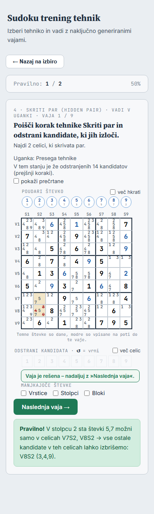

### 6c

- `trening/v-uganki.js`: gumba »Namig« in »Rešitev« pod sporočilom, okvir pomoči ostane do
  »Skrij« in se osveži ob vsaki potezi (tudi ob samodejni vrnitvi izbrisov), pravilen
  odgovor ga zapre. Korak pomoči po točki 6 (največ igralčevih izbrisov, sicer `KT[0]`).
  Rešitev: sporočilo koraka, »Opravljeno: N od M« s seznamom (kopija izrisa iz igre – igra
  ostane nespremenjena), »✓ Korak je izveden.«, na mreži samo še neizvedena dejanja.
- `trening/trening.css`: okvir pomoči (barve kot »Namig (drži)« v »Spoznaj«), gumbi
  Razveljavi/Ponovi/Začni znova manjši, da so pri 375 px v eni vrstici.
- Testi: `tests/trening-uganka-ui.test.js` (+3).
- Preverjanje: 396 testov; posnetek igre »Enako: 85 posnetkov.«;
  `tools/preveri-vadi-brskalnik.js` »Vse drži« (dopolnjen s pomočjo pri 4 s pravimi
  kliki; »Spoznaj« enak kot `5b9ae6f`).

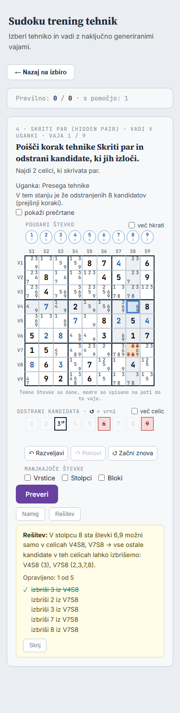

### 6d

- `trening/v-uganki.js`: E1/E2 – kljukica »senči« (pri E2 pomoč, kot v »Spoznaj«), niz
  »Vpiši« z vsemi 9 števkami, predlog v celici (niz, tipka s števko, Backspace/Delete, ista
  števka v isti celici ga pobriše), »Preveri« s `preveriVajo(v, stanje, predlog)`
  (pravilno → poteza vpis in zaklep, nevtralno ne šteje, napačno šteje; predlog se po oceni
  pobriše), namig za celo mrežo, rešitev z oznakami koraka. »Preveri« je tudi tu
  onemogočen do spremembe predloga.
- `trening/trening.js`: gumba »Spoznaj« in »Vadi v uganki« sta **vidna vedno** (zastavica
  `?vadi=1` odstranjena), tipkovnica tudi pri E1/E2.
- `shared/mreza.js` + `mreza.css`: `pogled.predlog` (razred `predlog`); `shared/plosca.js`:
  `predlog: true`.
- Testi: `tests/trening-uganka-ui.test.js` (+2, krog zdaj z odgovori 9/9), `tests/plosca.test.js`
  (+1), `tests/mreza.test.js` (predlog v obstoječem testu).
- Preverjanje: 399 testov; posnetek igre »Enako: 85 posnetkov.«;
  `tools/preveri-vadi-brskalnik.js` »Vse drži« (»Spoznaj« vseh 14 tehnik enak kot
  `5b9ae6f`); `preveri-enojcki-brskalnik.js`, `preveri-presek-brskalnik.js` in
  `preveri-niz-brskalnik.js` »Vse drži«.

**Videz predloga (odgovor 6).** Predlog: **vijolična poševna števka s črtkanim vijoličnim
okvirjem** (barva izbrane števke v »Spoznaj«, `#6840A0`). Loči se od danih (črne), vpisov
poti (modre) in odgovora (zelena celica); okvir pove, da vpis še ni potrjen. Druga možnost
– siva števka s sivim črtkanim okvirjem – je na desnem posnetku (samo za primerjavo, ni v
kodi). Pri izbrani celici (modrikasta podlaga) je siva slabše vidna.

| Vijolična (v kodi) | Siva (druga možnost) |
|---|---|
| 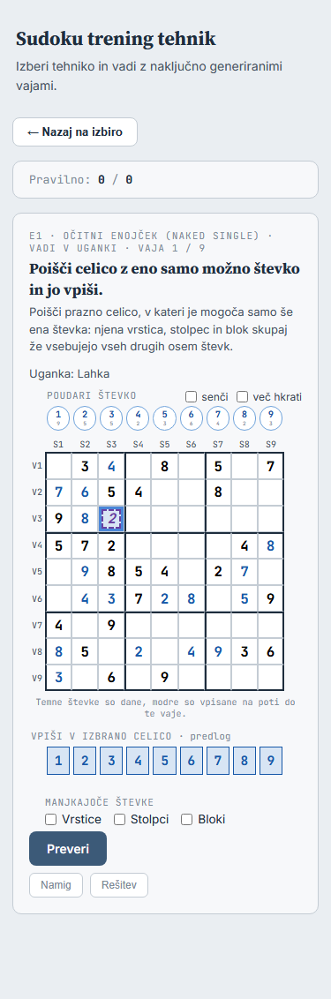 | 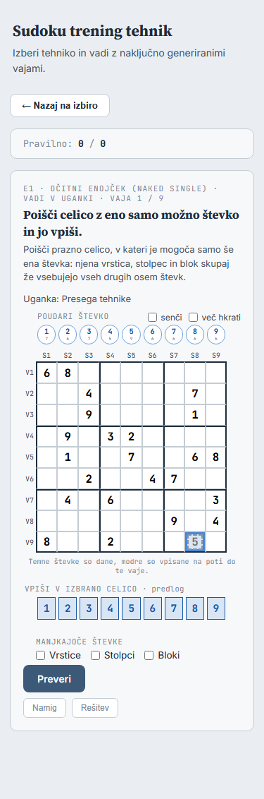 |

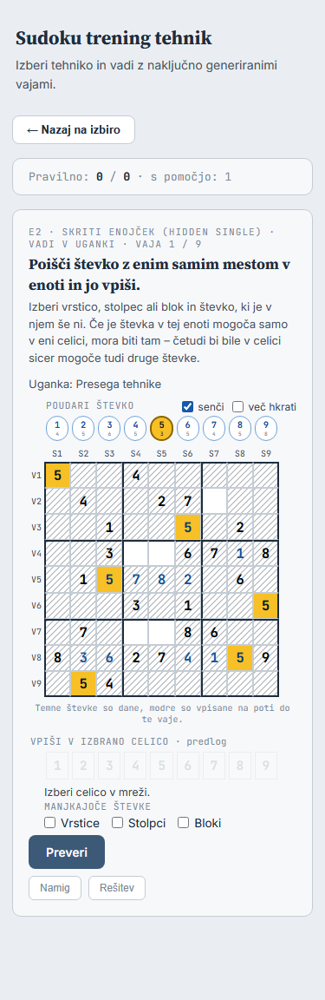

## 14. Ročni pregled (en sam, po 6d)

Prenesen v `docs/rocni-test.md`, razdelek »Trening: Vadi v uganki«.

## 15. Popravek po ročnem pregledu: območje koraka in besedilo prečrtanih (načrt, 2026-09-28)

**Kode še nisem spreminjal.** Posnetki pri 375 px so iz prototipa v začasni kopiji
projekta (trenutni `main` z dodatki spodaj).

**Opažanje (ročni pregled, 4 · Skriti par):** navodilo »Poišči korak tehnike Skriti par«
na celi uganki igralca zmede, ker ne ve, kje naj išče. Iz besedila pri prečrtanih
kandidatih ni razvidno, da niso del naloge.

### 15.1 Območje koraka in postopnost v krogu

- **Vaje 1–6** imajo **območje**: navodilo ga pove, na mreži je označeno (kot postopnost
  v »Spoznaj«). **Vaje 7–9** so brez območja (cela uganka, kot zdaj). Velja za vse
  tehnike, tudi za E1 in E2.
- **Katero območje, če je korakov več:** naključen korak iz `KT` (kot izbira koraka v
  »Spoznaj«), območje je njegovo. Pravilen je **vsak** korak tehnike v istem območju (npr.
  dva skrita para v istem bloku). Pomoč (Namig, Rešitev) izbira samo med koraki v območju.
- **Območje po tehnikah.** Pri 1–6 in E2 ima korak eno enoto (`step.unit` oziroma
  `hint.unit`), pri 7–12 in E1 pa ne. Zanje predlagam območje, ki je približno na ravni
  namiga (`stepHint()`) in vzorca ne izda:

| Tehnika | Območje | Navodilo (primer) | Na mreži | Korak je v območju, ko |
|---|---|---|---|---|
| E1 | vrstica, stolpec ali blok celice koraka (naključno, kot »Spoznaj« vaje 4–6) | »V vrstici 3 poišči celico z eno samo možno števko in jo vpiši.« | enota modrikasta (`oznacene`), izbrati je mogoče samo prazne celice v njej (kot »Spoznaj«) | celica koraka je v enoti |
| E2 | enota koraka | »V bloku 5 poišči števko z enim samim mestom in jo vpiši.« | enako | enako |
| 1–6 | enota koraka (blok pri 1, vrstica/stolpec pri 2, enota para/trojice pri 3–6) | »V vrstici 7 poišči skriti par in odstrani kandidate, ki jih izloči.« | enota modrikasta | ista enota |
| 7, 8, 9 | števka koraka | »Na števki 2 poišči X-krilo in odstrani kandidate, ki jih izloči.« | števka poudarjena ob začetku (niz Poudari, igralec jo lahko izklopi) | ista števka |
| 10 W-krilo | števki para | »Poišči W-krilo s parom kandidatov 3 in 7 in odstrani …« | obe števki poudarjeni (»več hkrati« se vklopi) | isti par števk |
| 11 XY-krilo | pivot | »Poišči XY-krilo s pivotom V8S1 in odstrani …« | celica pivota modrikasta | isti pivot |
| 12 Edinstveni pravokotnik | bloka pravokotnika | »V blokih 1 in 2 poišči edinstveni pravokotnik in odstrani …« | oba bloka modrikasta | ista bloka |

  Razlaga pod navodilom dobi pri označenih celicah še »Označeno območje je na mreži
  modrikasto.«, pri števkah »Števka je poudarjena.«. Ime tehnike v navodilu je v tožilniku
  (»skriti par«, »očitno trojico«, »mečarico« …) – preslikava je v `trening/v-uganki.js`,
  ker `imeTehnike()` da imenovalnik.

- **Pravilen korak zunaj območja (1–12):** nov izid **`druga-enota`** – kot `druga-tehnika`
  (ni napaka, ne šteje, izbrisi zunaj korakov v območju se samodejno vrnejo, »Preveri« do
  spremembe onemogočen). Vrstni red izidov: prazno → napačno → neutemeljeno →
  **druga-enota** → druga tehnika → delno / pravilno. Sporočila (brez sklanjanja imena
  tehnike, kot pri drugi tehniki):
  - enota: »To drži in je korak tehnike 4 · Skriti par, a v stolpcu 5 – naloga je v
    vrstici 7. Razveljavljeno: V2S5 (3).«
  - števka: »…, a na števki 3 – naloga je na števki 2.«; par: »…, a s parom 1 in 5 –
    naloga je s parom 3 in 7.«; pivot: »…, a s pivotom V2S3 – naloga je s pivotom
    V8S1.«; bloka: »…, a v blokih 4 in 5 – naloga je v blokih 1 in 2.«
  
  Pri E1/E2 do tega ne pride: izbrati je mogoče samo celice v enoti (kot v »Spoznaj«).
  Druga možnost je, da je vsak korak tehnike pravilen ne glede na območje (območje je
  samo pomoč pri iskanju) – potem bi navodilo postalo samo nasvet.
- **Kje v kodi:**
  - `shared/vaje-uganka.js` (brez DOM-a, testabilno): `obmocjeKoraka(korak, rnd)` →
    `{ vrsta: 'enota' | 'stevke' | 'pivot' | 'bloki', celice, stevke, opis }` in
    `vObmocju(korak, obmocje)`; `preveriVajo(vaja, stanje, predlog, obmocje)` – z območjem
    so koraki tehnike samo tisti v območju, drugi dajo `druga-enota`. Brez območja (vaje
    7–9, »Spoznaj«) se nič ne spremeni.
  - `trening/v-uganki.js`: območje ob izrisu vaje (`exNum < 6`), navodilo, `oznacene` ali
    poudarek, pri E1/E2 omejena izbira, pomoč iz korakov v območju, sporočilo
    `druga-enota`.
  - Igra in »Spoznaj« se ne spremenita (`preveriVajo()` brez območja dela kot zdaj).

**Posnetki (prototip, 375 px):**

| 4 · Skriti par, vaja 1 (vrstica 7), prečrtani vklopljeni | 7 · X-krilo, vaja 1 (števka 2) |
|---|---|
| 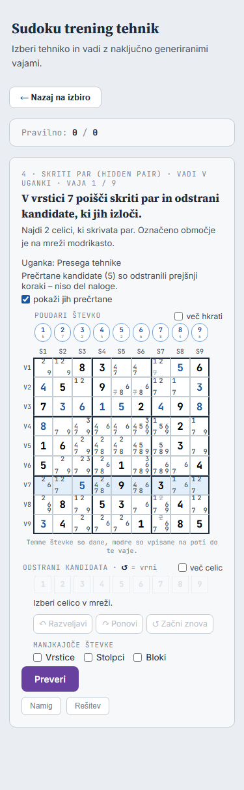 | 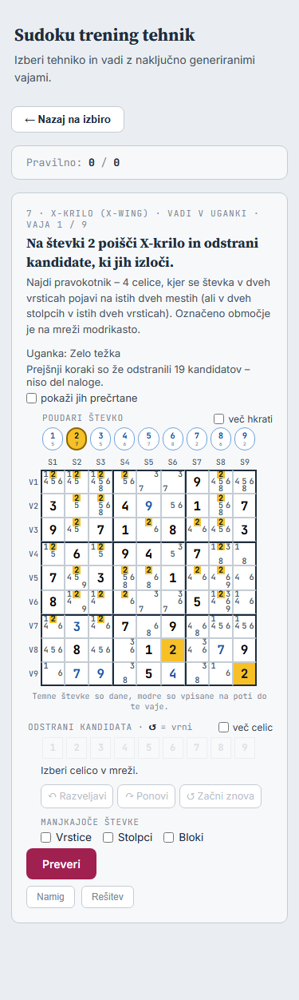 |

| 11 · XY-krilo, vaja 1 (pivot V8S1) | E1, vaja 1 (vrstica 3) |
|---|---|
| 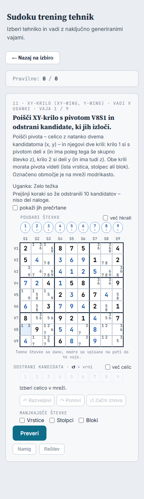 | 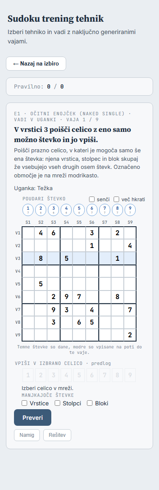 |

| 4 · Skriti par, vaja 1, prečrtani izklopljeni | 4 · Skriti par, vaja 7 (cela uganka) |
|---|---|
|  | 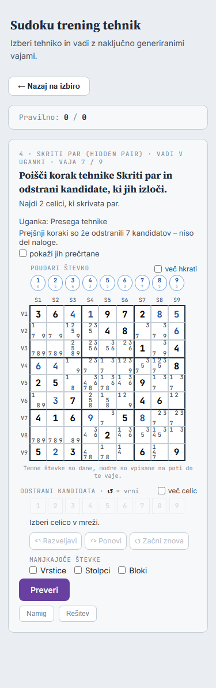 |

Na prototipu pri XY-krilu je pivot ena sama modrikasta celica (V8S1) – dobro viden, a
majhen; pri E1 je v prototipu izbira še na vsej mreži (v izvedbi omejena na enoto).

### 15.2 Besedilo pri prečrtanih kandidatih

| Stanje | Zdaj | Predlog |
|---|---|---|
| kljukica izklopljena | »V tem stanju je že odstranjenih 5 kandidatov (prejšnji koraki).« ☐ pokaži prečrtane | »Prejšnji koraki so že odstranili 5 kandidatov – niso del naloge.« ☐ pokaži jih prečrtane |
| kljukica vklopljena | isto | »Prečrtane kandidate (5) so odstranili prejšnji koraki – niso del naloge.« ☑ pokaži jih prečrtane |
| brez prej odstranjenih | »V tem stanju ni prej odstranjenih kandidatov.« | »Prejšnji koraki niso odstranili nobenega kandidata.« |

- Sklanjanje (tožilnik): 1 kandidata, 2 kandidata, 3 in 4 kandidate, 5 in več kandidatov
  (101 kandidata, 102 kandidata …).
- `title` kljukice: »Kandidate so odstranili koraki na poti do te vaje. Niso del odgovora –
  odstrani samo kandidate, ki jih izloči iskani korak.«

### 15.3 Testi in preverjanje

- `tests/vaje-uganka.test.js`: `obmocjeKoraka()` za vse tehnike iz semen v testu (območje
  vsebuje korak, `vObmocju()` drži za izbrani korak), `preveriVajo()` z območjem: korak v
  območju `pravilno`, korak iste tehnike zunaj `druga-enota` z razveljavitvijo, brez
  območja nespremenjeno.
- `tests/trening-uganka-ui.test.js`: navodilo in oznaka po stopnjah (vaje 1–6 z območjem,
  7–9 brez) za enoto, števke, pivot in bloka; E1/E2 omejena izbira; `druga-enota` prek
  UI; pomoč iz koraka v območju; novo besedilo prečrtanih s sklanjanjem.
- `tools/preveri-vadi-brskalnik.js`: označeno območje (izračunana barva), poudarjena
  števka, besedilo prečrtanih, brez drsnika pri 375 in 1200 px; »Spoznaj« enak kot
  `5b9ae6f`.
- Posnetek igre »Enako«, vsi testi.

Koraka izvedbe: **7a** `shared/vaje-uganka.js` (območje, `druga-enota`) in testi;
**7b** trening (navodilo, oznaka, postopnost, besedilo prečrtanih), scenarij,
dokumentacija. Vsak s commitom in pushem.

### 15.4 Vprašanja

1. **Območje pri 7–12:** števka (7–9), par števk (10), pivot (11), bloka (12) – predlog?
   Pri X-krilu in mečarici bi bile druga možnost osnovne vrstice/stolpci (izda pol vzorca).
2. **Pravilen korak zunaj območja:** `druga-enota` – ni napaka, ne šteje, izbrisi se vrnejo
   (predlog)? Ali ga sprejmem kot pravilnega?
3. **Katero območje:** naključen korak iz `KT` (predlog)?
4. **E1:** vrstica, stolpec ali blok celice koraka naključno, izbira omejena na enoto
   (predlog, kot »Spoznaj« vaje 4–6)?
5. **Besedilo prečrtanih:** kot v 15.2 (predlog)?

### 15.5 Odgovori (2026-09-28)

Točka 15 potrjena.

1. Območja pri 7–12 (števka, par števk, pivot, bloka): **da** (predlog).
2. Pravilen korak zunaj območja se **sprejme kot pravilen, brez novega izida**
   (`druga-enota` odpade, `preveriVajo()` ostane nespremenjena). Sporočilo pove, da je bil
   korak v drugem območju, npr. »Pravilno! (korak v stolpcu 5, ne v vrstici 7) …«. Namig
   in Rešitev ostaneta v območju.
3. Območje naključnega koraka iz `KT`: **da** (predlog).
4. E1 kot v »Spoznaj« (naključna enota celice koraka, izbira omejena nanjo): **da**.
5. Besedilo pri prečrtanih: **da** (predlog, 15.2).

Izvedba v dveh korakih (7a `shared/`, 7b trening), vsak s commitom in pushem. Ročni
pregled: obstoječih 5 točk (`docs/rocni-test.md`) se dopolni, največ 5.

### 15.6 Izvedba

| Korak | Stanje | Commit | Testi |
|---|---|---|---|
| 7a `shared/vaje-uganka.js`: `obmocjeKoraka()`, `vObmocju()` | **narejeno 2026-09-28** | `ebb4a60` | 400 (399 + 1) |
| 7b trening: navodilo, oznaka, postopnost, sporočilo, besedilo prečrtanih | **narejeno 2026-09-28** | (ta commit) | 403 (400 + 3) |

- 7a: nove funkcije brez DOM-a; `preveriVajo()` ostane nespremenjena (odgovor 2). Test na
  vseh korakih vaj iz semen v `tests/vaje-uganka.test.js`: območje vsebuje korak (tudi pri
  treh izbirah naključne enote pri E1), korak z drugim območjem ni v njem, vrste območij po
  tehnikah. Posnetek igre »Enako: 85 posnetkov.«
- 7b: `trening/v-uganki.js` – `izberiObmocje()` (vaje 1–6, `VADI_Z_OBMOCJEM`), navodilo
  `navodiloVadi()` (ime tehnike v tožilniku), razlaga dobi »Označeno območje je na mreži
  modrikasto.« / »Števka je poudarjena.«, oznaka `oznacene` (enota, pivot, bloka) ali
  poudarek števk ob začetku (pri W-krilu z »več hkrati«), pri E1/E2 izbira samo v enoti
  (druge prazne celice `neaktivne`), Namig in Rešitev iz korakov v območju (`KTob`; pri
  E1/E2 namig z oznako enote kot v »Spoznaj«), pravilen korak zunaj območja
  »Pravilno! (korak v stolpcu 5, ne v vrstici 7) …« (korak v območju ima prednost, če je
  cel), novo besedilo prečrtanih (15.2), ki se ob kljukici spremeni. `izrisiVadi(v, ob)`
  sprejme območje (test).
- Testi: `tests/trening-uganka-ui.test.js` (+3: območje po tehnikah, korak zunaj območja,
  korak v območju; posodobljeni navodilo, sklanjanje, izbira pri E1/E2, krog; testi
  odgovorov tečejo brez območja kot vaje 7–9).
- Preverjanje: 403 testi; posnetek igre »Enako: 85 posnetkov.«;
  `tools/preveri-vadi-brskalnik.js` »Vse drži« (dopolnjen z območjem pri 4, 7, 11, 12 in
  E1/E2 ter besedilom prečrtanih; »Spoznaj« enak kot `5b9ae6f`).
- Ročni pregled: točke 1, 4 in 5 v `docs/rocni-test.md` dopolnjene (še vedno 5 točk).

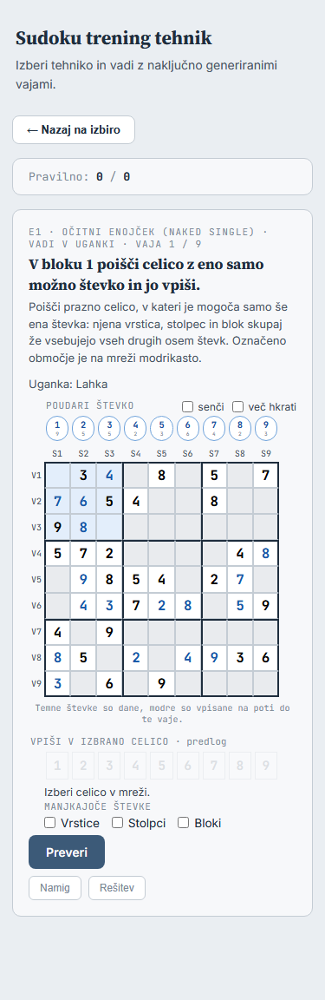
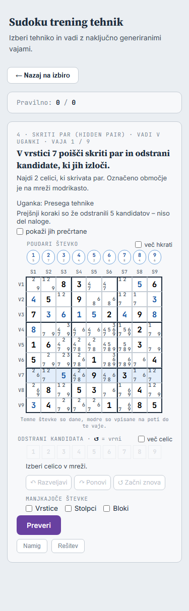

## 16. Izbira uganke po stopnji in ravni tehnike (načrt, 2026-09-29)

**Kode še nisem spreminjal.** Meritev je bila narejena na 30 000 minimalnih ugankah
(semena 1–30 000, `genMinimalnaUganka()` + `tehnikeVUganki()`, 37,6 ms na uganko v Node).
Skripti sta v začasni mapi, ne v repozitoriju.

**Zahteva (ročni pregled):** uganka za vajo naj upošteva stopnjo (`docs/uskladitev.md`,
razdelek 7) in raven tehnike:

1. uganka iste stopnje, kot je raven tehnike;
2. sicer višja rešljiva stopnja;
3. »Presega tehnike« samo v skrajnem primeru.

Pravilo mora izhajati iz ravni v kodi, ne iz seznama tehnik.

### 16.1 Raven tehnike → osnovna stopnja (iz kode)

Uganka, ki na poti motorja uporabi tehniko T, ima stopnjo **vsaj** tisto, ki jo da
množica {T} sama. Nižja ni mogoča, ker je T med uporabljenimi. Zato je **osnovna stopnja**
tehnike:

```js
stopnjaTehnike(kljuc) = STOPNJE_UGANK.find(s => s.ustreza(genMere(new Set([kljuc])))).ime
```

Uporablja samo ravni `GEN_LAHKE` … `GEN_EKSPERTNE` in `STOPNJE_UGANK` iz
`shared/generator.js`. Nova tehnika zato dobi pravilo sama, ko jo dodamo v raven:
XY-veriga v `GEN_EKSPERTNE` dobi Ekstrem, BUG+1 pa dobi stopnjo ravni, v katero pride.
Vrstni red stopenj (»višja«) je vrstni red `STOPNJE_UGANK`, na koncu je »Presega
tehnike«.

| Tehnika | Raven (`GEN_*`) | Osnovna stopnja | Nato |
|---|---|---|---|
| E1, E2 | lahka | Lahka | Srednja, Težka, Zelo težka |
| 1–6 | srednja | Srednja | Težka, Zelo težka |
| 7–12 | napredna | Težka (natanko ena napredna) | Zelo težka |
| (13 XY-veriga, pozneje) | ekspertna | Ekstrem | – |
| vse | | | Presega tehnike (skrajni primer) |

### 16.2 Meritev: uganke s stanjem tehnike po stopnji (30 000 ugank)

Stopnje vseh ugank: Lahka 12 410, Srednja 5641, Težka 3026, Zelo težka 1842, Presega
tehnike 7081.

| Tehnika | Lahka | Srednja | Težka | Zelo težka | Presega |
|---|---:|---:|---:|---:|---:|
| E1 Očitni enojček | **12 391** | 4425 | 2538 | 1527 | 5102 |
| E2 Skriti enojček | **12 125** | 5627 | 3020 | 1841 | 7056 |
| 1 Izločitev izven bloka | – | **5346** | 2401 | 1619 | 6484 |
| 2 Izločitev v bloku | – | **1712** | 1274 | 962 | 3684 |
| 3 Očitni par | – | **1542** | 1416 | 964 | 2719 |
| 4 Skriti par | – | **608** | 862 | 648 | 2355 |
| 5 Očitna trojica | – | **86** | 214 | 186 | 625 |
| 6 Skrita trojica | – | **24** | 68 | 51 | 221 |
| 7 X-krilo | – | – | **42** | 675 | 603 |
| 8 Mečarica | – | – | **8** | 162 | 117 |
| 9 Veriga ene števke | – | – | **1812** | 1413 | 2883 |
| 10 W-krilo | – | – | **728** | 1189 | 1356 |
| 11 XY-krilo | – | – | **334** | 652 | 797 |
| 12 Edinstveni pravokotnik | – | – | **102** | 196 | 422 |

Krepko je osnovna stopnja. X-krilo in mečarica sta skoraj vedno v uganki, ki potrebuje še
eno napredno tehniko (Zelo težka), zato sta v Težki redka.

**Sproti v 1 s** (v brskalniku 23,5 ms na uganko, torej 42 ugank; na telefonu predpostavka
3× počasneje, torej 14 ugank). Ocena `1 − (1 − p)^n`:

| Tehnika | uganka osnovne stopnje (p) | v 1 s namizni | telefon | rešljiva (ne Presega) v 1 s namizni / telefon |
|---|---:|---:|---:|---|
| E1, E2 | 40–41 % | 100 % | 100 % | 100 / 100 % |
| 1 | 17,8 % | 100 % | 94 % | 100 / 100 % |
| 2, 3, 9 | 5–6 % | 89–93 % | 52–58 % | 99 / 80–86 % |
| 4 Skriti par | 2,0 % | 58 % | 25 % | 95 / 64 % |
| 10 W-krilo | 2,4 % | 64 % | 29 % | 94 / 60 % |
| 11 XY-krilo | 1,1 % | 38 % | 15 % | 75 / 37 % |
| 12 Edinstveni pravokotnik | 0,34 % | 13 % | 5 % | 34 / 13 % |
| 5 Očitna trojica | 0,29 % | 11 % | 4 % | 50 / 20 % |
| 7 X-krilo | 0,14 % | 6 % | 2 % | 64 / 29 % |
| 6 Skrita trojica | 0,08 % | 3 % | 1 % | 18 / 7 % |
| 8 Mečarica | 0,03 % | 1 % | 0,4 % | 21 / 8 % |

Pri 4–8, 11 in 12 bo uganka osnovne stopnje večinoma iz banke.

**Banka zdaj** (220 zapisov, semena 1–5978) osnovne stopnje skoraj nima. Zapisi so
večinoma Zelo težka ali Presega tehnike (112). Uganke osnovne stopnje po tehnikah: E1, E2,
X-krilo, Skriti par 0; 1, 2, W-krilo 3; mečarica 4; 9, 12 8; XY-krilo 10.

### 16.3 Banko je treba ustvariti znova (samo z orodjem)

Novo pravilo orodja `tools/ustvari-banko-vaj.js`: uganka ostane, če ima tehniko, ki še
nima 50 ugank **osnovne stopnje** ali 50 **rešljivih** ugank (ne »Presega tehnike«).
Odvečni zapisi se odstranijo po istem pravilu, od zadnjega proti prvemu. Nova je **meja
semen**: redke kombinacije (mečarica v Težki uganki: 8 v 30 000 ugankah) do 50 ne pridejo
v razumnem času, zato orodje vzame, kar najde do meje, in izpiše, koliko jih je.

Simulacija pravila na izmerjenih ugankah:

| Meja semen | Zapisov | Presega | Osnovne stopnje pod 50 | Čas orodja (ocena) |
|---|---:|---:|---|---|
| zdaj (5978) | 220 | 112 | skoraj vse | 4 min |
| 10 000 | 442 | 0 | 5: 24, 6: 7, 7: 12, 8: 5, 12: 30 | 6 min |
| 20 000 | 458 | 0 | 6: 15, 7: 29, 8: 7 | 13 min |
| 30 000 | 463 | 0 | 6: 24, 7: 42, 8: 8 | 19 min |
| (ocena) 40 000 | pribl. 465 | 0 | 6: pribl. 32, 8: pribl. 10 | 25 min |

- Vse tehnike imajo vsaj 50 rešljivih ugank. Presega tehnike v banki ni več.
- Banka zraste s 220 na pribl. 460 zapisov (57 → pribl. 120 KB). Test
  `tests/vaje-banka.test.js` bo trajal pribl. 35 s namesto 16 s.
- **Predlog: meja 30 000 semen** (19 min, enkratno). Mečarica ima 8 ugank osnovne stopnje,
  skrita trojica 24, X-krilo 42; za 10 ugank mečarice bi bilo treba pribl. 37 500 semen.
- Test banke se spremeni skupaj s pravilom (ne ročni popravek): vsaj 50 rešljivih na
  tehniko, brez »Presega tehnike«, vsaj ena uganka osnovne stopnje na tehniko, noben zapis
  ni odveč po novem pravilu. Glava banke našteje uganke osnovne stopnje po tehnikah.

### 16.4 Izbira vaje

V `shared/vaje-uganka.js` (brez DOM-a, testabilno) pride `stopnjaTehnike(kljuc)`,
`rangUganke(stopnja, kljuc)` in izbira iz banke. Rang je razlika med stopnjo uganke in
osnovno stopnjo: 0 = osnovna, 1, 2 … = višje, »Presega tehnike« je zadnja.

- **Sproti (do 1 s):** takoj se vzame samo uganka ranga 0. Najboljša rešljiva uganka
  višjega ranga se zapomni.
- **Po meji:** najnižji rang iz banke in zapomnjena uganka iz sprotnega iskanja se
  primerjata. Vzame se nižji rang, pri enakem rangu sprotna (raznolikost).
- **Banka:** med zapisi s tehniko se vzame najnižji rang, v njem zapis, ki v tej seji še ni
  bil uporabljen. Ko zapisov tega ranga zmanjka, sta dve možnosti (vprašanje 2):
  - **(a) predlog:** vzame se neuporabljen zapis naslednjega ranga (npr. mečarica: 8
    Težkih, nato Zelo težke); ko zmanjka vseh, se začne znova pri rangu 0;
  - **(b)** znova pri rangu 0 (ponovitve iste uganke že po 8 vajah).
- »Presega tehnike« pride samo, če tehnika nima nobene rešljive uganke ne v banki ne
  sproti. Po novi banki se to ne more zgoditi, razen pri novi tehniki pred ponovnim
  ustvarjanjem banke.

### 16.5 Kje še velja

- **»Spoznaj« 1 in 2** (`genPresek()`) jemljeta uganke iz banke. Predlog: ista izbira
  (osnovna stopnja Srednja, nato višje), da je razlaga enotna. Tako se vaje 1 in 2 v
  »Spoznaj« spremenijo, ker so iz drugih ugank:
  - primerjavi »Spoznaj« z izhodiščem v `preveri-enojcki-brskalnik.js` (1–12) in
    `preveri-vadi-brskalnik.js` (14 tehnik) za 1 in 2 ne bosta več enaki;
  - obnašanje in videz vaje se ne spremenita, preverita ju `tests/trening-presek.test.js`
    in `preveri-presek-brskalnik.js`;
  - primerjava dobi novo izhodišče za 1 in 2 (commit po spremembi), druge tehnike ostanejo
    enake kot `5b9ae6f`.
- **»Spoznaj« E1 in E2** (`genEnojcek()`) banke ne uporabljata. Stanje je na poti samih
  enojčkov iz naključne minimalne uganke, stopnja ni izračunana. Predlog: ne spreminjam.
- **Igra in reševalec:** banke ne uporabljata, ne spremenita se.

### 16.6 Oznaka stopnje nad vajo

Ostane »Uganka: Težka«. Pri »Presega tehnike« (skrajni primer) je kratko pojasnilo:
»Uganka: Presega tehnike – za to vajo ni pomembno«, v `title` pa »Uganke brez ugibanja ni
mogoče rešiti do konca; vaja je korak pred mestom, kjer bi bilo treba ugibati.«

### 16.7 Koraki izvedbe in preverjanje

1. **8a** – `shared/vaje-uganka.js`: `stopnjaTehnike()`, `rangUganke()`, izbira iz banke
   (brez DOM-a) s testi v `tests/vaje-uganka.test.js`. Za vse tehnike iz `ALL_TECHNIQUES`
   se preveri, da je osnovna stopnja ime iz `STOPNJE_UGANK` in da uganka s tehniko nikoli
   nima nižje stopnje (na ugankah iz semen v testu). Za ekspertno raven je test na merah,
   kot v `generator.test.js`.
2. **8b** – orodje z novim pravilom in mejo semen, nova `shared/vaje-banka.js` (z orodjem,
   pribl. 19 min), test banke po novem pravilu.
3. **8c** – trening: sprotno iskanje z rangom, izbira iz banke v »Vadi v uganki« in v
   `genPresek()`, oznaka pri Presega tehnike. Testi v nadomestnem DOM-u, scenarij v
   brskalniku (novo izhodišče za 1 in 2), posnetek igre »Enako«, `CLAUDE.md`, ta načrt.

Vsak korak s commitom in pushem. Ročni pregled: točke v `docs/rocni-test.md` se dopolnijo
(največ 5).

### 16.8 Vprašanja

1. **Meja semen za banko:** 30 000 (predlog: 463 zapisov, 19 min, mečarica 8 ugank osnovne
   stopnje) – ali 40 000 (pribl. 10 mečaric, 25 min) ali manj?
2. **Ko zmanjka neuporabljenih zapisov osnovne stopnje:** (a) naslednja stopnja, nato znova
   (predlog) ali (b) ponovitev osnovne stopnje?
3. **»Spoznaj« 1 in 2:** ista izbira po stopnji (predlog) – ali ostaneta, kot sta?
4. **Oznaka pri Presega tehnike:** »– za to vajo ni pomembno« s pojasnilom v `title`
   (predlog)?

### 16.9 Odgovori (2026-10-03)

Točka 16 potrjena.

1. Meja banke: **30 000 semen**.
2. Ko v seji zmanjka neuporabljenih ugank osnovne stopnje: **naslednja stopnja, šele nato
   znova** (predlog a).
3. »Spoznaj« 1 in 2: **ista izbira** (predlog). Novo izhodišče primerjave samo za ti dve
   vaji; za druge tehnike ostane `5b9ae6f`.
4. Oznaka pri »Presega tehnike«: **da** (predlog, 16.6).

Izvedba v korakih 8a, 8b, 8c, vsak s commitom in pushem. Ob razliki v posnetku igre ali v
»Spoznaj« (razen 1 in 2) se izvedba ustavi. Ročni pregled: dopolnijo se obstoječe točke,
samo kar je nujno.

### 16.10 Izvedba

| Korak | Stanje | Commit | Testi |
|---|---|---|---|
| 8a `shared/vaje-uganka.js`: `stopnjaTehnike()`, `rangUganke()`, `izberiIzBanke()`, `najnizjiRangBanke()` | **narejeno 2026-10-03** | `29c9376` | 406 (403 + 3) |
| popravek A (16.11) | **narejeno 2026-10-03** | `c4dbd88` | 408 (406 + 2) |
| 8b orodje, nova banka, test banke | **narejeno 2026-10-03** | (ta commit) | 408 |
| 8c trening, »Spoznaj« 1 in 2, oznaka | | | |

- 8a: nove funkcije brez DOM-a; trening jih še ne uporablja. Testi v
  `tests/vaje-uganka.test.js`: osnovna stopnja po ravneh (tudi tehnika, dodana v
  `GEN_EKSPERTNE`, dobi Ekstrem), nobena uganka iz semen v testu in noben zapis banke nima
  nižje stopnje od osnovne, rang po vrsti in Presega zadnja, izbira iz banke za vseh 14
  tehnik (najnižji rang med neuporabljenimi, rang ne pade, vsak zapis enkrat, nato znova).
  Posnetek igre »Enako: 85 posnetkov.«

### 16.11 Napaka pri vaji 2 v »Spoznaj« (pred 8b) in popravek A

**Vzrok.** `tests/trening-presek.test.js` zahteva, da na delni mreži vaj 1 in 2 ni nobenega
drugega koraka iste tehnike z isto števko, katerega celice so vse vidne (»odgovor je
enoličen«). Generator (`genPresek()`) tega ni preverjal, samo predpostavljal. Stara banka
(220 zapisov) takega koraka nima nobenega, zato je test prej vedno držal. Nova banka (8b)
jih ima, in s staro kodo treninga je test pri svojem semenu padel pri vaji 2 · Izločitev
v bloku. Primer (števka 2, blok 4, stolpec 1): v stolpcu 1 je 2 mogoča samo v
V4S1–V6S1 (vaja), hkrati pa je v vrstici 6 mogoča samo v V6S1 in V6S3 – obe vidni, ker
je ves blok viden. Vrstica 6 zunaj bloka je skrita, zato drugega vzorca iz vidnega ni
mogoče preveriti; odgovor v označenem stolpcu ostane en sam.

**Pogostost** (nova banka, 900 vaj vsake tehnike s kodo 8c): 1 · Izločitev izven bloka 0,
**2 · Izločitev v bloku 2 (0,2 %)**, nikoli v označeni enoti.

**Odločitev (2026-10-03): A** – generator tako vajo zavrne in vzame drugo
(`presekEnolicen()` v `trening/generators.js`; tudi pri vaji s tremi celicami). Strožji
test ostane. Z novo banko se »Spoznaj« 2 spremeni pri pribl. 0,2 % vaj; to je del novega
izhodišča za primerjavo 1 in 2 (commit 8c), s staro banko se ne spremeni nič.

Vrstni red commitov: popravek A (s staro banko), 8b, 8c.

- Popravek A: `presekEnolicen()`, nov test v `tests/trening-presek.test.js` (pogoj se ujema
  s pogojem testa na vseh korakih vseh ugank banke). 408 testov, posnetek igre »Enako«,
  `preveri-vadi-brskalnik.js` (»Spoznaj« vseh 14 tehnik enak kot `5b9ae6f`) in
  `preveri-presek-brskalnik.js` »Vse drži«.

- 8b: `tools/ustvari-banko-vaj.js` z novim pravilom (osnovne stopnje, rešljive, vse;
  meja 30 000 semen), nova `shared/vaje-banka.js` z orodjem (1612 s): **463 zapisov**
  (Lahka 50, Srednja 111, Težka 250, Zelo težka 52; Presega tehnike 0), natanko kot v
  simulaciji 16.3. Osnovne stopnje pod 50: 6 · Skrita trojica 24, 7 · X-krilo 42,
  8 · Mečarica 8. Test banke po novem pravilu (pribl. 35 s); v `tests/trening-presek.test.js`
  še preverjanje, da nova banka ima korake, ki jih popravek A zavrne. Trening še izbira
  kot prej (8c). 408 testov, posnetek igre »Enako«, `preveri-vadi-brskalnik.js
  --brez-spoznaj` in `preveri-presek-brskalnik.js` »Vse drži«.
- Pri prvem zagonu `preveri-presek-brskalnik.js` z 8b so se tehnike 3–12 razlikovale od
  izhodišča za 0,016 px v širini gumba »Preveri«. Ponovni zagoni (z 8b dvakrat, brez 8b
  dvakrat) so enaki – razlika je bila enkratna, pisava Inter (600) se je v enem brskalniku
  naložila pozneje. Ta scenarij za razliko od `preveri-vadi-brskalnik.js` ne čaka na
  pisave (`document.fonts.status`); tega nisem popravljal (ni del naloge).
