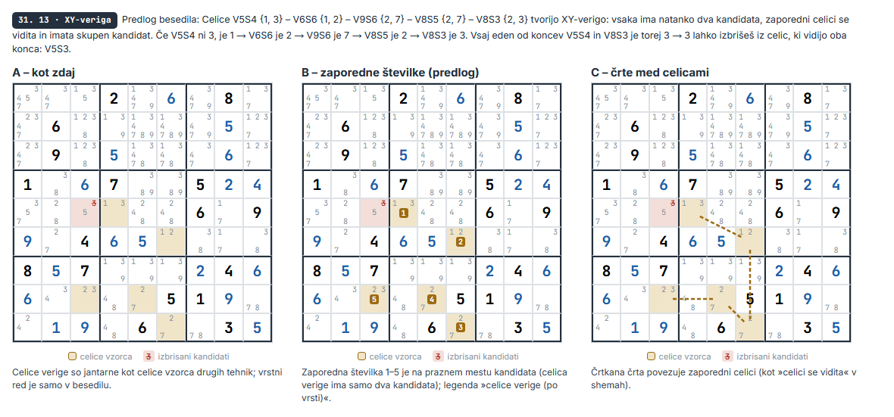
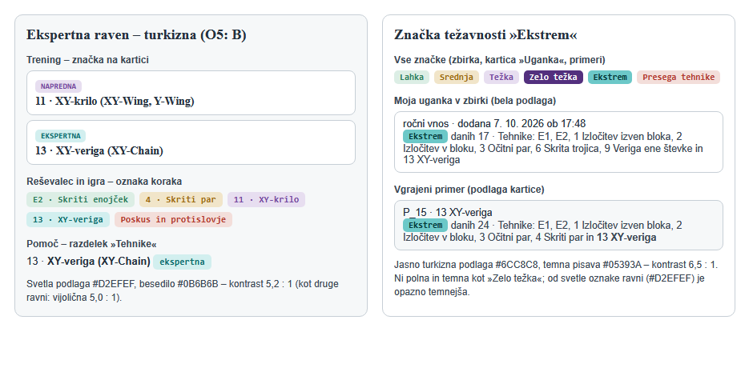
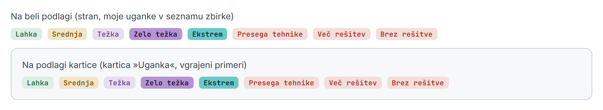
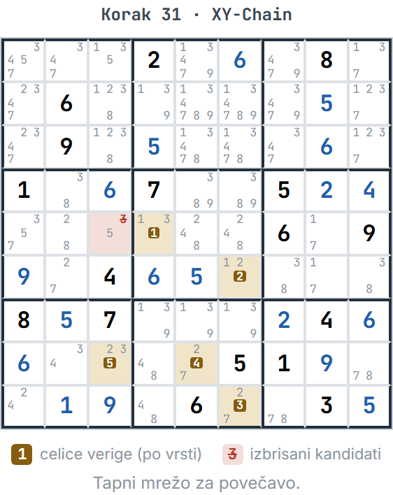
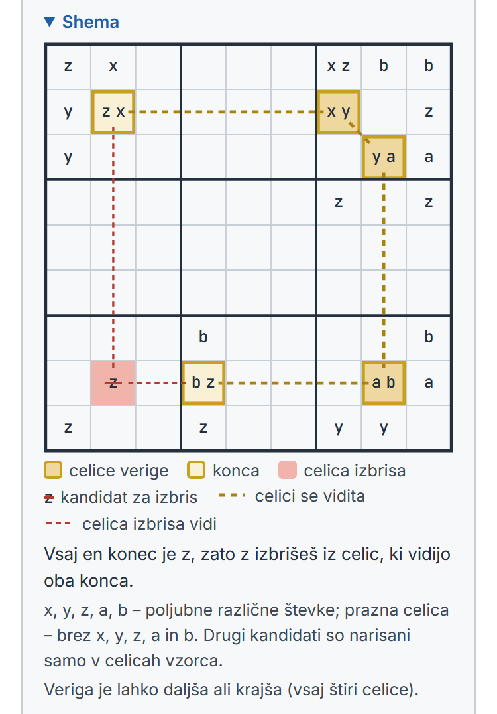

# XY-veriga (tehnika 13, ekspertna raven) – načrt

Načrt 2026-10-07 (vir: `docs/uskladitev.md`, »Vrstni red po fazi 6«, naloga 4). **Potrjen 2026-10-07**
(commit načrta `7a14814`); vse odločitve O1–O13 so v razdelku 13, dopolnitev za korak 2 (značka »Zelo
težka«) v razdelku 7, pravila za vse korake v razdelku 10. **Stanje:** koraki 1–4 so narejeni (razdelek 14),
naslednji je korak 5.

Vse številke v načrtu so **izmerjene** na prototipu tehnike v začasni kopiji projekta (motor z vgrajeno
XY-verigo, ni v repozitoriju), na tem računalniku (i7-7600U, Node 24, Edge brez glave), ne ocenjene.

Izhodišče: commit `8762a01`, vseh 592 testov zelenih – hitri 479 v 32–40 s (trije zagoni), vsi 592 v
1 min 56 s.

## 0. Povzetek

- **Tehnika.** XY-veriga je zaporedje celic z natanko dvema kandidatoma, v katerem se zaporedni celici
  vidita in imata skupen kandidat; konca imata isti kandidat z, zato je vsaj en konec z in z se izbriše iz
  celic, ki vidijo oba konca. **Od 4 do 8 celic** (3 celice so XY-krilo, tehnika 11). Ključ `XY-Chain`,
  ime **13 · XY-veriga (XY-Chain)**, ekspertna raven, zadnja v vrstnem redu.
- **Katera veriga:** najkrajša, nato tista z največ izbrisi, nato po položaju – isto stanje da vedno isti
  korak.
- **Preizkusna uganka drži:** v stanju pred poskusom (korak 31) motor najde tvojo verigo V5S4 – V6S6 –
  V9S6 – V8S5 – V8S3 (izbriše 3 iz V5S3) kot najkrajšo med desetimi. Uganka se nato reši **brez poskusa**,
  stopnja **Ekstrem**. Ena veriga po našem pravilu ne zadošča: tri korake pozneje (34.) je potrebna še
  druga (6 celic) – razdelek 2.
- **Ocena se spremeni samo pri ugankah »Presega tehnike«** – vse druge ostanejo, kot so (motor verigo
  pokliče šele, ko tehnike 1–12 ne najdejo ničesar). Na 1000 naključnih minimalnih ugankah jih 71 od 220
  postane Ekstrem. Testne: example-app in oakever-ekstrem-17-a postaneta Ekstrem; vgrajeni primeri
  P_1–P_15 obdržijo stopnjo, P_15 dobi v dnevnik verigo; zapisi v banki vaj obdržijo stopnjo in tehnike.
- **Hitrost:** en klic tehnike v povprečju 0,2 ms, največ 12 ms; ocena uganke +1 ms v povprečju;
  generator 0–4 % počasnejši; banka vaj +4,6 % (21 min 47 s); testi brez merljive razlike. Vaja verige v
  »Vadi v uganki« se v brskalniku najde povprečno v 0,3 s (XY-krilo 0,8 s, mečarica 0,9 s).
- **Za uporabnika:** nova tehnika v reševalcu, igri (»Naslednji korak«) in treningu (kartica 13 z značko
  EKSPERTNA, »Spoznaj«, »Vadi v uganki«, shema); stopnja Ekstrem se vrne v Pomoč; turkizna barva ekspertne
  ravni (O5); zaporedne številke verige na mreži (O4); nov vgrajeni primer Ekstrem; generator lahko ponudi
  Ekstrem (odločitev O9).
- **Sedem korakov**, vsak svoj commit (razdelek 10); v koraku 6 je seznam 22 testov, ki namerno padejo –
  vsak drug padel test pomeni ustavitev. Ročni pregled enkrat na koncu (razdelek 11).
- **BUG+1 (naloga 5)** bi po obeh virih stal pred XY-verigo kot napredna tehnika 13 (veriga postane 14);
  na 1000 ugankah 3 od 71 ugank Ekstrem postanejo Zelo težka (razdelek 12, odločitev O13).

## 1. Kaj šteje za XY-verigo

**Vzorec.** Celice c1, c2, …, cn, vsaka z natanko dvema kandidatoma. Zaporedni celici se vidita (sta v isti
vrstici, stolpcu ali bloku) in imata skupen kandidat, ki ju povezuje: c1 = {z, a}, c2 = {a, b}, c3 = {b, c} …
cn = {…, z}. Če c1 ni z, je a; potem c2 ni a, torej je b; … in cn je z. **Vsaj en konec je z**, zato z
izbrišeš iz vseh celic (razen koncev), ki vidijo oba konca. Veriga mora dati vsaj en izbris. Celica se v
verigi ne ponovi (preprosta veriga – razlaga »če … potem« je sicer nesmiselna).

**Najmanjša dolžina: 4 celice.** Veriga treh celic {z, a} – {a, b} – {b, z} je natanko XY-krilo (pivot je
srednja celica). XY-krilo je tehnika 11 in je v vrstnem redu pred verigo, zato bi veriga s tremi celicami
pri reševanju itak nikoli ne prišla na vrsto; v treningu pa bi isti korak pripadal dvema tehnikama
(»Preveri« ne bi vedel, ali je to korak tehnike 11 ali 13). Zato motor išče verige od 4 celic naprej.

**Največja dolžina: predlog 8 celic (O2).** Meritev na 1000 naključnih minimalnih ugankah (semena 1–1000,
`genMinimalnaUganka()`), brez meje: verigo potrebuje 72 ugank (45 eno, 27 dve ali več); na njihovih poteh
motor naredi 125 verig (vsakič najkrajšo v stanju):

| Celic v verigi | 4 | 5 | 6 | 7 | 8 | 9 |
|---|---|---|---|---|---|---|
| Verig | 60 | 34 | 26 | 3 | 1 | 1 |

Koliko od 220 ugank »Presega tehnike« postane Ekstrem pri dani meji:

| Meja (celic) | 4 | 5 | 6 | 7 | 8 | 9 ali več |
|---|---|---|---|---|---|---|
| Ekstrem | 34 | 51 | 69 | 70 | 71 | 72 |

in čas enega klica (vsa stanja na poteh 300 ugank – 16 018 stanj, tudi taka, v katerih verige ni; to je
najslabši primer za »Naslednji korak« s poudarjeno števko):

| Meja | povprečje | 99 % klicev pod | največ |
|---|---|---|---|
| 6 | 0,15 ms | 1,0 ms | 6 ms |
| **8** | **0,20 ms** | **2,0 ms** | **12 ms** |
| 10 | 0,24 ms | 3,1 ms | 24 ms |
| brez meje | 0,31 ms | 4,7 ms | 66 ms |

Meja 8 izgubi eno uganko od 72 (ta ostane »Presega tehnike«), čas klica pa ostane omejen – iskanje vseh
preprostih verig brez meje v redkem stanju z veliko celicami z dvema kandidatoma raste eksponentno (v
meritvi do pribl. 100 000 obiskanih vozlišč v enem klicu). Veriga z devetimi celicami je za človeka že
zelo dolga.

**Iskanje** (za vsako celico z dvema kandidatoma in vsako njeno števko z kot začetek): iskanje v globino po
preprostih poteh do 8 celic; za vsak par koncev in števko z obdrži najkrajšo verigo (pri enaki dolžini
leksikografsko najmanjše zaporedje celic – dopolnitev ob koraku 1, da je tudi izbira vmesnih celic po
pravilu, ne po vrstnem redu iskanja; izbrisi so pri obeh enaki, ker jih določata konca in z). Veriga in obrnjena
veriga sta ista (zapiše se od konca z nižjim položajem). Preizkusil sem tudi hitrejše iskanje v širino po
stanjih (celica, števka): na teh 1000 ugankah da isti izid, a v 711 klicih je 636 najdenih najkrajših poti
ponovilo celico – take je treba zavreči, zato bi lahko zgrešilo preprosto verigo. Iskanje v globino tega
problema nima.

**Kaj ni XY-veriga** (in je ta tehnika ne najde): veriga ene števke (to je tehnika 9 v omejeni obliki),
verige z močnimi povezavami v enoti (AIC), celice s tremi kandidati v verigi, sklep iz ponovljene celice.
Oddaljeni par (vse celice imajo isti par) je posebna oblika XY-verige in ga najde.

## 2. Katera veriga, če jih je več

Motor (`nextStep()`, `solve()`, generator) vzame prvi korak tehnike, zato funkcija vrne korake urejene po
stalnem pravilu (**O3**):

1. **najkrajša** (najmanj celic) – najlažja za človeka;
2. pri enaki dolžini tista z **največ izbrisi**;
3. nato po položaju prve celice (V1S1, V1S2 …), nato po števki z, nato po položaju zadnje celice.

Pravilo je popolno (dve različni verigi se vedno razlikujeta v enem od teh podatkov), zato isto stanje
vedno da isti korak. Z »Naslednji korak« s poudarjeno števko ali s sidrom na števko (`solve()`) velja isti
vrstni red med verigami s to števko.

**Preizkusna uganka.** V stanju pred poskusom (korak 31) je 10 verig s 5–11 celicami (z mejo 8: 4).
Najkrajša je tvoja: V5S4 {1, 3} – V6S6 {1, 2} – V9S6 {2, 7} – V8S5 {2, 7} – V8S3 {2, 3}, izbriše 3 iz
V5S3. Motor jo vzame in uganko reši brez poskusa (78 korakov, prej 77 s poskusom), stopnja Ekstrem. Ena
veriga pa po tem pravilu ne zadošča: po dveh korakih (33.) motor spet obtiči in potrebuje drugo verigo
V5S2 – V4S2 – V8S2 – V8S4 – V8S9 – V8S5 (6 celic, izbriše 2 iz V5S5). Preveril sem vseh 10 verig v stanju
31: tvoja (5 celic) sama ne zadošča, vsaka od drugih devetih pa sama zadošča. Druga aplikacija torej
verjetno izbere drugo verigo (ali ima tehnike, ki jih mi nimamo). S pravilom »največ izbrisov najprej« bi
motor vzel verigo z 8 celicami in dvema izbrisoma in uganko rešil z eno – a bi začel z daljšo verigo, ki jo
človek teže najde. Predlagam najkrajšo; izid (Ekstrem, brez poskusa) je pri obeh enak.

## 3. Hitrost (izmerjeno)

Vse meritve: osnova = današnji motor, prototip = motor z XY-verigo (meja 8, iskanje v globino).

| Kaj | Osnova | Z XY-verigo | Kako izmerjeno |
|---|---|---|---|
| en klic tehnike (vsa stanja poti) | – | povpr. 0,20 ms, največ 12 ms | 16 018 stanj na poteh 300 ugank |
| ocena uganke `oceniTezavnost()` (ročni vnos, uvoz) | povpr. 6,7 ms, mediana 3,3, največ 143 ms | povpr. 7,5 ms, mediana 3,4, največ 178 ms | 1000 minimalnih ugank |
| »Oceni zbirko« (`oceniUganko()` na uganko) | povpr. 15,6 ms, največ 154 ms | povpr. 16,6 ms, največ 162 ms | prvih 300 od teh ugank (100 ugank v zbirki: pribl. 1,7 s namesto 1,6 s) |
| generator, čas na najdeno uganko | lahka 0,25 s, srednja 0,81 s, težka 1,09 s, zelo težka 4,69 s | +0,4 / +3,0 / +3,9 / +0,2 % | ista semena 1–200, prepleteno (za vsako seme obe različici, izmenično prva) |
| generator, stopnja Ekstrem (če jo ponudi – O9) | – | 1,45 s na najdeno (25 od 300 semen; seme največ 0,5 s) | pogoj: ekspertna tehnika in vsaj dve srednji |
| hitri testi (479) | 32,0 / 32,4 / 39,8 s | 32,5 / 33,3 / 34,1 s | trije zagoni vsak; razlika je manjša od šuma |
| vsi testi | 592 v 1 min 56 s | samo motor: 592 v 1 min 56 s (21 padlih); prototip celotnega koraka 6: 599 v 1 min 57 s (24 padlih – razdelek 10, korak 6) | en zagon vsak; padli testi so lahko krajši |
| banka vaj (`tools/ustvari-banko-vaj.js`) | 20 min 49 s (356 zapisov) | 21 min 47 s (397 zapisov), +4,6 % | celoten zagon orodja (semena do 30 000) |

Brez meje dolžine je bil generator v enaki meritvi +0,6 / +4,7 / +4,0 / +3,9 % počasnejši. Novi testi tehnike in vaje (koraki 1, 3,
5) bodo dodali čas; vsak test, daljši od pribl. 10 s, gre med počasne (`tests/pocasni/`).

**»Naslednji korak« v igri:** tehnika se pokliče samo, ko 1–12 ne najdejo ničesar, ali pri poudarjeni
števki, ko nobena od 1–12 nima koraka s to števko – največ 12 ms v glavni niti, ni zaznavno.

**»Vadi v uganki« – iskanje vaje** (meja 1 s, nato banka). Stanje verige ima 97 od 1000 minimalnih ugank,
71 od teh je osnovne stopnje (Ekstrem).

*V brskalniku* (Edge brez glave, `tools/brskalnik.js`, na prototipu celotnega koraka 6 z novo banko; prava
funkcija `najdiVajo()` iz `trening/v-uganki.js`, naključna semena, 30 iskanj na tehniko):

| Tehnika | Računalnik (1280 px) | Telefon (posnemanje 375 px, ista CPE) |
|---|---|---|
| 13 XY-veriga | povpr. 300 ms, mediana 204, največ 1055; 28 sproti, 2 iz banke | povpr. 370 ms, mediana 311, največ 1021; 29 sproti, 1 iz banke |
| 11 XY-krilo (za primerjavo) | povpr. 817 ms, mediana 1019; 13 sproti, 17 iz banke | povpr. 788 ms; 16 sproti, 14 iz banke |
| 8 Mečarica (za primerjavo) | povpr. 920 ms, mediana 1024; 6 sproti, 24 iz banke | povpr. 883 ms; 6 sproti, 24 iz banke |

Ena uganka s stanji v brskalniku: povprečno 17 ms (mediana 16, največ 40) – v 1 s jih preizkusi pribl. 60;
na semenih 1–1000 najde uganko osnovne stopnje v 1 s pri vseh 983 začetkih. Vaja verige se torej najde
hitreje kot vaje 11 in 8, ki jih trening že ima. Pravi telefon je počasnejši (posnemanje spremeni samo
velikost zaslona, ne hitrosti), a meja 1 s in banka ostaneta: v najslabšem primeru je vaja iz banke.

*V Node* (isti postopek brez brskalnika): uganka s stanji 40 ms (največ 160 ms), v 1 s najde uganko osnovne
stopnje v 93 % začetkov (912 od 983) – Node je pri tem 2,4-krat počasnejši od brskalnika (vzroka nisem
raziskoval).

## 4. Ocena ugank – kaj dobi drugo stopnjo

**Pravilo:** XY-veriga je zadnja tehnika; motor jo pokliče šele, ko nobena od 1–12 ne najde ničesar (prej je
tam ugibal ali obtičal). Pot do tja je enaka kot danes. Zato se stopnja spremeni **samo** pri ugankah
»Presega tehnike« (postanejo Ekstrem ali ostanejo »Presega tehnike«), vse druge ostanejo, kot so –
izmerjeno tudi spodaj.

**1000 naključnih minimalnih ugank** (semena 1–1000):

| Stopnja | Danes | Z XY-verigo (meja 8) |
|---|---|---|
| Lahka | 423 | 423 |
| Srednja | 182 | 182 |
| Težka | 156 | 156 |
| Zelo težka | 19 | 19 |
| **Ekstrem** | 0 | **71** |
| Presega tehnike | 220 | 149 |

Ekstrem je torej 7,1 % vseh ugank (8,3 % ugank, ki jih motor reši brez ugibanja); Presega tehnike pade z
22,0 na 14,9 %.

**Testne uganke (`docs/uganke.md`):**

| Uganka | Danes | Z XY-verigo |
|---|---|---|
| example-app | Presega tehnike (1 poskus) | **Ekstrem**, brez poskusa (veriga 6 celic) |
| oakever-ekstrem-17-a | Presega tehnike (1 poskus) | **Ekstrem**, brez poskusa (veriga 7 celic) |
| hard-17-a | Presega tehnike | ostane (motor verige ne najde) |
| drugih pet | – | enako |
| **preizkusna (nova)** | Presega tehnike (poskus v koraku 31 od 77) | **Ekstrem**, brez poskusa (verigi 5 in 6 celic) |

**Vgrajeni primeri:** P_1–P_14 enako (stopnja, tehnike, dnevnik). **P_15** (Presega tehnike, seme 12)
ostane »Presega tehnike« z enim poskusom, a `solve()` pred poskusom zdaj naredi verigo z 8 celicami, zato
se spremeni njegovo polje `tehnike` (doda se 13) – `tools/izberi-primere.js` znova. Prva uganka »Presega tehnike« v virih orodja ostane seme 12, zato je primer ista uganka.

**Banka vaj (`shared/vaje-banka.js`, 356 zapisov):** vsi zapisi obdržijo stopnjo in tehnike (izračunano za
vseh 356) – v banki ni ugank »Presega tehnike«. Banka se kljub temu ustvari znova, da dobi vaje verige.
Izmerjeno s celim zagonom orodja na prototipu: **397 zapisov** (prej 356) – 342 enakih (seme, danosti,
stopnja, tehnike), 14 odpade (13 Težka, 1 Zelo težka – odvečni, ker uganke Ekstrem na poti pokrijejo tudi
njihove tehnike), 55 novih (50 Ekstrem, vse z vajami XY-verige, in 5 Težka). XY-veriga ima 50 ugank osnovne
stopnje (Ekstrem) – zadnja v semenu 3198, meja 30 000 semen je daleč; »več celic« pri verigi 39 %.

**Tvoja zbirka:** uganke s težavnostjo »Presega tehnike« dobijo po »Oceni zbirko« predlog »Presega
tehnike → Ekstrem«, če jih veriga reši. Stari zapisi »Ekstrem« (pred 2026-09-24 je pomenil ugibanje) se
po »Oceni zbirko« popravijo kot doslej.

**Posnetek igre** (`tools/posnetek-igre.js --primerjaj`) na prototipu: razlike samo v kartici »Uganka« pri
uganki oakever-ekstrem-17-a v koraku 85–99 (»Presega tehnike« → »Ekstrem«, »… in ugibanje« → »… 13
XY-veriga«); »Naslednji korak« je enak.

## 5. Reševalec: besedilo koraka in prikaz na mreži

**Oznaka koraka:** »13 · XY-veriga«, v namigu miške in povečavi »13 · XY-veriga (XY-Chain)« – iz
`imeTehnike()`, nič posebnega.

**Besedilo koraka** (pravila faze 6: druga oseba, »izbrišeš«, pari v zavitih oklepajih, puščica »→«);
preizkusna uganka, korak 31:

> Celice V5S4 {1, 3} – V6S6 {1, 2} – V9S6 {2, 7} – V8S5 {2, 7} – V8S3 {2, 3} tvorijo XY-verigo: vsaka ima
> natanko dva kandidata, zaporedni celici se vidita in imata skupen kandidat. Če V5S4 ni 3, je 1 → V6S6
> je 2 → V9S6 je 7 → V8S5 je 2 → V8S3 je 3. Vsaj eden od koncev V5S4 in V8S3 je torej 3 → 3 lahko
> izbrišeš iz celic, ki vidijo oba konca: V5S3.

Celice so v besedilu v vrstnem redu verige (ne urejene kot pri drugih tehnikah), od konca z nižjim
položajem.

**Prikaz na mreži (O4) – odločeno 2026-10-07: B, zaporedne številke.** Slika
`docs/slike/xy-veriga/predlog-veriga.png` (pravi izris male mreže reševalca, korak 31 preizkusne uganke):

- **A – kot zdaj:** celice verige so jantarne kot celice vzorca drugih tehnik, izbris rdeče prečrtan;
  vrstni red je samo v besedilu. Brez nove kode, a pri petih ali več celicah je težko videti, kako gre
  veriga.
- **B – zaporedne številke (odločeno):** v celici verige je na praznem mestu kandidata (celica ima samo
  dva kandidata, torej sedem praznih mest – mesto 5, sicer 8, 2, 4 …) majhna polna jantarna oznaka 1…n.
  Ne prekrije nobenega kandidata, deluje pri vsaki velikosti mreže (mala mreža, povečava, telefon) in v
  vseh treh izrisih mreže. Legenda: »celice verige (po vrsti)«.
- **C – črte med celicami:** črtkana črta med zaporednima celicama (kot »celici se vidita« v shemah).
  Najbolj nazorno, a črte gredo čez druge celice in njihove števke (na sliki čez dano 5 v V8S6), potrebna
  je plast SVG nad tremi različnimi izrisi mreže in preračun ob vsaki spremembi velikosti – več kode in
  tveganja.

Isti prikaz dobijo igra (»Naslednji korak«, tretja stopnja – `oznakeKoraka()` v `shared/mreza.js`) in trening
(»Vadi v uganki« – rešitev, pravilen odgovor; »Spoznaj« – »Rešitev (drži)«, pravilen odgovor).

## 6. Trening

**Kartica** (`trening/index.html`, `data-mode="xy-chain"`): značka **EKSPERTNA**, naslov **13 · XY-veriga
(XY-Chain)**, povzetek iz `TEHNIKE_OPISI`. Vnos `['xy-chain', 'XY-Chain']` na koncu `TRENING_TEHNIKE`.

**Besedila** (`TEHNIKE_OPISI['xy-chain']`, pravila faze 6 – »izbriši«, druga oseba, števila z besedo,
»enota« in »vidi« razložena):

| Polje | Predlog |
|---|---|
| ime / anglesko | XY-veriga / XY-Chain |
| povzetek | Celice z natanko dvema kandidatoma tvorijo verigo: zaporedni celici se vidita in imata skupen kandidat. Če imata oba konca verige kandidat z, z izbrišeš iz celic, ki vidijo oba konca. |
| razlaga | Poišči zaporedje vsaj štirih celic z natanko dvema kandidatoma. Zaporedni celici se vidita – sta v isti vrstici, stolpcu ali bloku – in imata skupen kandidat, ki ju povezuje: prva celica {z, a} in druga {a, b} si delita a, druga in tretja b, in tako naprej. Zadnja celica ima poleg povezovalne števke spet z, torej imata oba konca verige kandidat z. Veriga treh celic je XY-krilo (11). |
| posledica | Če prva celica ni z, je a. Potem druga ni a, torej je b, tretja ni b … in zadnja celica je z. Vsaj en konec verige je torej z. Iz vseh celic, ki vidijo oba konca, z izbrišeš. |
| navodilo (»Spoznaj«) | Izberi vse celice verige. |

**Namig** (`stepHint()`, O6): »Števka 3 – veriga ima 5 celic.« (števka z in dolžina; samo števka bi pri
dolgi verigi premalo pomagala, konca bi skoraj določila odgovor).

**»Spoznaj« (O8)** – sestavljena vaja kot pri 9–12: cela mreža 9 × 9, prazne so samo celice vaje (prikaz
`buildFullGridLayout()`), kandidati vidni, izbereš vse celice verige. Generator `genXYChain()` v
`trening/generators.js`: veriga 4–6 celic z različnimi števkami povezav, celica izbrisa in **motilec** –
veriga, ki spodleti pri natanko enem pogoju (sosednji celici se ne vidita ali konca nimata skupne števke).
Preverjanje kliče `xyChain()` iz motorja (izbrane celice = celice najdene verige, kot pri 9–12). Generator
zahteva, da motor najde načrtovano verigo in nobene druge ter da XY-krilo ne najde ničesar. Gumb »Pokaži
število kandidatov« da (kot pri 10–12). »Rešitev (drži)«, pravilen odgovor in legenda kot pri 9–12, z
zaporednimi številkami (O4).

**»Vadi v uganki«** deluje brez posebne kode: stanja, kjer je naslednji korak veriga (`stanjaVUganki()`),
odgovor so izbrisi, presoja `preveriVajo()` (vsak korak verige v stanju je v KT). Dodati: tožilnik
»XY-verigo« in ženski spol (»zaradi nje«) v `trening/v-uganki.js`, **območje (O7):** števka z, kot pri 7–9
(»Za števko 3 poišči XY-verigo in izbriši kandidate, ki zaradi nje odpadejo.«), osnovna stopnja vaje je
Ekstrem (`stopnjaTehnike()` jo izpelje iz ravni sama). Banka mora imeti vaje verige – razdelek 3 in 4.

**Shema vzorca** (`SHEME_TEHNIK['xy-chain']` v `shared/sheme.js`, kot pri 11): mreža 9 × 9, veriga petih
celic {z, x} – {x, y} – {y, a} – {a, b} – {b, z}, celica izbrisa s prečrtanim z, povezave »celici se vidita«
(črtkane jantarne) med zaporednimi celicami in »celica izbrisa vidi« (črtkane rdeče) do obeh koncev; konca
sta celici druge vrste (napis »konca«), sklep »Vsaj en konec je z, zato z izbrišeš iz celic, ki vidijo oba
konca.«, opomba »Veriga je lahko daljša ali krajša (vsaj štiri celice).«. Dodatne črke poiščem z iskanjem
kot pri 9–12 (tehnika najde natanko ta korak, lažje tehnike – tudi XY-krilo – nič). V treningu razdelek
»Shema«, v Pomoči zložljivo pod posledico.

## 7. Barva ekspertne ravni in značka – odločeno 2026-10-07: B, turkizna

Proste barve: zelena (lahka), jantarna (srednja), vijolična (napredna), rdeča (poskus, »Presega
tehnike«), modra (drugo, izbira) so zasedene; »Zelo težka« je polna temna vijolična. Predlagani sta bili
**A – temna** (polna skoraj črna #24303D z belim besedilom povsod, tudi pri »Ekstrem«) in **B –
turkizna**. **Odločeno: B**, z dopolnilom: značka »Ekstrem« v zbirki in v kartici »Uganka« ne sme biti
videti črna – podlaga jasno turkizna, pisava s kontrastom vsaj 4,5 : 1, svetlejša od prvega predloga
(polna temna turkizna #0B5A5A z belim besedilom). Slika `docs/slike/xy-veriga/predlog-barve.png` (pravi
slogi `shared/base.css` in `shared/zbirka.css`) kaže odločeno različico:

| Kje | Podlaga | Pisava | Kontrast |
|---|---|---|---|
| ekspertna raven: značka EKSPERTNA (trening), oznaka koraka »13 · XY-veriga« (reševalec, igra), značka ravni v Pomoči – `.tag.t-expert`, `.badge-ekspertna` | #D2EFEF (svetla turkizna) | #0B6B6B | 5,2 : 1 (vijolična napredne ravni 5,0 : 1) |
| značka težavnosti **Ekstrem** (zbirka, kartica »Uganka«, vgrajeni primeri, opis primera v reševalcu) | #6CC8C8 (jasno turkizna) | #05393A | 6,5 : 1 |
| značka težavnosti **Zelo težka** (dopolnitev spodaj, izbrano v koraku 2) | #B494D1 (srednje močna vijolična) | #2A1545 | 6,3 : 1 |

Značka »Ekstrem« je opazno temnejša od svetle oznake ravni (razmerje svetlosti 1,6 : 1), a ni polna in
temna kot »Zelo težka«.

**Dopolnitev 2026-10-07 (korak 2): značka »Zelo težka«.** Zdaj preveč izstopa (polna temna vijolična
`--purple-dark` z belo pisavo `--purple-dark-ink`). Dobi **enak slog kot nova »Ekstrem«**, v vijolični:
srednje močna vijolična podlaga in temna vijolična pisava, kontrast vsaj 4,5 : 1; ostati mora **jasno
temnejša od »Težka«** (svetla vijolična podlaga napredne ravni). Barvi se izbereta v koraku 2 (spremenljivke v
`:root` v `shared/base.css`, razred `znacka-zelo-tezka` v `shared/zbirka.css`), kontrast preveri test. Po
koraku 2 Darko dobi **eno sliko vrstice vseh značk težavnosti** (Lahka, Srednja, Težka, Zelo težka, Ekstrem,
Presega tehnike, Več rešitev, Brez rešitve) in korak 3 se začne šele po njegovem OK. Nove barve so spremenljivke v `:root` v `shared/base.css` (`tests/css-paleta.test.js`:
nobena druga datoteka jih ne definira znova); razred `.tag.t-expert` v `shared/base.css`,
`.badge-ekspertna` v `trening/trening.css`, razred značke »Ekstrem« v `shared/zbirka.css` in v
`ZNACKA_TEZAVNOSTI` (`shared/zbirka-ui.js`; zdaj je »Ekstrem« rdeča kot »Presega tehnike«),
`RAZRED_RAVNI.ekspertna` v `shared/engine.js` (`tagClass()`).

## 8. Pomoč – stopnja Ekstrem in ekspertna raven

- `stopnjeZaPomoc()` (`shared/pomoc.js`) pokaže Ekstrem sama, ko `GEN_EKSPERTNE` ni prazen – v igri
  (»Nova uganka«) in reševalcu (»Težavnost«). Opis Ekstrema v `STOPNJE_UGANK` se spremeni iz
  »potrebuje ekspertno tehniko (XY-veriga – še ni v reševalcu)« v »potrebuje ekspertno tehniko (13 –
  XY-veriga)«.
- Uvod razdelka »Tehnike« (vse tri aplikacije): »Tehnike so v štirih ravneh: lahke (E1, E2), srednje
  (1–6), napredne (7–12) in ekspertne (13) …«; seznam dobi 13 z značko »ekspertna« in shemo.
- Igra, okno Pomoč (`igra/index.html`), naštete stopnje: »Oceni zbirko … (Lahka, Srednja, Težka, Zelo
  težka, Ekstrem)«; pri »Nova uganka« in »Ustvarjena uganka se doda …« Ekstrem samo, če ga generator
  ponudi (O9) – takrat še `opisIskanja` Ekstrema in poved `OPIS_STROZJEGA_ISKANJA` (»pri srednji, težki,
  zelo težki in ekstremni zahteva vsaj dve različni srednji tehniki«).
- Trening, okno Pomoč: »Pri 1–12 …« → »Pri 1–13 …« (označevanje, tipkovnica).

## 9. Nov vgrajeni primer stopnje Ekstrem

`tools/izberi-primere.js` dobi ekspertno raven: za vsako tehniko iz `GEN_EKSPERTNE` uganka stopnje Ekstrem
iz banke (ali vira banke), pogoj kot pri drugih – dnevnik `solve()` uporabi natanko tehnike poti ocene.
Prednost (O10): ena sama veriga v dnevniku, brez napredne tehnike na poti (da je veriga edina »težka«
tehnika), vsaj dve srednji, krajša veriga, nižje seme. Kandidatov je dovolj (izmerjeno): od 71 ugank Ekstrem med 1000 minimalnimi jih ima 11 na poti ocene brez napredne tehnike in 47 v dnevniku `solve()` eno samo verigo; v novi banki je 7 od 50 ugank Ekstrem brez napredne tehnike med tehnikami vaj.

**Poskusni izbor** (orodje, razširjeno v prototipu s pogojem: XY-veriga natanko enkrat v dnevniku, brez
napredne tehnike, vsaj dve srednji; pribl. 6 min): P_1–P_14 so iste uganke kot zdaj; **P_15 Ekstrem** je
uganka iz banke s semenom 53 (24 danih, tehnike E1, E2, 1, 2, 3, 4 in 13; pogoju ustrezajo 3 uganke iz
banke); **P_16 »Presega tehnike«** je dosedanji P_15 (seme 12), ki ima v tehnikah zdaj še 13. Z njimi so
zeleni vsi testi primerov razen tistih z zapisanim seznamom stopenj (korak 6, testi 6 in 22).

Imena (O10): primeri so urejeni po stopnji, zato **P_15 postane Ekstrem (»P_15 · 13 XY-veriga«), dosedanji
P_15 (Presega tehnike) postane P_16**. Napredek igranja se shrani po danostih, zato ostane; `STARI_PRIMERI`
se ne spremeni, če uganka »Presega tehnike« ostane ista (orodje vzame prvo seme z enim poskusom – seme 12
je še vedno tako). Skupina »Ekstrem · tehnika« v seznamu primerov (reševalec, igra) nastane sama
(`zbirkaSkupinePrimerov()`).

## 10. Koraki

**Pravila za vse korake** (Darko, 2026-10-07):

- Vsak korak je svoj pogovor, commit in push.
- Test pred spremembo, zelen na stari kodi (razen koraka 1, kjer funkcije še ni).
- Če pade test, ki ni predviden v načrtu, ali se spremeni stopnja uganke, ki ni »Presega tehnike«:
  **ustavi se in poročaj**. Testa ne prilagajaj.
- Ročni pregled je eden, na koncu naloge (razdelek 11); po posameznem koraku največ pet točk, pri vsaki
  zakaj avtomatika ne more.

Od najmanj do najbolj tveganega; vsak je svoj pogovor, commit in push (oznaka različice s hookom). Koraki
1–5 so za uporabnika nevidni (razen barve značke »Ekstrem« v 2), ker tehnika še ni v vrstnem redu;
tveganje je zbrano v koraku 6, ki ga zato ni mogoče razdeliti (vklop tehnike brez kartice, številke,
banke in primera podre teste – spodaj). Korak 7 je majhen, a je odvisen od 6.

### Korak 1 – funkcija `xyChain()` v motorju (ni v vrstnem redu)

- **Kaj:** `xyChain(b)` v `shared/engine.js` za `uniqueRectangle()` (meja 4–8, pravilo izbire iz
  razdelka 2, sporočilo iz razdelka 5, `hint`), **ni** v `ALL_TECHNIQUES`. Preizkusna uganka v
  `docs/uganke.md` (`xy-veriga-17`, O11; zapis »danes s poskusom, po koraku 6 brez«).
- **Za uporabnika:** nič.
- **Test pred spremembo:** nov `tests/xy-chain.test.js` – pozicije so posnetki stanj pred poskusom pri
  preizkusni uganki, example-app in oakever-ekstrem-17-a (ne na pamet). Pričakovani koraki iz
  **neodvisnega** iskanja v testu (vse preproste poti po celicah z dvema kandidatoma, pravilo vzorca
  zapisano posebej, ne koda funkcije); preizkusna: prvi korak je V5S4 – V6S6 – V9S6 – V8S5 – V8S3 z
  izbrisom 3 iz V5S3; XY-krilo (3 celice) ni korak verige; veriga z 9 celicami ni najdena; vrstni red po
  pravilu; besedilo po pravilih faze 6. Na vseh stanjih pred prvim poskusom 300 minimalnih ugank: noben
  izbris ne izbriše števke rešitve (`solutionOf()`). Če traja več kot 10 s, gre med počasne. Na stari kodi
  test pade (funkcije ni) – to je edini korak brez »zelenega pred spremembo«.
- **Kaj ujame avtomatika:** napačen izbris, napačno izbrano verigo, preseženo mejo, nedeterminizem,
  besedilo. Ne ujame: ali je besedilo razumljivo (ročni pregled).

### Korak 2 – barva ekspertne ravni

- **Kaj:** O5 (B, razdelek 7) – spremenljivke barv in `.tag.t-expert` v `shared/base.css`, `.badge-ekspertna` v `trening/trening.css`,
  razred značke »Ekstrem« v `shared/zbirka.css`, `RAZRED_RAVNI.ekspertna` (`tagClass()`), »Ekstrem« v `ZNACKA_TEZAVNOSTI`.
- **Za uporabnika:** značka »Ekstrem« pri starih zapisih v zbirki (in kartici »Uganka«) ni več rdeča, ampak turkizna;
  značka »Zelo težka« ni več polna temna, ampak srednje močna vijolična s temno pisavo (dopolnitev v razdelku 7).
- **Po koraku:** slika vrstice vseh značk težavnosti za Darka in čakanje na njegov OK pred korakom 3.
- **Test pred spremembo:** `tests/ravni-tehnik.test.js` – razred za vsako raven iz tabele (ekspertna →
  `t-expert`) in značka »Ekstrem« ≠ »Presega tehnike« (najprej z današnjim, nato z novim pričakovanjem);
  `tests/css-paleta.test.js` (novi barvi samo v `shared/base.css`); kontrast vseh štirih značk ravni in
  značk težavnosti po WCAG ≥ 4,5 : 1 iz CSS (kot `tests/trening-kontrast.test.js`).
- **Kaj ujame avtomatika:** napačen razred, podvojeno barvo v drugi datoteki, premajhen kontrast. Brskalnik
  (`tools/preveri-faza7-brskalnik.js --korak 5` razširjen): izračunan slog značk. Ne ujame: ali se barva na
  zaslonu loči od »Zelo težka« in od svetle oznake ravni (ročni pregled).

### Korak 3 – prikaz zaporedja verige na mreži (O4)

- **Kaj:** korak z več kot tremi celicami in polji verige (npr. `korak.veriga = true`) dobi zaporedne
  številke: `renderGridInto()` in `legendaKoraka()` v `app/app.js`, `oznakeKoraka()` in izris v
  `shared/mreza.js` (igra, »Vadi v uganki«), mreža vaj 9–12 v `trening/trening.js`; slogi v `app/app.css`,
  `shared/mreza.css`, `trening/trening.css`.
- **Za uporabnika:** nič, dokler veriga ni v vrstnem redu.
- **Test pred spremembo:** izris male mreže reševalca in mreže igre za **vse korake** vseh ugank iz
  `docs/uganke.md` (nadomestni DOM) – `innerHTML` mora ostati do znaka enak (na stari kodi zelen); nov
  test s korakom `xyChain()` na stanju preizkusne uganke: številke 1–5 v pravih celicah, na praznem mestu
  kandidata, legenda »celice verige (po vrsti)«. Posnetek igre brez razlik.
- **Kaj ujame avtomatika:** spremembo prikaza drugih tehnik, napačen vrstni red, številko čez kandidata.
  Brskalnik: oznaka v celici pri 375 in 1280 px in v povečavi (izračunan slog, ne sega iz celice).

### Korak 4 – besedila in shema

- **Kaj:** `TEHNIKE_OPISI['xy-chain']` (razdelek 6), namig v `stepHint()` (O6), `SHEME_TEHNIK['xy-chain']`
  (iskanje dodatnih črk kot pri 9–12).
- **Za uporabnika:** nič (Pomoč in trening naštevata tehnike iz `TRENING_TEHNIKE`, tam je še ni).
- **Test pred spremembo:** `tests/trening-tehnike.test.js` (pravila besedil – na vseh opisih),
  `tests/sheme.test.js` (motor na deski iz sheme najde natanko en korak verige s celicami in izbrisom sheme,
  lažje tehnike in XY-krilo nič, povezave ne gredo čez celice s črkami; test »sheme so pri vseh tehnikah
  1-12« spremenim tako, da so ključi shem tehnike 1–12 iz `TRENING_TEHNIKE` in XY-veriga – velja zdaj in po
  vklopu v koraku 6), `tests/sklanjanje.test.js` (namig pri n = 4–8 celic).
- **Kaj ujame avtomatika:** besedila (»številka«, angleško ime zunaj oklepaja, ločila), napačno shemo.
  Brskalnik (`tools/preveri-sheme-brskalnik.js`): risba v kartici, črke v celicah. Ne ujame: ali sta
  razlaga in shema razumljivi.

### Korak 5 – vaja »Spoznaj« (generator)

- **Kaj:** `genXYChain()` v `trening/generators.js` (razdelek 6), brez vnosa v `MODES` (ta pride s kartico v
  koraku 6).
- **Za uporabnika:** nič.
- **Test pred spremembo:** nov `tests/trening-xy-chain.test.js` po vzoru `trening-turbot`/`trening-wwing`:
  200 vaj s semenom – motor (`xyChain()`) najde načrtovano verigo in nobene druge, XY-krilo nič, dolžine
  4–6 se izmenjujejo, motilec spodleti pri natanko enem pogoju (izračunano v testu), čas.
- **Kaj ujame avtomatika:** dvoumne vaje, motilec, ki je pravi vzorec, enolične dolžine.

### Korak 6 – vklop (najbolj tvegan)

- **Kaj:** `ALL_TECHNIQUES` (na konec), `RAVNI_TEHNIK.ekspertna`, `TECHNIQUE_GROUPS` (nova skupina – sidro
  ostane v nižjih), `TRENING_TEHNIKE`, kartica in `MODES['xy-chain']`, »Vadi v uganki« (tožilnik, spol,
  območje O7), opis Ekstrema, Pomoč (razdelek 8), `docs/uganke.md` (pokritost, spremembe pri example-app,
  oakever-ekstrem-17-a, preizkusni), `docs/tehnike.md` (13. vrstica), banka vaj znova (orodje,
  pribl. 22 min), primeri znova (`tools/izberi-primere.js` z ekspertno ravnijo – O10), novo izhodišče posnetka
  igre, `CLAUDE.md`.
- **Za uporabnika:** vse iz razdelka 0 razen generatorja Ekstrem.
- **Test pred spremembo:** dodam test, ki je zelen na stari kodi in mora ostati zelen: **stopnja vseh ugank,
  ki niso »Presega tehnike«, se ne spremeni** (vse uganke iz `docs/uganke.md`, `PRIMERI`, vseh 356 zapisov
  banke in 300 minimalnih ugank primerja z zapisanimi stopnjami) in dnevnik `solve()` je do prvega poskusa
  enak.
- **Vrstni red v koraku:** koda → `tools/ustvari-banko-vaj.js` → `tools/izberi-primere.js` (in nov
  `PRIMERI`) → `tools/oznaci-razlicico.js` → vsi testi. Brez orodij padejo še testi banke (2 v
  `pocasni/vaje-banka`) in primerov (»PRIMERI: težavnost in tehnike …« v `pocasni/generator`) – po orodjih
  morajo biti zeleni **brez spremembe**; `tests/razlicica.test.js` pade pri vsakem koraku, ki spremeni
  aplikacijo, dokler oznaka ni osvežena.

**Testi, ki v koraku 6 padejo in jih spremenim** (preverjeno: prototip celotnega koraka – koda koraka 6 s
poenostavljenimi koraki 1–5, nova banka, novi primeri iz razširjenega orodja – 599 testov, 24 padlih;
dva od njih sta posledica prototipa, glej pod tabelo). **Vsak drug padel test pomeni ustavitev** – ne
popravljam ga, ampak ti pokažem vzrok.

| # | Test (datoteka: ime) | Zakaj pade | Novo pričakovanje |
|---|---|---|---|
| 1 | `besedila-html`: »trening/index.html: opisi kartic brez angleških imen tehnik« | število kartic z opisom je zapisano kot 14 | 15 |
| 2 | `igra-ui`: »vgrajeni primeri: privzeto zaprti, v naslovu število primerov« | seznam skupin primerov brez »Ekstrem · tehnika« | skupina Ekstrem med »Zelo težka« in »Presega tehnike« |
| 3 | `igra-ui`: »opisi stopenj: okno »Nova uganka« in Pomoč iz STOPNJE_UGANK …« | Pomoč zdaj našteje tudi Ekstrem | seznam s petimi stopnjami (opis Ekstrema iz razdelka 8) |
| 4 | `pocasni/generator`: »ravni: vsaka tehnika … v natanko eni ravni« | preverja `GEN_EKSPERTNE` = [] (»ekspertne tehnike še ni«) | `['XY-Chain']` |
| 5 | `pocasni/generator`: »oceniUganko(): uganka, ki jo motor reši le z ugibanjem …« | uporablja example-app, ki je zdaj Ekstrem | uganka hard-17-a (ostane »Presega tehnike«) |
| 6 | `pocasni/generator`: »PRIMERI: vsaka stopnja in vsaka tehnika E1, E2, 1-12 ima vsaj en primer« | zapisani seznam stopenj primerov je brez Ekstrema | z Ekstremom; tehnike E1, E2, 1–13 |
| 7 | `pocasni/vaje-uganka`: »stanja na poti: za vsako tehniko …« | `SEMENA` nima semena za XY-verigo | seme, ki ga najde program (prvo z vajo verige) |
| 8 | `pocasni/vaje-uganka`: »uganka Presega tehnike: stanja so samo pred prvim poskusom …« | pri semenu 12 je pred poskusom zdaj veriga, za njo izločitev izven bloka z enakim številom praznih celic kot ob poskusu; pogoj »več praznih celic« ne drži | pogoj po zaporedni številki koraka na poti |
| 9 | `pocasni/vaje-uganka`: »obmocjeKoraka / vObmocju: … (vse tehnike)« | za XY-verigo ni vaje (isto seme kot 7) | z novim semenom; območje »za števko z« |
| 10–12 | `pomoc` (igra, reševalec, trening): »razdelek »Tehnike« – poved o ravneh, E1, E2, 1-12 …« | uvod »v treh ravneh … napredne (7–12)« | »v štirih ravneh … ekspertne (13)«, 15 tehnik |
| 13 | `pomoc`: »reševalec: težavnost – stopnje … (brez Ekstrema, dokler motor nima ekspertne tehnike)« | reševalec zdaj našteje Ekstrem | pet stopenj |
| 14 | `ravni-tehnik`: »tagClass(): 14 tehnik po ravni …« | tabela ravni v testu ima 14 tehnik | 15, XY-veriga → `t-expert` |
| 15 | `ravni-tehnik`: »tagClass(): vsak ključ iz dnevnika solve() …« | ključ `XY-Chain` v dnevnikih, tabela ga ne pozna (pričakuje `t-basic`) | `t-expert` |
| 16 | `ravni-tehnik`: »ravni v vrstnem redu ALL_TECHNIQUES …« | ekspertna = [] | `['XY-Chain']` |
| 17 | `ravni-tehnik`: »RAVNI_TEHNIK in ravenTehnike() …« | ekspertna = [] | `['XY-Chain']` |
| 18 | `trening-tehnike`: »oznake v treningu: E1, E2, nato 1-12« | oznake do 12 | do 13 |
| 19 | `trening-tehnike`: »številke tehnik 1-12 in isti vrstni red kot v ALL_TECHNIQUES« | zapisani seznam 12 tehnik | 13, XY-veriga zadnja |
| 20 | `trening-tehnike`: »značke v treningu: LAHKA …, NAPREDNA za 7-12« | 13 bi bila po pravilu testa napredna | EKSPERTNA za 13 |
| 21 | `trening-tehnike`: »imeTehnike(): dogovorjene oblike« | zapisana uganka za ključ poskusa se zdaj reši z verigo (brez poskusa) | uganka hard-17-a |
| 22 | `zbirka-zapis`: »primeri: imena P_1 … P_15 po vrsti, skupine po stopnji z naslovi« | 15 primerov, skupine brez Ekstrema | P_1 … P_16, skupina »Ekstrem · tehnika« |

V prototipu padeta še **dva testa shem** (`sheme`: »sheme so pri vseh tehnikah 1-12 …« in »trening: razdelek
»Shema« …«), ker prototip sheme 13 nima. V pravem poteku jo doda korak 4, ki test »sheme so pri vseh
tehnikah« zapiše tako, da velja pred vklopom in po njem (ključi shem = tehnike 1–12 iz `TRENING_TEHNIKE`
in XY-veriga) – v koraku 6 morata biti zelena; če padeta, je to ustavitev.
- **Kaj ujame avtomatika:** vse spremembe ocene, primerov in banke; posnetek igre (razlike samo pri
  oakever-ekstrem-17-a, dovoljene); brskalnik: kartica 13 in značka (`tools/preveri-faza7-brskalnik.js
  --korak 5`), Pomoč z Ekstremom in 13 (`tools/preveri-pomoc-brskalnik.js`), »Vadi v uganki« 13 in
  »Spoznaj« 13 s pravimi kliki, reševalec na preizkusni uganki (korak 31 z verigo, brez poskusa), brez
  preliva in napak JS (`tools/preveri-videz-brskalnik.js`).

### Korak 7 – generator ponudi Ekstrem (O9)

- **Kaj:** `ustrezaIskanju` Ekstrema (ekspertna tehnika in vsaj dve srednji), `opisIskanja`, gumb v oknu
  »Nova uganka«, besedila v Pomoči igre (razdelek 8).
- **Za uporabnika:** peti gumb stopnje »ekstrem«; iskanje povprečno 1,5 s.
- **Test pred spremembo:** `tests/pocasni/generator.test.js` – merilo iskanja je podmnožica stopnje (velja
  že zdaj za vse stopnje z merilom), ustvarjena uganka Ekstrem ima eno rešitev, `solve()` brez ugibanja,
  ocena Ekstrem; `tests/igra-ui.test.js` – gumbi stopenj iz `STOPNJE_GENERATORJA`.
- **Kaj ujame avtomatika:** uganko, ki bi ob oceni dobila drugo stopnjo; besedila Pomoči iz istega vira.

## 11. Ročni pregled (enkrat, na koncu naloge)

Največ pet točk; vse drugo preverijo testi, posnetek igre in brskalnik brez glave.

1. **Barva ekspertne ravni** (trening – kartica 13; igra – zbirka z uganko Ekstrem ob Zelo težki) na
   telefonu in računalniku: ali se ekspertna raven in »Ekstrem« ločita od »Zelo težka« in »Presega
   tehnike« in ali »Ekstrem« ni videti črn. *Avtomatika meri samo kontrast, ne zaznave barv na tvojem
   zaslonu.*
2. **Reševalec**, preizkusna uganka, koraka 31 in 34 »Pokaži na mreži« in povečava: ali se iz številk in
   besedila razbere, kako gre veriga. *Razumljivost prikaza ni merljiva.*
3. **Trening »Spoznaj« 13**, nekaj vaj s štirimi do šestimi celicami: ali je naloga jasna in motilec
   pošten (ne zavaja s skoraj pravim vzorcem). *Didaktika.*
4. **Trening »Vadi v uganki« 13**: namig in rešitev pri vaji z daljšo verigo, zaporedne številke na mreži.
   *Ali pomoč res pomaga, presodi samo človek.*
5. **Igra**, preizkusna uganka: »Naslednji korak« do verige (ime → namig → rešitev), izvedi izbris. *Celoten
   potek s tvojimi kliki in branjem treh stopenj.*

## 12. BUG+1 (naloga 5) – mesto v vrstnem redu

Ne načrtujem podrobno (naloga 5 dobi svoj načrt); tu samo, kje bi stal in kako to vpliva na Ekstrem.

**Tehnika.** BUG+1 (Bivalue Universal Grave + 1): vse prazne celice imajo po dva kandidata, ena tri; v
vsaki enoti je vsak kandidat dvakrat, le v enotah te celice je ena števka trikrat. Ta števka mora biti v
tej celici – sicer bi imela uganka dve rešitvi. Kot edinstveni pravokotnik (12) sklepa iz enoličnosti,
zato jo `solve()` pri uganki brez natanko ene rešitve izpusti.

**Viri o zahtevnosti** – obe lestvici imata BUG+1 lažji od XY-verige:

| Vir | BUG+1 | XY-veriga | Za primerjavo |
|---|---|---|---|
| HoDoKu (točke, raven) – `Options.solverSteps[]`, kot v `docs/tehnike.md` | 100, HARD | 260, UNFAIR | XY-krilo 160 HARD, edinstveni pravokotnik (tip 1) 100 HARD |
| Sudoku Explainer (ocena) | 5,6–6,0 (Bivalue Universal Graves) | 6,6–7,0 (Y-cycles) | XY-krilo 4,2, edinstveni pravokotnik 4,5–5,0 |

**Preizkusna uganka** (preverjeno s programom: 17 danih, ena rešitev). Danes jo `solve()` reši s poskusom
v koraku 58 od 75 (stopnja »Presega tehnike«). V stanju pred poskusom je 17 praznih celic, vse z dvema
kandidatoma razen V8S6 {3, 7, 9} – stanje BUG+1, odvečna je 3 (prototip BUG+1 vpiše V8S6 = 3, kar je
rešitev). V istem stanju je 11 XY-verig (meja 8), najkrajše s štirimi celicami.

**Možnosti in meritev** (prototip BUG+1 v kopiji projekta z XY-verigo; 1000 minimalnih ugank, semena
1–1000; spremenijo se lahko samo uganke, ki so z XY-verigo Ekstrem ali »Presega tehnike«):

| | A – BUG+1 pred XY-verigo | B – BUG+1 za XY-verigo |
|---|---|---|
| Raven in številka | napredna, **13**; XY-veriga postane **14** | ekspertna, 14 |
| Ekstrem (71 z XY-verigo) | 68 – **3 postanejo Zelo težka** (rešljive z naprednimi, med njimi BUG+1) | 71 – nič |
| »Presega tehnike« (149) | 149 – nič | 149 – nič |
| Uganke z BUG+1 na poti | 4 | **0** – v stanju BUG+1 so skoraj vse celice z dvema kandidatoma, zato veriga vedno pride prej |
| Preizkusna uganka | **Težka** (BUG+1, brez verige) | Ekstrem (veriga štirih celic, BUG+1 ne pride na vrsto) |
| Napačnih vpisov BUG+1 | 0 | 0 |

**Predlog: A** – tak je vrstni red po obeh virih, kot pri drugih tehnikah (»znotraj ravni po
zahtevnosti«), pri B bi bila tehnika praktično mrtva. Posledice za to nalogo:

- XY-veriga ob nalogi 5 dobi številko **14** (napredne 7–13, ekspertne 14). Številke niso nikjer shranjene
  (zbirka in izvoz hranita imena), zato se spremenijo samo prikaz, besedila (»13 – XY-veriga« v opisu
  Ekstrema, uvod Pomoči »ekspertne (13)«), dokumentacija in testi – kot ob preštevilčenju 2026-09-24.
  Če tega nočeš, je druga možnost naloga 5 pred nalogo 4: potem XY-veriga takoj dobi 14.
- Stopnja Ekstrem postane malo redkejša (na 1000 ugankah 68 namesto 71); uganka v stanju BUG+1 je Težka ali
  Zelo težka, ne Ekstrem.
- Na ta načrt to ne vpliva drugače: XY-veriga ostane zadnja tehnika in edina ekspertna.

Odločitev O13 spodaj (ni nujna za to nalogo, določa pa številko verige).

## 13. Odločitve

Vse odločil Darko 2026-10-07 (O4 in O5 ob pregledu predlogov, druge ob potrditvi načrta).

| # | Vprašanje | Možnosti | Odločeno |
|---|---|---|---|
| O1 | Najmanjša dolžina | 3 (vključno z XY-krilom) · 4 | **4** – 3 celice so XY-krilo (11), sicer en korak dveh tehnik |
| O2 | Največja dolžina | 6 · 8 · 10 · brez meje | **8** – 71 od 72 ugank, klic največ 12 ms; brez meje do 66 ms in eksponentna rast |
| O3 | Katera veriga, če jih je več | najkrajša · največ izbrisov | **najkrajša**, nato največ izbrisov, nato položaj |
| O4 | Prikaz verige na mreži | A kot zdaj · B zaporedne številke · C črte | **B** – zaporedne številke |
| O5 | Barva ekspertne ravni | A temna · B turkizna | **B**; »Ekstrem« jasno turkizna #6CC8C8 s pisavo #05393A (6,5 : 1), razdelek 7; dopolnitev: »Zelo težka« dobi enak slog v vijolični (razdelek 7, korak 2) |
| O6 | Namig (druga stopnja pomoči) | števka z · števka z in dolžina · konca | **števka z in dolžina** |
| O7 | Območje v »Vadi v uganki« (vaje 1–6 kroga) | števka z · brez območja | **števka z** (kot 7–9) |
| O8 | »Spoznaj« | sestavljena vaja 4–6 celic z motilcem · stanje prave uganke iz banke | **sestavljena** (kot 9–12, nadzorovana dolžina) |
| O9 | Generator ponudi Ekstrem | da · ne | **da** – korak 7 |
| O10 | Imena primerov | P_15 Ekstrem, Presega → P_16 · Ekstrem kot P_16 | **P_15 Ekstrem, dosedanji P_15 (Presega tehnike) postane P_16** |
| O11 | Preizkusna uganka | v `docs/uganke.md` kot `xy-veriga-17` · tudi kot vgrajeni primer | **samo v `docs/uganke.md`** (dodana v koraku 1); primer izbere orodje |
| O12 | Ime in ključ | XY-veriga (XY-Chain), ključ `XY-Chain`, trening `xy-chain` | **tako** |
| O13 | Številka verige; mesto BUG+1 (naloga 5) | A pred XY-verigo (napredna 13, veriga postane 14) · B za njo (ekspertna 14) | **XY-veriga je zdaj 13.** O nalogi 5 (BUG+1) Darko odloči po tej nalogi; če jo naredimo, velja **A** in veriga postane 14 |

## 14. Izvedba

### Korak 1 – narejeno 2026-10-07

- **Motor:** `xyChain(b)` v `shared/engine.js` za `uniqueRectangle()`, konstanti `XY_VERIGA_NAJMANJ` (4) in
  `XY_VERIGA_NAJVEC` (8); **ni** v `ALL_TECHNIQUES`, `RAVNI_TEHNIK` ali `TECHNIQUE_GROUPS`. Korak:
  `technique: 'XY-Chain'`, `cells` v vrstnem redu verige od konca z nižjim položajem, `eliminate`,
  `assign: []`, `hint: { digits: [z], celic: n }` (besedilo namiga – O6 – doda korak 4; do takrat
  `stepHint()` vrne »Števka z.«), `message` po razdelku 5. Iskanje v globino kot v prototipu; dopolnitev:
  pri enako dolgih verigah z istima koncema in z ostane leksikografsko najmanjše zaporedje celic (razdelek 1).
- **Preizkusna uganka** `xy-veriga-17` v `docs/uganke.md` (O11) z zapisom »danes s poskusom, po koraku 6 brez«.
- **Testi:** `tests/xy-chain.test.js` (hiter, 8 testov, pod 0,5 s) – pozicije pred poskusom pri
  xy-veriga-17, example-app, oakever-ekstrem-17-a in stanje z XY-krilom iz oakever-ekstrem-lv4 (posnetki,
  skladnost z rešitvijo preveri test); preizkusna: prvi korak V5S4 – V6S6 – V9S6 – V8S5 – V8S3, izbris
  V5S3≠3, besedilo do znaka; na vseh pozicijah koraki = neodvisno iskanje (4–8 celic, isti vrstni red);
  XY-krilo ni korak; pet verig z devetimi celicami na preizkusni poziciji ni najdenih; determinizem in
  vrstni red po pravilu O3; besedilo vseh korakov (sklep »če … potem« izračunan v testu, pravila faze 6).
  `tests/pocasni/xy-chain-uganke.test.js` (pribl. 16 s, zato med počasnimi – načrt je predvidel eno
  datoteko): 300 minimalnih ugank, 15 327 stanj do prvega poskusa, v 5757 vsaj ena veriga, 36 147 korakov
  dolžin 4–8 – noben izbris ne izbriše števke rešitve, koraki so na vseh stanjih natanko neodvisno iskanje.
  Neodvisno iskanje (razširjanje vseh preprostih poti po plasteh, brez kode motorja) je v
  `tests/xy-veriga-neodvisno.js`, ker ga uporabljata oba testa. Na stari kodi hitri test pade (7 od 8 –
  `xyChain` ni funkcija; zelen je samo test skladnosti pozicij).
- **Izid na preizkusni uganki:** v stanju pred poskusom (korak 31) štiri verige do 8 celic (5, 6, 7, 8
  celic); prva je Darkova veriga, druga veriga šestih celic iz 34. koraka (razdelek 2). Neodvisno
  iskanje brez meje najde deset verig (5–11 celic, pet z devetimi), kot v razdelku 2.

### Korak 2 – narejeno 2026-10-08

- **Barve** (spremenljivke v `:root` v `shared/base.css`, `tests/css-paleta.test.js`): `--turq` #0B6B6B na
  `--turq-bg` #D2EFEF (ekspertna raven – `.tag.t-expert` v `shared/base.css`, `.badge-ekspertna` v
  `trening/trening.css`), `--turq-dark-ink` #05393A na `--turq-dark` #6CC8C8 (značka »Ekstrem« –
  `.tag.znacka-ekstrem` v `shared/zbirka.css`, v `ZNACKA_TEZAVNOSTI` razred `t-expert znacka-ekstrem`),
  `--purple-dark-ink` #2A1545 na `--purple-dark` #B494D1 (»Zelo težka«, imeni spremenljivk ostaneta – prej
  bela na #53307E). `RAZRED_RAVNI.ekspertna = 't-expert'` (`tagClass()`).
- **Odstopanje (Darko 2026-10-08):** test kontrasta na stari kodi ni bil zelen – zelena oznaka/značka lahke
  ravni (#2E7D5C na #DCEEE5) je imela 4,14 : 1, jantarna srednje (#9C6B12 na #F1E5C9) 3,71 : 1. Odločeno:
  temnejša pisava samo v značkah – `--green-ink` #2A7355 in `--amber-ink` #865C0F (oba 4,73 : 1) v
  `.tag.t-single`, `.tag.t-pair`, `.badge-lahka`, `.badge-srednja`; `--green` in `--amber` drugod ostaneta.
- **Kontrast vseh značk** (pisava na podlagi): Lahka 4,73 · Srednja 4,73 · Težka 5,05 · Zelo težka 6,27 ·
  Ekstrem 6,49 · Presega tehnike, Več rešitev, Brez rešitve 4,60 · ekspertna raven 5,21 · oznaka »drugo«
  (`t-basic`) 5,15. Razmerje svetlosti podlag »Zelo težka« : »Težka« 2,0, »Ekstrem« : ekspertna raven 1,6.
- **Testi** (pred spremembo z današnjim pričakovanjem, zeleni na stari kodi razen kontrasta lahke in srednje):
  `tests/ravni-tehnik.test.js` (tehnika, začasno dodana v ekspertno raven, dobi `t-expert` – prej `t-basic`;
  »Ekstrem« ≠ »Presega tehnike« – prej enaka), nov `tests/znacke-kontrast.test.js` (kontrast vseh značk
  ravni in težavnosti iz CSS, »Zelo težka« jasno temnejša od »Težke«, »Zelo težka« in »Ekstrem« srednje
  močna podlaga s temno pisavo, »Ekstrem« turkizen in temnejši od oznake ravni), `tests/css-paleta.test.js`
  (nova imena). Vsi testi: 614, pribl. 2 min; posnetek igre brez razlik.
- **Brskalnik:** `tools/preveri-faza7-brskalnik.js --korak 5` razširjen (izračunan slog vseh značk težavnosti
  in ekspertne ravni, kontrast, primerjava z izhodiščem dovoli natanko novi pisavi lahke/srednje in novo
  »Zelo težka«); `tools/brskalnik.js` `odpri()` dobi `skala` (posnetek v dvojni ločljivosti);
  `tools/preveri-primeri-brskalnik.js` pričakuje `--amber-ink`. Zeleni tudi `preveri-primeri-`, `-pomoc-` in
  `-videz-brskalnik.js`; `preveri-pregled6-brskalnik.js` pade pri »Tehnike: … v dveh odstavkih« že na HEAD
  (odstavki shem iz faze 3a) – ni del te naloge.
- **Slika za Darka:** vrstica vseh osmih značk težavnosti na beli podlagi in na kartici (prava
  `zbirkaZnacka()` in slogi reševalca):

### Korak 3 – narejeno 2026-10-08

- **Motor:** korak `xyChain()` ima še `veriga: true` (celice v `cells` so po vrsti verige). Mesto številke v
  celici: `mestoStevilkeVerige(zasedeno)` in `MESTA_STEVILKE_VERIGE` v `shared/engine.js` – mesto 5, sicer prvo
  prosto po vrstnem redu 8, 2, 4, 6, 1, 3, 7, 9 (načrt je določil prva štiri); isto pravilo v vseh treh izrisih.
- **Izris:** številka je v polju praznega mesta kandidata (tretjina celice, odmik 4 %), zato po zgradbi ne more
  segati iz celice ali prekriti kandidata. Polna jantarna oznaka `--amber-ink` (#865C0F) z belo številko,
  kontrast 5,9 : 1 (`--amber` bi dal 4,6). Reševalec: `renderGridInto()` (`mcand mcand-veriga`) in
  `legendaKoraka()` (»celice verige (po vrsti)« z vzorčkom »1« namesto »celice vzorca«); igra in »Vadi v uganki«:
  `oznakeKoraka()` vrne še `veriga` (celica → številka), izris `kand k-veriga` (mesto izbere tudi mimo
  prečrtanih kandidatov); legenda »Vadi v uganki« (`trening/v-uganki.js`) enako; »Spoznaj« (mreža 9 × 9):
  `oznaciVerigo()`/`pobrisiVerigo()` v `trening/trening.js` – skrita mala števka na tem mestu pokaže številko
  (`.cd.veriga-st`), ob »Rešitvi (drži)« začasno, po pravilnem odgovoru (`match.veriga`) trajno; legenda ob
  »Rešitvi« brez izbire »celice verige (po vrsti)«. **Za korak 5:** generator verige nastavi vaji
  `solutionVeriga: true` (`exDigitStep().veriga`), korak 6 doda `xyChain` v veje `peekOn()`/`checkPhase1`
  za 9–12.
- **Testi:** nov `tests/izris-korakov.test.js` (pred spremembo, zelen na stari in novi kodi) – mala mreža
  reševalca z legendo in mreža igre s kandidati in brez njih za vseh 631 korakov s posnetkom 9 ugank iz
  `docs/uganke.md` in rešena mreža, do znaka enako posnetku `tests/posnetki/izris-korakov.json` (narejen na
  `d6c64db`); nov `tests/veriga-prikaz.test.js` (7 testov, na stari kodi pade 5) – prvo stanje z verigo
  vsake uganke in stanje pred korakom 31 preizkusne (pri preizkusni uganki je veriga štirih celic že v
  zgodnejšem stanju, a jo prehitijo lažje tehnike, zato je stanje 31 izbrano izrecno): številke 1–5 v
  V5S4, V6S6, V9S6, V8S5, V8S3, vse verige vseh stanj po pravilu mesta (tudi celice s kandidatom 5),
  kandidati in izbrisi nespremenjeni, legenda; »Spoznaj« na vaji XY-krila s poljem veriga. Vsi testi: 622
  (prej 614), pribl. 2 min (z vzporedno tekočim brskalnikom 3,6 min); posnetek igre brez razlik (99).
- **Brskalnik:** nov `tools/preveri-veriga-brskalnik.js` – zelen pri 375 in 1280 px: reševalec (koraki 31–34
  s štirimi verigami 5–8 celic, celica 31 px / 42 px, številka 9 / 12 px; povečava 36 / 52 px, številka
  10 / 15 px, brez drsnika), igra (tretja stopnja, celica 38 / 56 px), »Spoznaj« (celica 30 / 46 px) – v
  celici, brez prekrivanja, slog in kontrast, legenda, brez preliva in napak JS. `preveri-vadi-brskalnik.js`
  (»Spoznaj« 3–12, 1, 2, E1, E2 enako izhodišču `4c47cc0`) in `preveri-videz-brskalnik.js` zelena.
- **Slika** (mala mreža reševalca pri 375 px, korak 31 preizkusne uganke – veriga vstavljena v scenariju;
  oznaka koraka je do koraka 6 še ključ »XY-Chain«):

### Korak 4 – narejeno 2026-10-08

- **Besedila** (`TEHNIKE_OPISI['xy-chain']` v `shared/engine.js`, dobesedno po razdelku 6): ime XY-veriga, angleško
  XY-Chain, povzetek, razlaga, posledica, navodilo. Opis je pred kartico in številko (`TRENING_TEHNIKE`), ki
  prideta v koraku 6 – do takrat ga uporabnik ne vidi; oznaka koraka je še ključ »XY-Chain«.
- **Namig** (`stepHint()`, O6): »Števka 3 – veriga ima 5 celic.« (pri štirih celicah »4 celice«, `sklanjaj()`).
- **Shema 13** (`SHEME_TEHNIK['xy-chain']` v `shared/sheme.js`): veriga V2S2 {z, x} – V2S7 {x, y} – V3S8 {y, a} –
  V8S8 {a, b} – V8S4 {b, z} (vrstica, blok, stolpec, vrstica), celica izbrisa V8S2 (vidi oba konca), konca
  druge vrste (»konca«), vmesne celice »celice verige«; povezave »celici se vidita« (štiri) in »celica izbrisa
  vidi« (dve); sklep in opomba po razdelku 6. Dodatnih 18 črk (skupaj 30) je poiskal program (iskanje v
  začasni datoteki, ni v repozitoriju): za vsako črko enako število praznih vrstic, stolpcev in blokov, vsaka
  črka v enoti nič ali vsaj dvakrat, celice na črtah prazne, največ dve črki v celici; na deski iz sheme
  `xyChain()` najde natanko to verigo z izbrisom z iz V8S2, vseh 12 tehnik iz `ALL_TECHNIQUES` (tudi
  XY-krilo) nič. Izbrana najredkejša od štirih semen (31, –, 32, 30 črk).
- **Testi** (pred spremembo; na stari kodi so dosedanji preizkusi zeleni, padejo samo preizkusi novega):
  `tests/sheme.test.js` – ključi shem = tehnike 1–12 iz `TRENING_TEHNIKE` in XY-veriga (pred vklopom in po
  njem isti seznam; funkcija tehnike pred vklopom `xyChain`, lažje tehnike vse iz `ALL_TECHNIQUES`), črke v
  pet različnih števk (prej a = x, b = y – pri W-krilu enakovredno), povezave pri 9–11 in 13, sklep, druga vrsta,
  izris in nov test zgradbe verige; na stari kodi 25 zelenih, 6 padlih (manjka shema). `tests/trening-tehnike.test.js`
  – pravila besedil na vseh opisih (14 vaj in XY-veriga) in namig XY-verige; `tests/sklanjanje.test.js` – namig pri
  4–8 celicah; `tests/xy-chain.test.js` – namig vsakega koraka verige na pozicijah do znaka (prej samo niz). Vsi
  testi: 627 (prej 622).
- **Brskalnik:** `tools/preveri-sheme-brskalnik.js` – tehnike s kartico kot prej, shema brez kartice (XY-veriga) v
  razdelku »Shema« vaje »Spoznaj« 12 z zamenjano risbo pri 375 in 1280 px: risba v kartici, 30 črk v svojih
  celicah, barve, povezave, legenda, sklep, opomba – vse drži. Posnetek igre: enako, 99 posnetkov.
- **Slika** (razdelek »Shema« pri 375 px, dvojna ločljivost):

